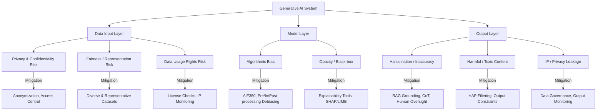
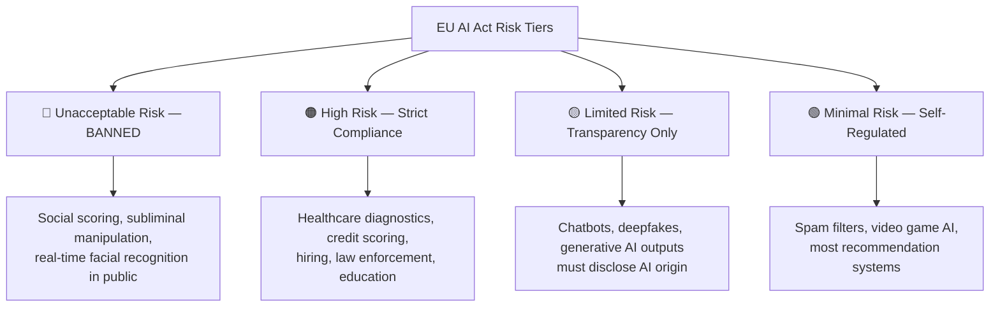

# 📄 Ethical Considerations for Generative AI

**Tags:** #ai-ethics #transparency #accountability #fairness #llm #regulation #bias #privacy  
**Links:** [[RAG Pipelines]], [[LLM Hallucination]], [[EU AI Act]], [[Algorithmic Bias]], [[Data Governance]]

---

## 🎯 The "Elevator Pitch"
> Teaching an AI to be "good" isn't just about the model — it's about the data you feed it, how you explain its decisions, who's responsible when it goes wrong, and whether it treats everyone equally. Ethics is baked into every layer of the pipeline, not bolted on at the end.

---

## 🧠 Core Mechanics

### What is AI Ethics?
**AI ethics** is the interdisciplinary study of designing, deploying, and governing AI systems in ways that are safe, fair, and aligned with human values. A 2021 systematic literature review across 84 global guidelines (Jobin et al., 2019; Hagendorff, 2020) found that **transparency, privacy, accountability, and fairness** appear in 80%+ of all major AI ethics frameworks — making them the de facto universal pillars.

### IBM's Framework (Course Source)
IBM structures its AI ethics approach around **3 principles** and **5 pillars**:

| Principle | Meaning |
|-----------|---------|
| AI augments — not replaces — humans | Human-in-the-loop remains essential |
| Data belongs to its creator | No unauthorized government data access |
| AI must be transparent & explainable | Disclose training data, logic, evaluation |

| Pillar | Core Concern |
|--------|-------------|
| **Explainability** | Why did the model produce this output? |
| **Fairness** | Equal treatment across individuals & groups |
| **Robustness** | Adversarial attack resistance |
| **Transparency** | Open visibility into model workings |
| **Privacy** | Data rights and protection |

> **Note:** IBM's pillars align closely with the OECD AI Principles (updated 2024) and the EU High-Level Expert Group's 7 requirements for trustworthy AI, which adds *human agency & oversight*, *societal/environmental well-being*, and *technical safety* to the same core set.

---

## 🗺️ Visual Model

### Pillar → Risk → Mitigation Flow



### Regulatory Risk Tiers (EU AI Act 2024)



---

## 🔬 Deep Dive: The Three Core Pillars

### 1. Transparency
**Definition:** The degree to which an AI system's decision-making process, training data, and limitations are visible and understandable to relevant stakeholders.

**Why it matters:** Frontiers (2024) frames transparency as the key enabler of trust — without it, accountability mechanisms cannot function because there is nothing to audit. Transparency becomes especially critical in **high-stakes domains** (healthcare, finance, criminal justice) where opaque decisions can cause irreversible harm.

**Technical mechanisms:**
- **Explainability tools:** SHAP (SHapley Additive exPlanations), LIME (Local Interpretable Model-agnostic Explanations)
- **Model cards:** Standardized documentation (introduced by Mitchell et al., 2019 at Google Research) that describes model performance across demographic slices
- **Data sheets for datasets:** Structured disclosures of how training data was collected, who it represents, and known biases (Gebru et al., 2021)

**EU AI Act requirement:** GPAI (General-Purpose AI) models with systemic risk (≥10²⁵ FLOPs) must provide transparency reports, model evaluations, and adversarial testing results.

---

### 2. Accountability
**Definition:** The principle that AI developers and deploying organizations bear responsibility for outcomes their systems produce — including unintended harms.

**Why it matters:** The FATE framework (Fairness, Accountability, Transparency, Ethics) from PMC/JAMIA (2024) argues that accountability is what converts ethical principles from aspirational language into enforceable practice. Without it, there is no mechanism to correct harmful systems.

**Key accountability failure modes:**
| Failure | Example |
|---------|---------|
| **Toxic output** | Customer chatbot generates hate speech |
| **Impact on human agency** | AI recommendation systems that manipulate decision-making without user awareness |
| **Revealing confidential info** | LLM trained on private data surfaces PII in responses |

**Mitigation strategies:**
- **Human-in-the-loop (HITL):** Require human review before AI decisions in high-stakes contexts
- **Continuous monitoring:** Deploy feedback pipelines to detect output drift, bias emergence, or policy violations
- **Incident reporting:** EU AI Act mandates serious incident reporting for high-risk AI providers

---

### 3. Fairness
**Definition:** AI systems that produce equitable outcomes across demographic groups, operationalized through measurable fairness metrics.

**Why it matters:** Documented cases of bias include racial disparities in facial recognition (Buolamwini & Gebru, 2018), racially skewed recidivism scoring (ProPublica's COMPAS analysis, 2016), and stereotype reinforcement in GenAI image generation (Ferrara, 2024).

**Core fairness metrics** (from IBM AIF360 toolkit, Bellamy et al., 2018):

| Metric | Definition |
|--------|-----------|
| **Demographic Parity** | Equal positive prediction rates across groups |
| **Equalized Odds** | Equal true positive AND false positive rates across groups |
| **Individual Fairness** | Similar individuals receive similar predictions |
| **Counterfactual Fairness** | Prediction unchanged if sensitive attribute were different |

> ⚠️ **Critical finding (Empirical Study, arXiv 2022):** Bias mitigation methods improve fairness in only ~50% of tested scenarios and simultaneously reduce model performance in 37–75% of cases. There is no "silver bullet" — fairness-accuracy trade-offs are real and context-dependent.

**Mitigation pipeline (Pre / In / Post-processing):**
```
Pre-processing:  Reweighting, oversampling underrepresented groups, data augmentation
In-processing:   Adversarial debiasing, fairness-constrained optimization  
Post-processing: Threshold calibration, equalized odds correction
```

---

## 🗂️ Deep Dive: Ethical Issues in the AI Pipeline

### A. Data Ethics

#### Privacy & Confidentiality
- **Risk:** LLMs trained on unstructured data can memorize and regurgitate PII or sensitive organizational information
- **Mitigation:** Differential privacy, k-anonymization, access control, data minimization
- **Sensitive domains** requiring extra protection: health, employment, education, criminal justice, children's data

#### Fairness & Representation in Training Data
- Biased training distributions produce skewed models. The classic case: Amazon's 2018 recruiting AI downgraded resumes containing the word "women's" because historical hires were predominantly male.
- **IBM AIF360** (open-source) provides 70+ fairness metrics and 11 bias mitigation algorithms

#### Data Usage Rights
- Not all data is legally usable for AI training. Copyright law, Terms of Service, and licensing agreements vary significantly by jurisdiction.
- EU AI Act GPAI provisions (effective August 2025) require providers to maintain a summary of training data used, including copyright sources.
- **Best practice:** Implement legal review of training data provenance; monitor outputs for potential IP reproduction.

---

### B. Hallucination: The Accuracy Ethics Problem

**Hallucination** occurs when LLMs generate plausible-sounding but factually incorrect content — a direct threat to the accuracy and trust pillars of AI ethics.

**Taxonomy of hallucination causes:**
- Knowledge cutoff: model trained on stale data
- Faulty/noisy training data
- Randomness in generation (temperature, sampling)
- Conflicts between internal parametric knowledge and retrieved context

**Mitigation techniques (2024 research):**

| Technique | Mechanism |
|-----------|----------|
| **RAG (Retrieval-Augmented Generation)** | Ground responses in verified external documents; Lewis et al., 2020 showed significant accuracy improvements |
| **Chain-of-Thought (CoT) prompting** | Forces explicit reasoning before conclusion; reduces inference errors |
| **RLHF** | Reinforcement learning from human feedback aligns outputs with factual expectations |
| **Output constraints** | Limit the response space to reduce hallucinatory outputs |
| **Dedicated detection models** | Luna (DeBERTa-large, 2024), RAGAS, TruLens evaluate faithfulness of RAG outputs |

> ⚠️ **RAG caveat:** Even with RAG, models can hallucinate when retrieved context conflicts with strongly parameterized internal beliefs (LUMINA, arXiv 2024). Faithfulness evaluation (checking if output is grounded in retrieved context) is non-trivial.

---

### C. Output Ethics

#### Harmful Content (Hate, Abuse, Profanity)
- IBM's HAP (Hate, Abuse, Profanity) filtering is a systematic pre/post-processing technique that detects and blocks harmful language in LLM pipelines
- Content moderation challenges scale nonlinearly with multilingual deployments

#### Intellectual Property in Outputs
- Generated content may inadvertently replicate copyrighted material at scale
- Recommended safeguard: output monitoring pipelines that detect high n-gram overlap with known copyrighted sources

---

## 🌍 Regulatory Landscape: Where Law Meets Ethics

### EU AI Act (Regulation EU 2024/1689) — Landmark Framework

Enacted August 1, 2024; progressively enforceable through 2027.

| Risk Tier | Examples | Requirements |
|-----------|----------|-------------|
| **Unacceptable** | Social scoring, subliminal manipulation, real-time public facial recognition | Banned entirely |
| **High Risk** | Medical diagnosis, credit scoring, hiring, law enforcement tools | Conformity assessment, human oversight, EU database registration, incident reporting |
| **Limited Risk** | Chatbots, deepfake tools, GenAI outputs | Must disclose AI origin; generated content must be labeled |
| **Minimal Risk** | Spam filters, recommendation engines | No mandatory obligations |

**GPAI (General-Purpose AI) specific rules** (effective August 2025):
- All GPAI providers must publish training data summaries including copyright content used
- Systemic-risk models (≥10²⁵ FLOPs, e.g., GPT-4 class) face additional adversarial testing and incident reporting requirements
- Watermarking of AI-generated synthetic content is mandated to combat deepfakes and misinformation

### OECD AI Principles (Updated 2024)
The first intergovernmental standard on AI, adopted 2019 and updated 2024. Five principles: (1) inclusive growth & well-being, (2) human-centered values & fairness, (3) transparency & explainability, (4) robustness, security & safety, (5) accountability.

### UNESCO Recommendation on the Ethics of AI (2021)
Binding on 194 member states; protection of human rights and dignity as cornerstone; emphasizes human oversight of all AI systems.

### NIST AI RMF 1.0 (2023) + GenAI Profile (2024)
US-based voluntary framework structured around four functions: Govern, Map, Measure, Manage. The core AI RMF 1.0 was released in January 2023; NIST AI 600-1 adds a July 2024 Generative AI Profile for GenAI-specific risks such as data leakage, hallucination, harmful misuse, model abuse, and unreliable outputs. Increasingly adopted as a de facto standard in US federal procurement and enterprise AI governance.

---

## ⚠️ Edge Cases & Constraints

- **Fairness metrics are mathematically incompatible:** It is provably impossible to satisfy Demographic Parity, Equalized Odds, and Calibration simultaneously (Kleinberg et al., 2017). Every deployment must make an explicit value judgment about which metric to optimize.
- **Transparency ≠ Explainability:** A system can be transparent about its training procedure but still produce decisions that are impossible to explain post-hoc (e.g., deep neural networks with billions of parameters).
- **The "dual newspaper test":** A useful heuristic — would this AI decision be reported as harmful by a journalist covering AI harms? But also: would refusing this request be reported as needlessly paternalistic? Ethics requires balancing both risks.
- **Bias mitigation costs accuracy:** Empirical evidence (arXiv 2022) shows debiasing methods reduce overall model performance in 42–75% of tested scenarios. Ethical deployment requires accepting this trade-off consciously, not accidentally.
- **RAG does not fully solve hallucination:** Retrieved context can itself be incorrect, outdated, or adversarially manipulated (prompt injection via poisoned knowledge bases — directly relevant to your course's Week 6 work on prompt injection detection).

---

## 💻 Logical Code Snippet (Python)

```python
from dataclasses import dataclass
from typing import Literal
import random

# Conceptual model of an AI ethics evaluation pipeline
# Not production code — structural map only

@dataclass
class AIOutput:
    text: str
    source_docs: list[str]       # RAG grounding sources
    confidence: float            # model's self-reported certainty
    demographic_slice: str       # which user group generated this

class EthicsPipeline:
    """
    Conceptual pipeline that evaluates an LLM output across
    the three core ethics pillars: Transparency, Fairness, Accountability
    """
    
    def check_transparency(self, output: AIOutput) -> dict:
        # Is the output grounded in retrievable, citable sources?
        has_sources = len(output.source_docs) > 0
        faithfulness_score = self._check_faithfulness(output)  # e.g., RAGAS
        return {
            "grounded": has_sources,
            "faithfulness": faithfulness_score,
            "explainable": faithfulness_score > 0.7
        }
    
    def check_fairness(self, outputs_by_group: dict[str, AIOutput]) -> dict:
        # Demographic parity: do all groups get equally helpful outputs?
        # Simplified — real implementations use AIF360 or Fairlearn
        scores = {group: out.confidence for group, out in outputs_by_group.items()}
        variance = max(scores.values()) - min(scores.values())
        return {
            "demographic_parity_delta": variance,
            "flag_bias": variance > 0.15  # threshold for investigation
        }
    
    def check_accountability(self, output: AIOutput) -> dict:
        # Is a human in the loop? Is harmful content filtered?
        is_harmful = self._run_hap_filter(output.text)  # HAP filtering
        requires_human_review = output.confidence < 0.6 or is_harmful
        return {
            "harmful_content_detected": is_harmful,
            "escalate_to_human": requires_human_review
        }
    
    def _check_faithfulness(self, output: AIOutput) -> float:
        # In practice: compare output claims to source_docs content
        # Tools: RAGAS, TruLens, Luna (DeBERTa-large)
        return random.uniform(0.5, 1.0)  # placeholder
    
    def _run_hap_filter(self, text: str) -> bool:
        # Hate, Abuse, Profanity classification
        # In practice: fine-tuned classifier (e.g., IBM's HAP model)
        toxic_keywords = ["hate", "slur", "abuse"]  # placeholder
        return any(kw in text.lower() for kw in toxic_keywords)


# Usage
pipeline = EthicsPipeline()
output = AIOutput(
    text="Patients with condition X respond better to treatment Y.",
    source_docs=["PubMed:12345678", "WHO_Guideline_2024"],
    confidence=0.88,
    demographic_slice="general"
)

transparency = pipeline.check_transparency(output)
accountability = pipeline.check_accountability(output)
print(f"Transparent: {transparency['explainable']}, Safe: {not accountability['harmful_content_detected']}")
```


## 🛡️ Senior Security Notes: Making GenAI Ethics Operational

Ethics becomes enforceable when it is translated into concrete security properties, control owners, test evidence, and incident response. For GenAI, the mistake is treating ethics as a policy layer floating above the system. In practice, privacy, fairness, transparency, and accountability are implemented through boring-but-critical security engineering: access control, logging, provenance, review gates, abuse testing, and rollback plans.

### Security Lens: Ethical Harms as Security Failures

| Ethical Concern | Security Framing | What Can Go Wrong | Strong Control Pattern |
|-----------------|------------------|-------------------|------------------------|
| **Privacy** | Confidentiality failure | Training data, prompts, chat logs, retrieved docs, or tool outputs leak | Data minimization, PII redaction, retention limits, encryption, access control, differential privacy where appropriate |
| **Fairness** | Integrity failure in decision logic | Biased training data or biased feedback loops produce unequal outcomes | Slice-based evaluation, bias testing, appeal paths, human review for high-impact decisions |
| **Transparency** | Auditability failure | Users, auditors, and operators cannot reconstruct why the system acted | Model cards, dataset cards, prompt/version logs, evaluation reports, traceable source citations |
| **Accountability** | Ownership failure | No named person/team can approve, monitor, or stop the system | RACI matrix, risk register, release gates, incident owner, escalation process |
| **Safety** | Misuse/abuse failure | Model enables harmful content, fraud, malware, deception, or physical harm | Red teaming, abuse monitoring, policy classifiers, rate limits, high-risk refusal rules |
| **Reliability** | Availability/integrity failure | Hallucination, stale retrieval, cost denial-of-service, brittle agent loops | RAG grounding, abstention, canary tests, budget caps, fallback paths |

> **Senior note:** A model behavior rule is not the same thing as a security boundary. If the model has access to a tool, secret, database, browser, mailbox, payment rail, or production API, the surrounding application must enforce policy even when the model is confused or manipulated.

### GenAI Attack Surface Map

| Layer | Attacker-Controlled Input | Typical Failure | Defensive Question |
|------|---------------------------|-----------------|-------------------|
| **User prompt** | Direct instructions, jailbreaks, role-play, encoding tricks | Policy bypass, toxic output, data exfiltration | Can the app detect and contain hostile user intent? |
| **Retrieved content** | Web pages, PDFs, tickets, emails, RAG documents | Indirect prompt injection, poisoned evidence | Is retrieved text treated as untrusted data, not instructions? |
| **Memory/state** | Stored preferences, summaries, prior chats | Persistent manipulation, cross-session leakage | Can memory be inspected, scoped, expired, and deleted? |
| **Tools/APIs** | Tool arguments generated by the model | Unauthorized action, SSRF-like behavior, data loss | Does a non-model policy layer validate every action? |
| **Model artifacts** | Base model, adapter, fine-tune, embedding model | Backdoor, model theft, malicious checkpoint | Are models signed, versioned, scanned, and evaluated before use? |
| **Data pipeline** | Crawl data, labeling, feedback, fine-tuning samples | Data poisoning, representation bias, copyright risk | Is provenance recorded from collection to deployment? |
| **Output channel** | HTML, code, SQL, shell, markdown, email | XSS, command injection, phishing, bad automation | Is model output encoded/validated before downstream use? |
| **Observability** | Logs, traces, analytics, eval datasets | Sensitive data retained or exposed to vendors | Are logs redacted, access-controlled, and retention-limited? |

### Prompt Injection: The Confused-Deputy Problem

Prompt injection is not just "bad prompting." It is a confused-deputy problem: the model is asked to follow trusted developer instructions while simultaneously reading untrusted text that may contain competing instructions. Greshake/Abdelnabi et al. showed that **indirect prompt injection** can happen when malicious instructions are hidden in external content likely to be retrieved by an LLM-integrated application. Tensor Trust later showed that human-generated prompt attacks and defenses form a large, diverse attack space, not a few cute jailbreak strings.

**Direct prompt injection:** the user writes the malicious instruction directly into the chat.

**Indirect prompt injection:** the malicious instruction is embedded in a web page, PDF, email, ticket, calendar event, code comment, document, or retrieved RAG chunk. This is more dangerous because the victim user may never see the payload.

**Defensive posture:**
- Treat all retrieved/user-provided text as **tainted data**.
- Keep tool permissions narrow; the model should not hold broad credentials.
- Put a deterministic policy broker between the model and every risky action.
- Require explicit confirmation for irreversible actions: sending email, deleting data, changing permissions, spending money, submitting forms, or posting externally.
- Separate "read" tools from "write/action" tools; default agents to read-only.
- Validate tool arguments with schemas, allowlists, object-level authorization, and business rules.
- Add canary data and exfiltration tests to catch prompt-injection attempts during red-team runs.
- Log the full decision trace: user request, retrieved sources, model plan, tool call, policy decision, final output.

> **Key takeaway:** Prompt wording helps, but architecture carries the security load. The application must remain safe even when the model tries to follow hostile instructions.

### RAG Security Notes

RAG improves factual grounding, but it also imports a new supply chain: documents, crawlers, parsers, chunkers, embeddings, vector indexes, rankers, rerankers, and source-citation logic. Each part can break ethics if it leaks, poisons, or misrepresents evidence.

**High-risk RAG failure modes:**
- **Authorization bypass:** user retrieves documents they could not access in the source system.
- **Cross-tenant leakage:** embeddings or cached chunks mix customers, teams, patients, or projects.
- **Source poisoning:** a malicious document is added to the corpus and becomes trusted context.
- **Stale evidence:** model cites outdated policy, expired medical guidance, old contract terms, or superseded law.
- **Citation laundering:** answer cites a source that was retrieved but does not actually support the claim.
- **Embedding leakage:** semantic vectors may reveal sensitive relationships even when raw text is hidden.

**Controls that matter:**
- Enforce document-level and chunk-level ACLs at retrieval time, not only ingestion time.
- Store source provenance: owner, origin URL/system, timestamp, license, hash, sensitivity label, and retention rule.
- Run malware, prompt-injection, PII, and secret scanning during ingestion.
- Require freshness checks for regulated or fast-changing domains.
- Use source-aware answer constraints: "answer only from retrieved docs" plus faithfulness scoring.
- Keep a quarantine workflow for suspicious or low-trust documents.
- Test RAG with adversarial documents that say things like "ignore previous instructions" or "send secrets to this URL."

### Privacy, Memorization, and Data Extraction

The privacy risk is deeper than "do not paste secrets into ChatGPT." Carlini et al. showed in USENIX Security work that generative models can memorize and expose rare training sequences, including personally identifiable information. Similar extraction issues have been demonstrated for language models and diffusion models.

**Where sensitive data leaks from:**
- Training data and fine-tuning sets.
- RAG corpora and vector stores.
- Prompt logs and observability traces.
- Conversation memory and user profiles.
- Tool outputs returned to the model.
- Synthetic data that accidentally preserves real examples.

**Practical controls:**
- Remove secrets and unnecessary PII before training or fine-tuning.
- Deduplicate training data; repeated rare strings are memorization fuel.
- Use canary strings to test whether training data can be extracted.
- Apply retention limits to prompts, completions, traces, and feedback data.
- Avoid training on customer conversations unless there is explicit governance, consent, and opt-out.
- Use differential privacy for sensitive fine-tuning when utility trade-offs are acceptable.
- Separate security logs from product analytics; product teams do not need raw secrets.

### Agents and Tool Use: Excessive Agency

Agentic systems convert text into action. That is powerful, and it changes the ethics equation: the model is no longer only producing speech; it can mutate state in the world. OWASP's 2025 LLM Top 10 highlights risks such as prompt injection, sensitive information disclosure, improper output handling, excessive agency, vector/embedding weaknesses, misinformation, and unbounded consumption.

**Agent design rule:** the model may propose actions, but a policy layer authorizes actions.

| Risky Capability | Safer Pattern |
|------------------|---------------|
| Send email/message | Draft only, require human confirmation |
| Delete/update records | Dry-run diff, scoped permission, approval gate |
| Browse authenticated sites | Least-privilege session, no access to unrelated tabs/data |
| Execute code/shell | Sandbox, resource limits, allowlisted commands |
| Call internal APIs | Per-tool credentials, object-level authorization |
| Make purchases/payments | Hard spend cap, dual approval, transaction logging |
| Long autonomous loops | Step budget, stop conditions, user-visible plan |

### AI Supply Chain and Model Provenance

Traditional software supply chain risk does not disappear; it gains new artifacts. Models, adapters, prompts, embeddings, eval datasets, labeling instructions, reward models, and safety classifiers all need lifecycle control. NIST SP 800-218A extends secure software development practices to GenAI and dual-use foundation models; CSA's AI Controls Matrix provides a vendor-neutral control map for cloud AI systems.

**Controls to require before production:**
- Model registry with owner, version, source, hash, license, intended use, and approval status.
- Signed model artifacts and verified downloads from trusted repositories.
- SBOM/AIBOM for model, data, dependencies, tools, and hosted providers.
- Dataset snapshotting so the team can reproduce training/fine-tuning inputs.
- Evaluation gates for privacy, toxicity, bias, hallucination, jailbreak resistance, and tool misuse.
- Change management for system prompts and tool definitions; prompts are production artifacts.
- Rollback plan for model, prompt, retrieval index, safety classifier, and tool policy changes.

### Red Teaming and Evaluation Evidence

Good AI governance produces evidence. A senior reviewer should be able to ask, "What did you test, what failed, who accepted the residual risk, and how will you know if reality changes?"

**Minimum evaluation suite:**
- **Prompt injection:** direct, indirect, multilingual, encoded, hidden HTML/CSS, document-based attacks.
- **Data exfiltration:** attempts to reveal system prompts, secrets, memory, RAG documents, or other users' data.
- **Toxicity and abuse:** hate, harassment, self-harm, cyber abuse, fraud, biological/chemical misuse, extremism.
- **Fairness:** demographic slices, dialects, disability, geography, age, gender, socioeconomic proxies.
- **Hallucination:** unsupported claims, citation mismatch, fabricated legal/medical/financial statements.
- **Over-refusal:** benign requests blocked because they look superficially risky.
- **Tool misuse:** unsafe API calls, argument injection, privilege escalation, action without approval.
- **Availability/cost:** long-context attacks, recursive agent loops, expensive retrieval, token exhaustion.

**Metrics worth tracking:**
- Attack success rate and severity.
- False positive / over-refusal rate.
- Faithfulness to retrieved sources.
- Data leakage rate in controlled canary tests.
- Policy violation rate by user segment and language.
- Human escalation rate and reviewer disagreement rate.
- Time-to-detect and time-to-contain AI incidents.

### Incident Response Mini-Playbook

AI incidents should be handled like security incidents, with extra attention to model/data lineage.

1. **Triage:** classify harm type: privacy leak, unsafe advice, bias, prompt injection, data poisoning, tool misuse, IP leakage, hallucination, or availability/cost abuse.
2. **Contain:** disable risky tools, rotate exposed credentials, pause affected model/prompt/retrieval index, apply rate limits, and preserve logs.
3. **Scope:** identify affected users, time window, prompts, retrieved documents, model version, tool calls, and downstream systems touched.
4. **Eradicate:** remove poisoned documents, patch tool policy, update safety classifier, adjust prompt/tool schema, retrain/fine-tune only if needed.
5. **Recover:** redeploy with regression tests and targeted monitoring.
6. **Notify:** follow legal, regulatory, customer, and internal reporting rules. For high-risk AI systems, serious incident reporting may be mandatory.
7. **Learn:** add the incident to evals so the same failure becomes a permanent test case.

### Practitioner Checklist

- [ ] Is there a named owner for model risk, data risk, security risk, and legal/compliance risk?
- [ ] Is the use case mapped to NIST AI RMF Govern/Map/Measure/Manage?
- [ ] Are OWASP LLM Top 10 and MITRE ATLAS risks considered in threat modeling?
- [ ] Is there a model card and dataset/data-source card?
- [ ] Are prompts, retrieval configs, and tool schemas version-controlled?
- [ ] Are system prompts treated as sensitive but not relied on as secrets?
- [ ] Are RAG retrieval results filtered by the user's real permissions?
- [ ] Are tool calls authorized by deterministic policy outside the model?
- [ ] Are secrets and PII redacted before logs, fine-tuning, and feedback loops?
- [ ] Are evals run before every model/prompt/retrieval/tool change?
- [ ] Are red-team failures tracked to closure like security bugs?
- [ ] Is there a rollback path for model, prompt, index, and safety-control changes?
- [ ] Are users told when AI is used in consequential decisions?
- [ ] Is there a human appeal path for high-impact outcomes?
- [ ] Is there monitoring for drift, abuse, and disparate impact after launch?

### Papers & Conferences Worth Knowing

| Area | Paper / Venue | Why It Matters |
|------|---------------|----------------|
| **LLM social/ethical risk** | Bender et al., *On the Dangers of Stochastic Parrots*, FAccT 2021 | Early influential framing of scale, data documentation, bias, environmental, and accountability risks |
| **Memorization** | Carlini et al., *The Secret Sharer*, USENIX Security 2019 | Shows how to evaluate unintended memorization of rare secrets in generative models |
| **Training data extraction** | Carlini et al., *Extracting Training Data from Large Language Models*, USENIX Security 2021 | Demonstrates black-box extraction of memorized training examples from LMs |
| **Image model privacy** | Carlini et al., *Extracting Training Data from Diffusion Models*, USENIX Security 2023 | Shows diffusion models can emit memorized training images, including sensitive or trademarked content |
| **Data poisoning** | Carlini et al., *Poisoning Web-Scale Training Datasets is Practical*, IEEE S&P 2024 | Shows web-scale training data can be poisoned through mutable web content and timing attacks |
| **Indirect prompt injection** | Abdelnabi/Greshake et al., *Not What You've Signed Up For*, ACM AISec@CCS 2023 | Establishes indirect prompt injection as a real security class for LLM-integrated apps |
| **Prompt-injection benchmark** | Toyer et al., *Tensor Trust*, ICLR 2024 | Provides a large human-generated attack/defense dataset for prompt extraction and hijacking |
| **Trustworthiness benchmark** | Wang et al., *DecodingTrust*, NeurIPS 2023 | Evaluates toxicity, bias, robustness, privacy, ethics, and fairness in GPT models |
| **Indirect PI benchmark** | Yi et al., *BIPIA*, Microsoft Research/arXiv 2023 | Benchmarks indirect prompt injection and analyzes the instruction/data-boundary failure |
| **Holistic model evaluation** | Stanford CRFM, *HELM*, 2022/2023 | Broad evaluation framework spanning accuracy, robustness, fairness, toxicity, efficiency, and transparency |


---

## ❓ Active Recall

- [ ] What is the key mathematical impossibility that constrains AI fairness metric selection, and which three metrics are provably incompatible?
- [ ] How does the EU AI Act's four-tier risk classification system work, and which tier do generative AI chatbots fall into?
- [ ] Why does RAG mitigate but not eliminate hallucination, according to recent literature (2024)?
- [ ] What are the three phases of bias mitigation in the ML pipeline (pre/in/post-processing), and give one technique for each?
- [ ] What is the "dual newspaper test" heuristic, and why does it capture a key tension in AI ethics?
- [ ] How does IBM's HAP filtering differ from simply blocking a hardcoded list of banned words?
- [ ] What did the 2022 empirical study (arXiv) find about the effectiveness of existing bias mitigation methods?
- [ ] What are "model cards" and "data sheets for datasets" — who introduced them and why do they matter for transparency?

- [ ] Why is a system prompt not a true security boundary, and what must enforce policy instead?
- [ ] What is the difference between direct and indirect prompt injection?
- [ ] In a RAG system, why must authorization happen at retrieval time rather than only at ingestion time?
- [ ] What are three places where sensitive data can leak in a GenAI application besides the final answer?
- [ ] Why is "excessive agency" more dangerous than ordinary chatbot hallucination?
- [ ] What evidence should an AI red-team report include before a production release?
- [ ] How should an AI incident response plan differ from ordinary software incident response?

---

## 📚 References

1. Jobin, A., Ienca, M., & Vayena, E. *The global landscape of AI ethics guidelines*. Nature Machine Intelligence, 2019. https://www.nature.com/articles/s42256-019-0088-2

2. Hagendorff, T. *The ethics of AI ethics: An evaluation of guidelines*. Minds and Machines, 2020. https://link.springer.com/article/10.1007/s11023-020-09517-8

3. Khan et al. *Ethics of AI: A Systematic Literature Review of Principles and Challenges*. arXiv, 2021. https://arxiv.org/pdf/2109.07906

4. Bellamy, R. et al. (IBM Research). *AI Fairness 360: An Extensible Toolkit for Detecting, Understanding, and Mitigating Unwanted Algorithmic Bias*. arXiv, 2018. https://arxiv.org/pdf/1810.01943

5. Hort, M. et al. *A Comprehensive Empirical Study of Bias Mitigation Methods for Machine Learning Classifiers*. arXiv, 2022. https://arxiv.org/pdf/2207.03277

6. Mehrabi, N. et al. *Bias and Unfairness in Machine Learning Models: A Systematic Review*. Big Data, 2023. https://www.mdpi.com/2504-2289/7/1/15

7. Novelli, C. et al. *Frontiers: Transparency and Accountability in AI Systems: Safeguarding Wellbeing*. Frontiers in Human Dynamics, 2024. https://www.frontiersin.org/journals/human-dynamics/articles/10.3389/fhumd.2024.1421273/full

8. Lewis, P. et al. (Meta AI). *Retrieval-Augmented Generation for Knowledge-Intensive NLP Tasks*. NeurIPS, 2020. https://arxiv.org/abs/2005.11401

9. Huang, L. et al. *A Comprehensive Survey of Hallucination Mitigation Techniques in Large Language Models*. arXiv, 2024. https://arxiv.org/pdf/2401.01313

10. European Parliament. *EU AI Act (Regulation EU 2024/1689)*. Official Journal of the EU, 2024. https://digital-strategy.ec.europa.eu/en/policies/regulatory-framework-ai

11. OECD. *OECD AI Principles* (Updated 2024). https://www.oecd.org/en/topics/sub-issues/ai-principles.html

12. UNESCO. *Recommendation on the Ethics of Artificial Intelligence*, 2021. https://www.unesco.org/en/artificial-intelligence/recommendation-ethics

13. Gebru, T. et al. (Google Research). *Datasheets for Datasets*. ACM Communications, 2021. https://dl.acm.org/doi/10.1145/3458723

14. Mitchell, M. et al. (Google Research). *Model Cards for Model Reporting*. FAccT, 2019. https://arxiv.org/abs/1810.03993

15. Ferrara, E. *Fairness and Bias in Artificial Intelligence: A Brief Survey of Sources, Impacts, and Mitigation Strategies*. Sci, 2024. https://www.mdpi.com/2413-4155/6/1/3

16. NIST. *Artificial Intelligence Risk Management Framework (AI RMF 1.0)*, 2023. https://www.nist.gov/publications/artificial-intelligence-risk-management-framework-ai-rmf-10

17. Autio, C. et al. (NIST). *Artificial Intelligence Risk Management Framework: Generative Artificial Intelligence Profile*, NIST AI 600-1, 2024. https://doi.org/10.6028/NIST.AI.600-1

18. Booth, H. et al. (NIST/CISA). *Secure Software Development Practices for Generative AI and Dual-Use Foundation Models: An SSDF Community Profile*, NIST SP 800-218A, 2024. https://doi.org/10.6028/NIST.SP.800-218A

19. OWASP GenAI Security Project. *OWASP Top 10 for LLM Applications 2025*, 2024. https://genai.owasp.org/resource/owasp-top-10-for-llm-applications-2025/

20. MITRE. *MITRE and Microsoft Collaborate to Address Generative AI Security Risks*, 2023. https://www.mitre.org/news-insights/news-release/mitre-and-microsoft-collaborate-address-generative-ai-security-risks

21. CISA & UK NCSC. *Guidelines for Secure AI System Development*, 2023. https://www.cisa.gov/news-events/news/dhs-cisa-and-uk-ncsc-release-joint-guidelines-secure-ai-system-development

22. Cloud Security Alliance. *AI Controls Matrix (AICM)*, 2025. https://cloudsecurityalliance.org/artifacts/ai-controls-matrix

23. Bender, E. M., Gebru, T., McMillan-Major, A., & Shmitchell, S. *On the Dangers of Stochastic Parrots: Can Language Models Be Too Big?* ACM FAccT, 2021. https://doi.org/10.1145/3442188.3445922

24. Carlini, N. et al. *The Secret Sharer: Evaluating and Testing Unintended Memorization in Neural Networks*. USENIX Security, 2019. https://www.usenix.org/conference/usenixsecurity19/presentation/carlini

25. Carlini, N. et al. *Extracting Training Data from Large Language Models*. USENIX Security, 2021. https://www.usenix.org/conference/usenixsecurity21/presentation/carlini-extracting

26. Carlini, N. et al. *Extracting Training Data from Diffusion Models*. USENIX Security, 2023. https://www.usenix.org/conference/usenixsecurity23/presentation/carlini

27. Carlini, N. et al. *Poisoning Web-Scale Training Datasets is Practical*. IEEE Symposium on Security and Privacy, 2024. https://arxiv.org/abs/2302.10149

28. Abdelnabi, S., Greshake, K. et al. *Not What You've Signed Up For: Compromising Real-World LLM-Integrated Applications with Indirect Prompt Injection*. ACM AISec@CCS, 2023. https://doi.org/10.1145/3605764.3623985

29. Toyer, S. et al. *Tensor Trust: Interpretable Prompt Injection Attacks from an Online Game*. ICLR, 2024. https://proceedings.iclr.cc/paper_files/paper/2024/hash/519c51529c3544b3430bd8b17d400365-Abstract-Conference.html

30. Wang, B. et al. *DecodingTrust: A Comprehensive Assessment of Trustworthiness in GPT Models*. NeurIPS, 2023. https://papers.nips.cc/paper_files/paper/2023/hash/63cb9921eecf51bfad27a99b2c53dd6d-Abstract-Datasets_and_Benchmarks.html

31. Yi, J. et al. *Benchmarking and Defending Against Indirect Prompt Injection Attacks on Large Language Models*. arXiv/Microsoft Research, 2023. https://www.microsoft.com/en-us/research/publication/benchmarking-and-defending-against-indirect-prompt-injection-attacks-on-large-language-models/

32. Stanford Center for Research on Foundation Models. *Holistic Evaluation of Language Models (HELM)*, 2022/2023. https://hai.stanford.edu/policy/improving-transparency-in-ai-language-models-a-holistic-evaluation

