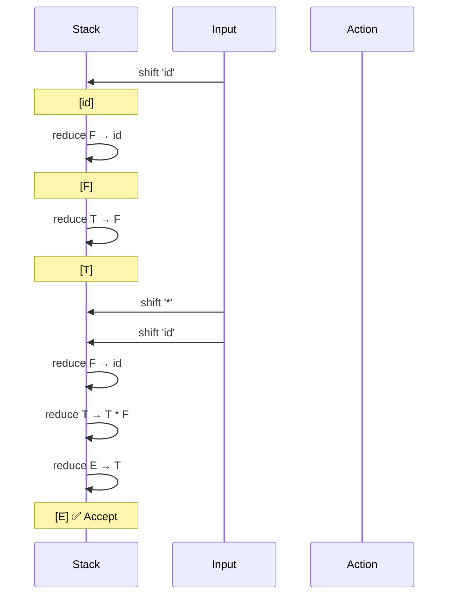
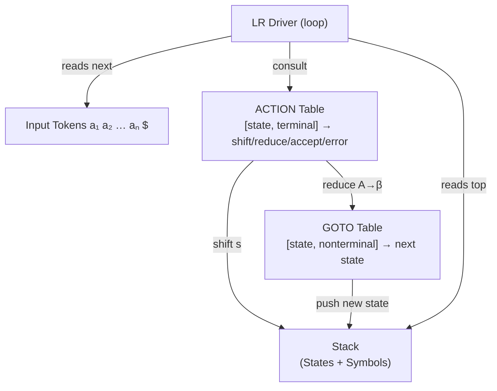
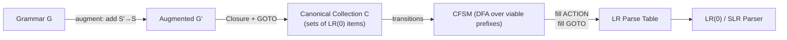

# 📄 Bottom-Up Parsing: Shift-Reduce, LR(0), and SLR

**Tags:** #compiler #parsing #LR #shift-reduce #SLR #LR0 #CFSM #handle
**Links:** [[Top-Down Parsing]], [[LL Parsers]], [[LALR Parsing]], [[FOLLOW Sets]], [[Grammar Augmentation]]

---

## 🎯 The "Elevator Pitch"

> Bottom-up parsing reads a token stream left-to-right and repeatedly identifies the **rightmost production body** on a stack, replacing it (reducing) with the left-hand side nonterminal — effectively tracing a rightmost derivation in reverse, from leaves to root.

---

## 🧠 Core Mechanics

### What is Bottom-Up Parsing?

| Property | Bottom-Up (LR) | Top-Down (LL) |
|---|---|---|
| **Direction** | Leaves → Root | Root → Leaves |
| **Derivation traced** | Rightmost, in reverse | Leftmost |
| **Action on production** | RHS → LHS (reduce) | LHS → RHS (expand) |
| **Stack contents** | Partial parse tree suffixes | Prediction stack |
| **Power** | Strictly stronger | Subset of LR |

The "LR" in LR parsing stands for:
- **L** = left-to-right scan of input
- **R** = rightmost derivation (in reverse)
- **k** = k symbols of lookahead

### The Four Parser Actions

Every shift-reduce parser chooses among exactly four actions at each step:

1. **Shift** — move the next input token onto the top of the stack
2. **Reduce** — the handle is on top of the stack; pop its symbols and push the corresponding nonterminal (LHS)
3. **Accept** — the start symbol is alone on the stack and input is exhausted (`$`)
4. **Error** — no valid action exists; call error recovery

### Handle Pruning (the Core Idea)

A **handle** is a pair $(A \to \beta, k)$ — a production body $\beta$ appearing in the sentential form at position $k$ such that reducing $\beta$ to $A$ yields the *previous* step of the rightmost derivation.

**Key invariant:** For an unambiguous grammar, the right end of the handle always appears at the top of the stack. This is why a stack suffices — we never need to look *inside* the stack to find where to reduce.

**Handle pruning algorithm:**
```
while stack ≠ [Start-Symbol]:
    if top-of-stack is a handle:
        reduce (pop RHS, push LHS)
    else:
        shift next input token
```

A **viable prefix** is any prefix of a right-sentential form that does not extend *past* the right end of its handle. The stack always holds a viable prefix.

---

## 🗺️ Visual Models

### Shift-Reduce Parse Trace (Stack Evolution)



### LR Parsing Engine Architecture



### LR(0) Table Construction Pipeline



### Conflict Diagnosis Decision Tree

```mermaid
flowchart TD
    CONF["Conflict in Parse Table\n(shift/reduce or reduce/reduce)"]
    AMB{"Is grammar\nambiguous?"}
    CONF --> AMB
    AMB -->|Yes| DEAD["No deterministic fix.\nUse operator precedence\nor rewrite grammar."]
    AMB -->|No| MORE{"More lookahead\nor stronger method?"}
    MORE -->|Add FOLLOW lookahead| SLR["Use SLR(1)"]
    MORE -->|Use LR(1) items| LALR["Use LALR(1) or LR(1)"]
```

---

## 🔬 LR(0) Items and the CFSM

### LR(0) Items

An **LR(0) item** is a production with a **dot (•)** marking how much of the RHS has been seen:

- $A \to \bullet\, \alpha\beta$ — nothing seen yet; expect $\alpha$
- $A \to \alpha\, \bullet\, \beta$ — seen $\alpha$; expect $\beta$
- $A \to \alpha\beta\, \bullet$ — seen everything; this is a **reduce item** (can reduce)

### Closure Algorithm

Given a set of items $I$:

```
Closure(I):
    result = I
    repeat:
        for each item [A → α • B β] in result:
            for each production B → γ:
                add [B → • γ] to result if not already there
    until no change
    return result
```

Intuitively: if the dot is before a nonterminal $B$, we must also consider all productions *for* $B$.

### GOTO Function

$$\text{GOTO}(I, X) = \text{Closure}(\{[A \to \alpha X \bullet \beta] \mid [A \to \alpha \bullet X \beta] \in I\})$$

GOTO simulates a DFA transition: given state $I$ and grammar symbol $X$, return the next item set after consuming $X$.

### Canonical Collection $C$

Build the full DFA (CFSM) via:
```
C = { Closure({[S' → • S]}) }
for each set I in C:
    for each grammar symbol X:
        if GOTO(I, X) ≠ ∅ and not already in C:
            add GOTO(I, X) to C
```

### Characteristic Finite-State Machine (CFSM)

The CFSM is a DFA whose:
- **States** = sets of LR(0) items
- **Alphabet** = terminals + nonterminals
- **Transitions** = GOTO function
- **Accept states** = states containing a reduce item (dot at end) → these are the **double-boxed** states in textbook figures

The CFSM formally recognizes *viable prefixes* of the grammar. When the automaton reaches a double-boxed state, the stack holds a viable prefix that ends exactly at a handle.

---

## 📋 Filling the LR(0) Parse Table

For each state $I_i$ in the CFSM:

| Condition | Action |
|---|---|
| $[A \to \alpha \bullet a \beta] \in I_i$ and $\text{GOTO}(I_i, a) = I_j$ | $\text{ACTION}[i, a] = \text{shift } j$ |
| $[A \to \alpha \bullet] \in I_i$ and $A \neq S'$ | $\text{ACTION}[i, a] = \text{reduce } A \to \alpha$ **for all** $a$ |
| $[S' \to S \bullet] \in I_i$ | $\text{ACTION}[i, \$] = \text{accept}$ |
| $\text{GOTO}(I_i, A) = I_j$ (for nonterminal $A$) | $\text{GOTO}[i, A] = j$ |
| All other cells | error |

---

## 📋 SLR(1) — Simple LR with 1-Token Lookahead

SLR resolves the overly aggressive reduce entries of LR(0) by conditioning reduce actions on **FOLLOW sets**.

### SLR Modification to LR(0)

Replace the LR(0) reduce rule:

> ~~For all $a$: reduce $A \to \alpha$~~

With the SLR rule:

> **Only for $a \in \text{FOLLOW}(A)$: reduce $A \to \alpha$**

This eliminates many spurious conflicts. A grammar is **SLR(1)** if its SLR(1) parse table contains no conflicts.

### SLR Table Construction Algorithm

1. Augment grammar: add $S' \to S$
2. Build the canonical collection $C$ of LR(0) item sets
3. For each state $I_i$:
   - $[A \to \alpha \bullet a \beta] \in I_i$ → $\text{ACTION}[i,a] = s_j$ where $\text{GOTO}(I_i,a)=I_j$
   - $[A \to \alpha \bullet] \in I_i$, $A \neq S'$ → $\text{ACTION}[i,a] = r_{A\to\alpha}$ for all $a \in \text{FOLLOW}(A)$
   - $[S' \to S \bullet] \in I_i$ → $\text{ACTION}[i,\$] = \text{accept}$
   - $\text{GOTO}(I_i, A) = I_j$ → $\text{GOTO}[i,A] = j$
4. All undefined entries → error

### Grammar Hierarchy (Power)

$$\text{LR(0)} \subset \text{SLR(1)} \subset \text{LALR(1)} \subset \text{LR(1)} \subset \text{All CFGs}$$

Most real programming language grammars are **LALR(1)** — which is why tools like `yacc`/`bison` use LALR(1) parsing.

---

## ⚠️ Edge Cases & Constraints

### Shift-Reduce Conflict
The ACTION table cell $[i, a]$ contains *both* a shift entry and a reduce entry.

**Cause A:** Ambiguous grammar (e.g., dangling-else; classic arithmetic expressions with no precedence)
**Cause B:** Non-ambiguous grammar where LR(0)/SLR analysis is too coarse.

**Resolution (for ambiguous grammars):** Use operator precedence rules to break the tie:
- Prefer shift → right-associative operator / higher-precedence operator
- Prefer reduce → left-associative operator

### Reduce-Reduce Conflict
Two different reductions are possible from the same state on the same lookahead.

**Cause:** Grammar captures the same string via two different nonterminals, or the parser method's lookahead is too weak to distinguish them.

**Resolution:** Either rewrite the grammar, use a stronger method (LALR/LR(1)), or restructure the grammar.

### Non-LR(k) Grammars
Some (unambiguous) grammars cannot be parsed by any LR(k) parser because the decision to reduce requires knowing the entire past derivation, not just $k$ lookahead tokens. Example: $\{wcw^R \mid w \in \{a,b\}^*\}$ requires knowing the last character of the prefix.

### Common Misconceptions

- **"A handle is any RHS that appears on the stack."** ❌ A handle must be the *rightmost* such occurrence, and only one exists per sentential form in an unambiguous grammar.
- **"SLR = LR(1)."** ❌ SLR uses FOLLOW sets (which are *global*, over-approximations); LR(1) uses per-item precise lookahead sets. A grammar may be LR(1) but not SLR(1).
- **"Adding augmented start S'→S changes the language."** ❌ Augmentation is purely mechanical and never changes the language recognized.
- **"More states = better parser."** Partially wrong — LALR(1) merges states aggressively vs. LR(1), producing smaller tables at the cost of some grammars gaining spurious reduce-reduce conflicts.

---

## 💻 Logical Code Snippet (Python)

```python
# Conceptual shift-reduce parser driven by a precomputed ACTION/GOTO table
def lr_parse(tokens, action_table, goto_table, grammar):
    stack = [0]           # stack of parser states
    sym_stack = []        # parallel symbol stack (for clarity)
    ip = 0                # input pointer

    while True:
        state = stack[-1]
        token = tokens[ip]
        action = action_table.get((state, token))

        if action is None:
            raise SyntaxError(f"No action for state={state}, token={token!r}")

        if action[0] == 'shift':
            _, next_state = action
            stack.append(next_state)
            sym_stack.append(token)
            ip += 1

        elif action[0] == 'reduce':
            _, prod_id = action
            lhs, rhs = grammar[prod_id]     # e.g., ('E', ['E', '+', 'T'])
            # Pop |rhs| states
            for _ in rhs:
                stack.pop()
                sym_stack.pop()
            # Goto: push the new state reached by lhs
            top_state = stack[-1]
            stack.append(goto_table[(top_state, lhs)])
            sym_stack.append(lhs)

        elif action[0] == 'accept':
            return sym_stack  # parse tree root

        else:
            raise SyntaxError("Parse error")
```

---

## ❓ Active Recall

### Definition Level
- [ ] What does the dot in an LR(0) item represent, and how does it change through shifts?
- [ ] Define "handle" formally. Why is it guaranteed to appear at the top of the stack in an unambiguous grammar?
- [ ] What does CFSM stand for, and what language does it recognize?

### Mechanics Level
- [ ] Walk through `Closure({[S' → • E]})` for a simple expression grammar. What items does it add and why?
- [ ] Given `GOTO(I, X)`, what does the algorithm do step-by-step?
- [ ] How do the ACTION and GOTO tables differ in what they index (row/column)?
- [ ] In SLR(1), what restricts a reduce action compared to LR(0)? Write the condition precisely.

### Analysis Level
- [ ] A grammar has a shift-reduce conflict in its SLR table. What two root causes exist, and how do you diagnose which applies?
- [ ] Why is LALR(1) more powerful than SLR(1) even though both use one-token lookahead?
- [ ] An LR(0) state contains both $[A \to \alpha \bullet]$ and $[B \to \gamma \bullet a \delta]$. What kind of conflict is this, and under what condition does SLR resolve it?

### Synthesis Level
- [ ] Trace the full SLR parse of `id * id + id` through the expression grammar — draw the stack contents, input remaining, and action at each step.
- [ ] Explain why an ambiguous grammar *cannot* be LR(k) for any $k$. What structural property of the parse table makes this impossible?
- [ ] Compare viable prefixes and handles. Why must the stack always hold a viable prefix, not an arbitrary prefix?

---

## 📚 References

1. Aho, A. V., Lam, M. S., Sethi, R., & Ullman, J. D. *Compilers: Principles, Techniques, and Tools* (2nd ed., "Dragon Book"). Addison-Wesley, 2006. (Sections 4.5–4.7 cover bottom-up parsing, shift-reduce, and SLR)
2. EPFL LARA Course Notes. *SLR Parser Actions*. École Polytechnique Fédérale de Lausanne. https://lara.epfl.ch/w/cc09/slr_parser_actions
3. GeeksforGeeks. *SLR, CLR and LALR Parsers*. 2025. https://www.geeksforgeeks.org/slr-clr-and-lalr-parsers-set-3/
4. CS 540 (GMU). *Building SLR Parse Tables*. George Mason University. https://cs.gmu.edu/~white/CS540/slr.pdf
5. INFLIBNET e-PG Pathshala. *SLR Parser — LR(0) Items* (Module 14). https://ebooks.inflibnet.ac.in/csp10/chapter/slr-parser-lr0-items/
6. UWO CSD. *Bottom-Up Parsing — Handle Pruning and LR Parsers*. University of Western Ontario. https://www.csd.uwo.ca/~mmorenom/CS447/Lectures/Syntax.html/node28.html
