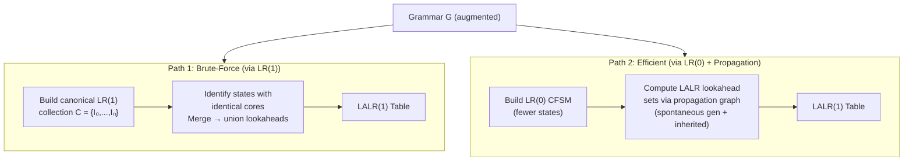
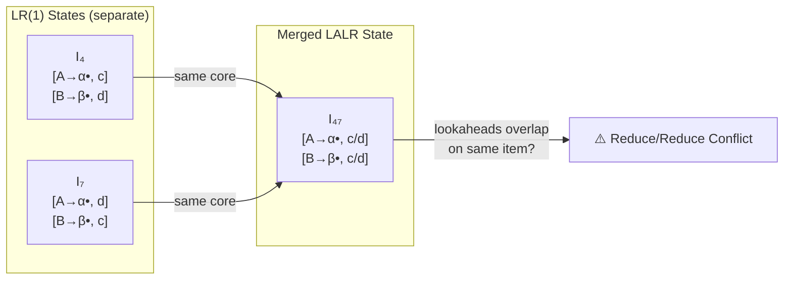
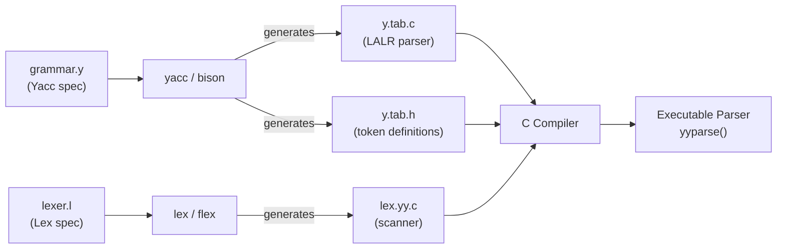
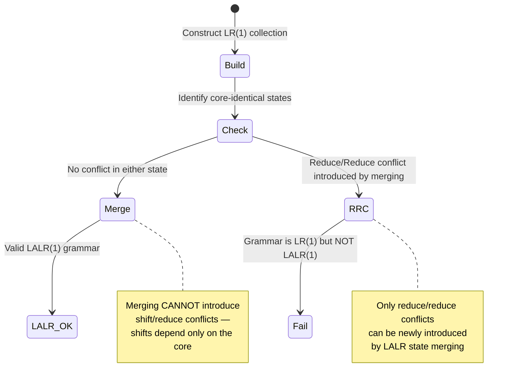

# 📄 LALR(1), Canonical LR(1), and Yacc

**Tags:** #compiler #parsing #LALR #LR1 #yacc #bison #lookahead #conflict-resolution
**Links:** [[Ch6-Bottom-Up-Parsing]], [[SLR Parsing]], [[FOLLOW Sets]], [[FIRST Sets]], [[Lex]], [[Symbol Table]]

---

## 🎯 The "Elevator Pitch"

> LALR(1) is the sweet spot of practical parsing: it squeezes LR(1)'s precise lookahead analysis into the same compact table size as LR(0)/SLR by merging states that share identical *cores* (LR(0) skeletons), then unioning their lookahead sets — and Yacc/Bison automates this whole pipeline, turning a grammar file into a working C parser.

---

## 🧠 Core Mechanics

### The LR Parser Family — Recap and Positioning

| Method | Items | Lookahead Source | #States | Power |
|---|---|---|---|---|
| **LR(0)** | $[A \to \alpha \bullet \beta]$ | None — reduce everywhere | $n$ | Weakest |
| **SLR(1)** | LR(0) items | $\text{FOLLOW}(A)$ — global over-approx. | $n$ | ⬆ |
| **LALR(1)** | LR(0) cores + propagated lookaheads | Per-state union of LR(1) lookaheads | $n$ | ⬆ (practical choice) |
| **LR(1)** | $[A \to \alpha \bullet \beta,\, a]$ | Per-item precise lookahead | $n'$ ($\gg n$) | Strongest |

All four methods share the same shift and GOTO behavior — they differ only in **where** and **when** they apply reduce actions.

---

## 🔬 LR(1) Items — Canonical LR

### What is an LR(1) Item?

An **LR(1) item** extends an LR(0) item with a **lookahead terminal**:

$$[A \to \alpha \bullet \beta,\; a]$$

- $A \to \alpha \bullet \beta$ — the core (same as LR(0))
- $a$ — the lookahead: this item is "active" only when the *next input symbol* is $a$

**Semantic:** The item $[A \to \alpha \bullet \beta, a]$ is valid for viable prefix $\gamma$ if there exists a rightmost derivation:

$$S' \Rightarrow^*_{rm} \delta A w \Rightarrow_{rm} \delta \alpha \beta w$$

where $\gamma = \delta\alpha$ and $a$ is either the first symbol of $w$, or $w = \varepsilon$ and $a = \$$.

A **reduce item** $[A \to \alpha \bullet, a]$ triggers a reduction *only* when the lookahead is $a$ — not for all terminals as in LR(0), and not for all $a \in \text{FOLLOW}(A)$ as in SLR.

### LR(1) Closure

```
Closure(I):
    result = I
    repeat:
        for each item [A → α • B β, a] in result:
            for each production B → γ:
                for each b in FIRST(βa):
                    add [B → • γ, b] if not already in result
    until no change
    return result
```

The key difference from LR(0) closure: the new lookahead is **$b \in \text{FIRST}(\beta a)$**, not an arbitrary terminal. This propagates lookahead information forward through the item set.

### LR(1) GOTO

$$\text{GOTO}(I, X) = \text{Closure}(\{[A \to \alpha X \bullet \beta, a] \mid [A \to \alpha \bullet X\beta, a] \in I\})$$

Identical structure to LR(0) GOTO — the lookahead $a$ simply rides along unchanged.

### LR(1) Table Construction

For each state $I_i$ in the canonical LR(1) collection:

| Condition | Table Entry |
|---|---|
| $[A \to \alpha \bullet a\beta,\, b] \in I_i$ and $\text{GOTO}(I_i, a) = I_j$ | $\text{ACTION}[i, a] = s_j$ |
| $[A \to \alpha \bullet,\, a] \in I_i$, $A \neq S'$ | $\text{ACTION}[i, a] = r_{A \to \alpha}$ |
| $[S' \to S \bullet,\, \$] \in I_i$ | $\text{ACTION}[i, \$] = \text{accept}$ |
| $\text{GOTO}(I_i, A) = I_j$ | $\text{GOTO}[i, A] = j$ |

Reduces are now conditioned on the **per-item lookahead**, not FOLLOW — this is why LR(1) resolves conflicts that SLR cannot.

---

## 🗺️ Visual Models

### The Two LALR Construction Paths



### State Merging in LALR



### Yacc/Bison Compilation Pipeline



### LALR Conflict Inheritance Property



---

## 📋 LALR(1) — Deep Dive

### The Core Insight: State Merging

Two LR(1) states are **core-identical** (can be merged) if their sets of LR(0) items (productions + dot positions, ignoring lookaheads) are identical. Their LALR(1) successor is formed by keeping the shared LR(0) skeleton and taking the **union** of all lookahead sets for each item.

**Key theorem:** Merging LR(1) states with identical cores **cannot introduce shift/reduce conflicts**. This is because shift actions depend solely on the core — a shift on symbol $a$ from state $I$ is valid in LR(1) if and only if it is valid in LALR(1). The only new conflicts possible from merging are **reduce/reduce conflicts**, when two items with the same core have lookaheads whose union now overlaps another reduce item's lookahead.

### The LALR Propagation Graph (Efficient Construction)

Instead of building the full LR(1) collection, build LALR lookaheads directly on LR(0) states using two channels:

1. **Spontaneous generation:** Lookahead $b$ for item $[B \to \bullet\gamma, b]$ in state $j$ arises spontaneously if $b \in \text{FIRST}(\beta a)$ for some item $[A \to \alpha \bullet B\beta, a]$ in state $i$ and $b \neq a$ (i.e., $b$ did not "come from" $a$).

2. **Propagation (inheritance):** Lookahead $a$ for $[B \to \bullet\gamma, a]$ propagates (is inherited) from $[A \to \alpha \bullet B\beta, a]$ when $\varepsilon \in \text{FIRST}(\beta)$, meaning the lookahead of the parent item passes through to the child item unchanged.

The propagation graph encodes these edges; a fixed-point computation over the graph gives the complete LALR lookahead sets without ever materializing the full LR(1) states.

### LALR vs SLR: Why LALR is Strictly Stronger

- **SLR** uses $\text{FOLLOW}(A)$ — a *global* set computed over the whole grammar. It is an over-approximation: it may include terminals that cannot actually follow $A$ in the specific parse context where the reduction occurs.
- **LALR** uses per-state, per-item lookahead sets — more precise because they reflect the specific viable prefixes that led to this state.
- Every SLR(1) grammar is LALR(1) (LALR can only be *more* precise, never less). The converse is false.

### The Canonical Example: LR(1) but NOT LALR(1)

The grammar $S \to aEb \mid aFc \mid bFb \mid bEc$, $E \to e$, $F \to e$ is LR(1) but not LALR(1). In LR(1), two states with core $[E \to e \bullet]$ and $[F \to e \bullet]$ have *disjoint* lookaheads $\{b\}$ and $\{c\}$ respectively. Merging into one LALR state gives lookaheads $\{b, c\}$ for **both** — a reduce/reduce conflict since the parser cannot decide to reduce to $E$ or $F$ when it sees $b$ or $c$.

---

## 🛠️ Yacc/Bison — The Practical Interface

### Yacc Specification File Structure

A `.y` file has three sections separated by `%%`:

```yacc
/* Section 1: Declarations */
%{
    /* C code included verbatim in y.tab.c */
%}
%token DIGIT LETTER   /* token declarations — copied to y.tab.h */
%left '+' '-'         /* precedence: lowest, left-associative */
%left '*' '/'         /* higher precedence, left-associative */
%right UMINUS         /* unary minus: highest, right-associative */
%%
/* Section 2: Grammar Rules + Semantic Actions */
expr : expr '+' expr  { $$ = $1 + $3; }
     | expr '*' expr  { $$ = $1 * $3; }
     | '(' expr ')'   { $$ = $2; }
     | DIGIT           { $$ = $1; }
     ;
%%
/* Section 3: Supporting C code */
int yyerror(char *s) { ... }
```

- `$$` = semantic value of the LHS (synthesized attribute)
- `$1`, `$2`, `$3` = semantic values of RHS symbols (left-to-right)
- Token values are communicated via `yylval` (set in the lexer before returning a token)

### Yacc Disambiguating Rules (All 6 — from the Dragon Book §4.9)

When conflicts arise, Yacc applies these rules in order:

| # | Conflict Type | Default Resolution |
|---|---|---|
| 1 | Shift/reduce (no precedence info) | **Shift** |
| 2 | Reduce/reduce (no precedence info) | **Reduce by earlier grammar rule** (textual order) |
| 3 | Token declaration | Record precedence/associativity via `%left`, `%right`, `%nonassoc` |
| 4 | Rule precedence | Rightmost terminal in RHS (overridable with `%prec TOKEN`) |
| 5 | Shift/reduce (both have precedence) | Higher precedence wins; on tie: left-assoc → reduce, right-assoc → shift, nonassoc → error |
| 6 | Otherwise | Apply rules 1 and 2 |

### Precedence and Associativity in Practice

Declarations are listed **lowest to highest** precedence (later lines = higher):

```yacc
%left  '+' '-'        /* lowest precedence, left-associative */
%left  '*' '/'        /* higher precedence, left-associative */
%right UMINUS         /* highest, right-associative (unary) */
```

A production's precedence defaults to the **rightmost terminal** in its RHS. Use `%prec` to override:

```yacc
expr : '-' expr %prec UMINUS  { $$ = -$2; }  /* unary minus gets UMINUS precedence */
```

**Conflict resolution example:** Parsing `1 + 2 * 3`:
- Stack has `1 + 2`, lookahead is `*`
- `*` has higher precedence than `+` → **shift** (correct: multiplication binds tighter)

### Lexer–Parser Interface

- The lexer (`yylex()`) returns a token name and stores its semantic value in `yylval`
- `y.tab.h` (generated by Yacc) declares `#define` constants for each named token
- The lexer `#include`s `y.tab.h` to use these constants
- `yyparse()` (the generated parser) calls `yylex()` to advance the input

---

## ⚠️ Edge Cases & Constraints

### What Merging Can and Cannot Do

- ✅ **Cannot** introduce shift/reduce conflicts (shifts are core-only operations)
- ❌ **Can** introduce reduce/reduce conflicts (lookahead union may create overlap)
- If a grammar is LR(1) but not LALR(1), the reduce/reduce conflict is real — not resolvable by precedence rules; the grammar needs rewriting or a full LR(1) parser

### The FOLLOW-vs-Lookahead Gap

SLR fails on some grammars not because the grammar is inherently ambiguous, but because `FOLLOW(A)` includes terminals that are impossible in the current parse context. LALR(1) avoids this by tracking per-state lookahead rather than a grammar-wide approximation. This is the most common cause of "SLR conflict, LALR(1) clean."

### Yacc Error Modes

- **Shift/reduce conflict with no precedence:** Yacc defaults to shift — this silently accepts potentially incorrect parses (dangling-else is the classic case)
- **Reduce/reduce conflict:** Yacc defaults to the earlier rule — **dangerous**, almost always indicates a grammar design error, not a benign default
- Both conflict types generate warnings in `-v` mode (verbose); inspect `y.output` to diagnose

### Non-LALR Grammars in Practice

Most real-world programming language constructs are LALR(1). Common exceptions include:
- Some natural expression grammars (fixable with operator precedence declarations in Yacc)
- Context-sensitive ambiguities (e.g., typedef name vs. variable name in C — handled via a "lexer hack")
- Some template/generic syntax in C++ (handled via parser state feedback to the lexer)

### Common Misconceptions

- **"LALR always has fewer states than SLR."** ❌ LALR and SLR have the *same* number of states (both built on LR(0) item sets). LALR has more precise (smaller) reduce lookahead sets per state, enabling fewer spurious reduce entries.
- **"Merging states can introduce shift/reduce conflicts."** ❌ Only reduce/reduce conflicts can be newly introduced. Proof: if $[A \to \alpha\bullet a\beta, c]$ is in a merged state, then $[A \to \alpha\bullet a\beta]$ was in the core of the original LR(1) state, so the shift on $a$ was already there.
- **"Yacc generates an LR(1) parser."** ❌ Yacc/Bison generate an **LALR(1)** parser. (Bison does have a `--language=lr` flag for full LR(1) since version 2.x, but LALR(1) is the default.)
- **"$1, $2, $3 count all symbols."** ✅ They do — including terminals. `$2` in `expr '+' expr` is the `'+'` token (usually ignored).

---

## 💻 Logical Code Snippet (Python)

```python
# LALR(1) construction via brute-force: build LR(1), then merge states with identical cores

def core(lr1_item_set):
    """Strip lookaheads — return the LR(0) skeleton of an LR(1) state."""
    return frozenset((prod, dot) for (prod, dot, _lookahead) in lr1_item_set)

def build_lalr_from_lr1(lr1_collection):
    """
    Merge LR(1) states that share identical cores.
    Returns a mapping: core → merged LR(1) state (with unioned lookaheads).
    """
    core_to_states = {}
    for state in lr1_collection:
        c = core(state)
        core_to_states.setdefault(c, []).append(state)

    merged = {}
    for c, states in core_to_states.items():
        # Union all lookaheads for each (prod, dot) pair
        item_dict = {}
        for state in states:
            for (prod, dot, la) in state:
                key = (prod, dot)
                item_dict.setdefault(key, set()).update(la)
        merged[c] = frozenset(
            (prod, dot, frozenset(la)) for (prod, dot), la in item_dict.items()
        )
    return merged

def check_conflicts(merged_state):
    """Detect reduce/reduce conflicts introduced by merging."""
    reduce_items = [
        (prod, la) for (prod, dot, la) in merged_state
        if dot == len(prod.rhs)  # dot at end → reduce item
    ]
    seen_lookaheads = {}
    for prod, la in reduce_items:
        for terminal in la:
            if terminal in seen_lookaheads:
                raise ValueError(
                    f"Reduce/reduce conflict: {prod} vs {seen_lookaheads[terminal]} on '{terminal}'"
                )
            seen_lookaheads[terminal] = prod
```

---

## ❓ Active Recall

### Definition Level
- [ ] What is an LR(1) item? How does it differ structurally from an LR(0) item, and what additional information does the lookahead carry?
- [ ] Define "core-identical" LR(1) states. What happens to the lookahead sets when they are merged?
- [ ] What does Yacc's `%prec` directive override, and why is it needed for unary operators?

### Mechanics Level
- [ ] Walk through the LR(1) Closure procedure. What is the formula for the new lookahead $b$ added to $[B \to \bullet\gamma, b]$?
- [ ] In the LALR propagation graph, distinguish *spontaneous generation* from *propagation (inheritance)* of lookaheads. Give an example of each.
- [ ] How does Yacc resolve a shift/reduce conflict when (a) both sides have precedence info, (b) neither side does?
- [ ] Why does a production's default precedence come from its **rightmost** terminal (not its leftmost)?

### Analysis Level
- [ ] A grammar is SLR(1)-conflicting but LALR(1)-clean. What does this tell you about the FOLLOW set vs. the per-state lookahead set for the problematic nonterminal?
- [ ] Two LR(1) states $I_4 = \{[A \to e\bullet, b], [B \to e\bullet, c]\}$ and $I_7 = \{[A \to e\bullet, c], [B \to e\bullet, b]\}$ are to be merged into LALR. What is the resulting merged state, and is there a conflict?
- [ ] Explain why LALR state merging cannot produce shift/reduce conflicts. Use the structure of shift actions (core-only) as your argument.

### Synthesis Level
- [ ] The grammar $S \to aEb \mid aFc \mid bFb \mid bEc$, $E \to e$, $F \to e$ is LR(1) but not LALR(1). Trace which two LR(1) states get merged and show exactly where the reduce/reduce conflict arises.
- [ ] Design the Yacc declarations (`%left`, `%right`, `%nonassoc`) needed to correctly handle the arithmetic grammar $E \to E+E \mid E*E \mid (E) \mid \text{id}$ with standard math precedence. Explain why the ambiguous grammar is acceptable in this context.
- [ ] Compare the three lookahead strategies — FOLLOW (SLR), union of LR(1) lookaheads (LALR), per-item LR(1) — as a hierarchy of precision. For what class of grammars does each boundary matter in practice?

---

## 📚 References

1. Aho, A. V., Lam, M. S., Sethi, R., & Ullman, J. D. *Compilers: Principles, Techniques, and Tools* (2nd ed., "Dragon Book"). Addison-Wesley, 2006. (Sections 4.7–4.9: Canonical LR, LALR, Yacc)
2. Knuth, D. E. *On the Translation of Languages from Left to Right*. Information and Control, 8:607–639, 1965. (Original LR(k) paper)
3. Stanford CS143 Course Notes (Summer 2012). *LALR Parsing* (Handout 14). https://web.stanford.edu/class/archive/cs/cs143/cs143.1128/handouts/140%20LALR%20Parsing.pdf
4. Stanford CS143 Course Notes (Summer 2005). *Introduction to Yacc and Bison* (Handout 13). https://edoras.sdsu.edu/doc/yacc-intro.pdf
5. EPFL LARA Course Notes. *LR Parsing with Lookahead Items*. https://lara.epfl.ch/w/compilation/lr_parsing_with_lookahead_items
6. GeeksforGeeks. *SLR, CLR and LALR Parsers*. 2025. https://www.geeksforgeeks.org/slr-clr-and-lalr-parsers-set-3/
7. Grokipedia. *LALR Parser*. 2026. https://grokipedia.com/page/LALR_parser
8. GNU Bison Manual. *The Bison Parser Algorithm* (Section 5). https://fog.misty.com/perry/osp/references/bison/by-chapter/bison_8.html
