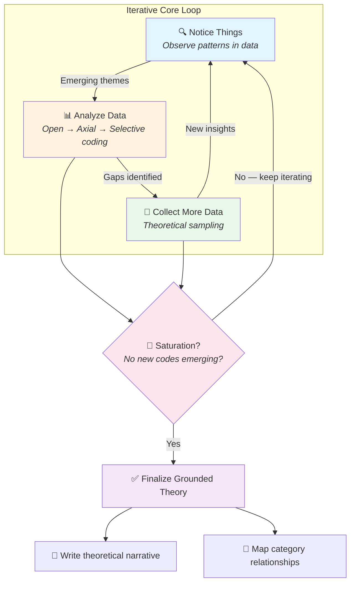

# 📄 Grounded Theory & Qualitative Interview Methods in HCI

**Tags:** #academic #hci #research-methods #qualitative-research #grounded-theory #interview-methods #human-ai-interaction
**Links:** [[Qualitative Research Methods]], [[Thematic Analysis]], [[User Experience Research]], [[Ethnography]], [[Human-Centered Design]]

---

## 🎯 The "Elevator Pitch"

> Grounded Theory is a method for *building* theories from real data rather than *testing* pre-existing ones. You talk to people, code what they say into labeled fragments, group those labels into patterns, and keep iterating until a coherent theory "emerges" from the ground up. It's detective work meets philosophy — you're discovering what people *actually* think, not confirming what you *assume* they think.

---

## 🧠 Core Mechanics

**Definition:**  
**Grounded Theory** is a systematic qualitative research methodology that develops theory *inductively* from empirical data through iterative cycles of data collection, coding, and analysis. Unlike hypothetico-deductive methods that start with a theory and seek to validate it, grounded theory starts with observations and generates explanatory frameworks that are "grounded" in the data itself.

**Key Components:**

1. **Iterative Data Collection-Analysis Loop:** You don't collect all data first and then analyze. Instead, early analysis *shapes* what data you collect next. This is called **theoretical sampling** — you pursue leads that emerge from your ongoing analysis.

2. **Coding as Conceptual Abstraction:** Raw data (interview transcripts, field notes) is segmented and labeled with codes. Codes are *conceptual handles* — abstract labels that capture the essence of a data fragment. The goal: transform messy reality into manipulable conceptual units.

3. **Saturation as Stopping Criterion:** Data collection ends when new interviews no longer produce new codes or insights. This is **theoretical saturation** — the theory has absorbed all the variation the data can offer.

---

## 🔀 The Three-Stage Coding Process

### 1. Open Coding — *Fracturing the Data*

**What it is:** Line-by-line examination of raw data, assigning conceptual labels to meaningful fragments. You're breaking the data into atomic units of meaning.

**Technique:**
- Read transcript closely
- Identify meaningful segments (a sentence, a paragraph, an idea)
- Assign a code — either **in vivo** (using the participant's own words) or **constructed** (your analytical label)

**Example from lecture:**
```
Interviewer: Tell me about teens and drug use.
Respondent: "I think teens use drugs as a release from their parents"

Codes assigned:
- ["rebellious act"]
- ["experience"]  
- ["drug talk"]
- ["negative connotation"]
```

**Critical Insight:** Open coding is *purposefully naive*. You resist imposing pre-existing categories. The goal is to let the data surprise you.

---

### 2. Axial Coding — *Reassembling Around Axes*

**What it is:** Finding relationships *between* codes. You're building structure — grouping codes into **categories**, identifying subcategories, and mapping how they relate.

**Technique:**
- Examine all your codes
- Ask: What codes naturally cluster together?
- Create category names that capture the *higher-order* concept

**Example:**
| Individual Codes | Category |
|------------------|----------|
| Email, Telephone Conversation, Text Message, Voice Mail | **Communication** |

**Critical Insight:** Axial coding is where interpretation intensifies. The same codes could be grouped differently depending on your analytical lens. This is why grounded theory acknowledges researcher subjectivity — *you* are the instrument.

---

### 3. Selective Coding — *Crystallizing the Core*

**What it is:** Identifying the **central category** — the conceptual backbone that links all other categories together. This becomes the foundation of your emergent theory.

**Technique:**
- Review all categories from axial coding
- Ask: What's the overarching story here? What single concept unifies everything?
- Eliminate categories that lack sufficient data support
- Refine until you have a coherent theoretical narrative

**Critical Insight:** Selective coding requires courage. You must *commit* to a theoretical interpretation, knowing it could be wrong. Grounded theory is theory-*generative*, not theory-*proving*.

---

## 🎙️ Interview Types as Data Collection Instruments

| Type | Structure | Best For | Tradeoffs |
|------|-----------|----------|-----------|
| **Unstructured** | No fixed questions; conversation flows freely | Exploratory research when you know little about the domain | High flexibility → High risk of missing key topics; Analysis is difficult |
| **Structured** | Fixed questions, fixed order, often fixed response options | Large-scale studies needing comparable data across participants | Easy analysis → No ability to pursue unexpected leads |
| **Semi-structured** | Topic guide with flexibility to probe | Most HCI research — you know *what* to ask but not *what they'll say* | Balanced flexibility and focus |

**Design Principle:** Your interview type should match your *epistemic situation*. Know nothing? Go unstructured. Know a lot? Go structured. Know the landscape but not the terrain? Go semi-structured.

---

## 🔗 Conceptual Connections

**Belongs to Paradigm:**  
Grounded theory emerges from **symbolic interactionism** in sociology — the view that meaning is socially constructed through interaction. It also aligns with **constructivist epistemology** — knowledge is not "discovered" but "constructed" through the research process.

**Contrasts With:**  
- **Hypothetico-deductive research:** Starts with theory, derives hypotheses, tests them. Grounded theory inverts this.
- **Content analysis:** Often applies *pre-existing* coding schemes. Grounded theory generates codes *de novo*.
- **Quantitative user research:** Prioritizes generalizability and statistical power. Grounded theory prioritizes depth and theoretical insight.

**Enables/Unlocks:**  
- **Theory generation in novel domains** — When no theory exists, you can build one from scratch.
- **Capturing user mental models** — You learn how *users* conceptualize their world, not how *you* do.
- **Informing design** — Rich qualitative insights can inspire design directions that surveys never reveal.

**Analogies:**
- *Paleontology:* Like assembling a dinosaur skeleton from scattered bones, you're reconstructing a coherent theory from fragmented data. You don't know what you're building until you've collected enough pieces.
- *Machine Learning (unsupervised):* Open coding is like clustering — you let structure emerge from the data rather than imposing labels. The "loss function" is theoretical coherence.

---

## 📜 Historical Context

| Era | Figure | Contribution | Context |
|-----|--------|--------------|---------|
| 1967 | **Barney Glaser & Anselm Strauss** | Published *The Discovery of Grounded Theory* | Reaction against "grand theories" in sociology that were untethered from data |
| 1990s | **Anselm Strauss & Juliet Corbin** | Developed more structured, prescriptive approach (Straussian GT) | Made grounded theory more teachable but more proceduralized |
| 2000s | **Kathy Charmaz** | Introduced **Constructivist Grounded Theory** | Acknowledged that theories are co-constructed by researcher and participant; embraced reflexivity |
| 2010s-present | HCI community adoption | Grounded theory becomes standard for qualitative HCI research | Need to understand user experience in complex, novel technologies (VR, AI, social media) |

---

## ⚠️ Edge Cases, Limits & Caveats

- **When it breaks down:** 
  - If you need *causal claims* or *generalizable statistics*, grounded theory cannot provide them. It generates hypotheses, not proofs.
  - If you have strong prior theoretical commitments, you may unconsciously force data into pre-existing categories — defeating the purpose.

- **Common misconceptions:** 
  - *"Grounded theory means having no theory in mind."* — Wrong. You can't enter the field as a blank slate. The goal is to remain *open* to revision, not to have zero prior knowledge.
  - *"Coding is mechanical labeling."* — Wrong. Coding is *interpretive*. Two researchers may code the same transcript differently — and that's epistemologically expected.

- **Open questions:** 
  - How do you achieve **theoretical saturation** in practice? It's often asserted, rarely operationalized rigorously.
  - Can AI assist in coding without distorting the interpretive process? (Active area of HAI research.)

---

## 💡 Deeper Insight: The Epistemological Tension in "Grounded" Theory

Here's a provocative observation the lecture doesn't make explicit:

Grounded theory claims to let theory "emerge" from data as if theories were *found* rather than *made*. But this obscures a deep philosophical tension. **Data doesn't speak for itself.** The act of coding — assigning labels — is an act of *interpretation*. When you label something "rebellious act," you've already imported a conceptual framework (sociology of deviance, parent-child dynamics, etc.).

**Charmaz's constructivist revision** addresses this by acknowledging: the "grounded theory" you produce is not *the* theory latent in the data. It's *a* theory, constructed by *you*, shaped by your disciplinary training, personal history, and analytical choices.

**Implication for HCI:** When you use grounded theory to study how users experience an AI chatbot, the "theory" you generate reflects not just user cognition but also *your* interpretive apparatus. This isn't a flaw — it's the nature of qualitative research. The rigor lies in *transparency*, not objectivity.

---

## 🔄 Grounded Theory as Iterative System



**Critical Pattern:** The triple feedback loop (notice → analyze → collect) is not a linear pipeline. You should expect to *revisit* early interviews after insights from later ones. This is why grounded theory is labor-intensive — iteration is not optional.

📌 **Note:** The diagram above uses Mermaid syntax, which renders natively in Obsidian. If viewing in a non-Mermaid environment, install a Mermaid plugin or view in Obsidian's reading mode.

---

## 🛠️ Practical Wisdom: Conducting Interviews

**Before:**
- Develop an **interview guide (訪綱)** — a topic roadmap, not a rigid script
- Prepare probing questions for when participants give brief answers
- Test your recording equipment

**During:**
- Build rapport early (casual conversation, interests)
- Don't fear silence — let participants fill it
- When they give short answers ("It was interesting"), probe: *"What made it interesting?"*
- Redirect gently when they drift off-topic
- Take live notes — you'll forget nuances by transcription time

**After:**
- Transcribe promptly (while memory is fresh)
- Begin coding immediately — don't wait until all interviews complete
- Keep a **memo** of emerging insights and questions for future interviews

**Handling Awkward Moments:**
> "The experiment was interesting."  
> *[Silence]*

Don't panic. Find a keyword ("interesting") and probe: *"What specifically struck you as interesting?"* Your job is to extract depth, not to fill dead air with your own talk.

---

## 🧰 Tools for Qualitative Analysis

| Tool | Use Case |
|------|----------|
| **Dedoose** | Cloud-based QDA; collaborative coding across teams |
| **NVivo** | Industry standard for complex qualitative projects |
| **Atlas.ti** | Visual network building for relationships between codes |
| **Miro / FigJam** | Affinity diagramming for physical/digital post-it coding |
| **Obsidian** | Note-based qualitative analysis for solo researchers |

**Tool-agnostic principle:** The tool should support, not constrain, your analytical thinking. If you're spending more time fighting the software than thinking about your codes, switch tools.

---

## 🧩 Relationship to Other Qualitative Methods

| Method | Key Difference from Grounded Theory |
|--------|-------------------------------------|
| **Thematic Analysis** | Can use pre-existing codebook; less committed to theory *generation* |
| **Phenomenology** | Focuses on *lived experience* rather than theory building; more philosophical |
| **Ethnography** | Emphasizes prolonged field immersion; grounded theory can work with shorter engagements |
| **Content Analysis** | Often quantifies code frequencies; grounded theory resists reducing meaning to numbers |

---

## ❓ Active Recall

### Factual
- [ ] What are the three stages of grounded theory coding?
- [ ] What is "theoretical saturation" and why does it matter?
- [ ] Who originated grounded theory and in what year?
- [ ] What distinguishes "in vivo" codes from constructed codes?

### Application
- [ ] You've conducted 12 interviews but keep encountering new themes. What should you do?
- [ ] A participant says "I just didn't trust it." What probing questions could deepen this response?
- [ ] You're studying how users interact with a new AI assistant. Would you use structured, semi-structured, or unstructured interviews? Justify.

### Critical Analysis
- [ ] Grounded theory claims theories "emerge" from data. What's philosophically problematic about this claim?
- [ ] Under what conditions would a quantitative survey be *better* than grounded theory interviews?
- [ ] Two researchers code the same transcript and produce different codebooks. Is this a validity problem or an expected feature? Defend your answer.
- [ ] How might AI-assisted coding tools (like LLM-based classifiers) change the epistemology of grounded theory?

### Synthesis
- [ ] How does grounded theory's iterative loop parallel reinforcement learning's explore-exploit tradeoff?
- [ ] If you had to explain grounded theory's philosophy to a positivist quantitative researcher, what would be your strongest argument for its rigor?

---

## 📚 Further Reading

- Charmaz, K. (2014). *Constructing Grounded Theory* (2nd ed.). Sage.
- Glaser, B. & Strauss, A. (1967). *The Discovery of Grounded Theory*. Aldine.
- Corbin, J. & Strauss, A. (2008). *Basics of Qualitative Research* (3rd ed.). Sage.
- Rogers, Y. (2012). *HCI Theory: Classical, Modern, and Contemporary*. Synthesis Lectures on Human-Centered Informatics.

---

## 🔮 Innovation Provocations

1. **AI-Augmented Grounded Theory:** Could an LLM serve as a "second coder" — proposing alternative codes that the human researcher didn't see? What would this do to the epistemological claim that theories emerge from *human* interpretation?

2. **Real-Time Coding Interfaces:** What if coding happened *during* the interview, with live suggestions appearing to the interviewer based on speech-to-text + semantic analysis? Would this accelerate insight or bias the inquiry?

3. **Grounded Theory for HAI:** As AI systems become conversational partners, how do we apply grounded theory to study *human-AI* interaction transcripts where the "participant" is partially synthetic?

4. **Saturation Metrics:** Can we operationalize theoretical saturation with information-theoretic measures (e.g., decreasing entropy of code distributions across successive interviews)? Would this strengthen or weaken the qualitative ethos?

5. **Cross-Cultural Coding:** Codes are linguistically and culturally situated. When coding interviews in Mandarin Chinese for an English-language publication, what gets lost in translation? Is there a "grounded theory" of coding across language barriers?


---

Participant Fee:
