# 📄 Model Context Protocol (MCP) — Deep Technical Note

**Tags:** #ai #protocol #mcp #function-calling #agents #interview-prep #systems-design #rest-api
**Links:** [[Function Calling]], [[JSON-RPC 2.0]], [[AI Agents]], [[Tool Use]], [[LLM Integration]], [[REST API]]

---

## 🎯 The "Elevator Pitch"

> MCP is a standardized, open protocol that lets AI applications connect to external tools and data sources in a **provider-agnostic, reusable, and discoverable** way — solving the M×N integration mess that raw function calling creates.

If function calling is "giving the LLM a remote control," MCP is "the universal wiring standard behind every outlet in the house."

---

## 🧠 Core Mechanics

### Definition

**Model Context Protocol (MCP)** is an open, JSON-RPC 2.0–based protocol created by Anthropic that standardizes how AI applications (hosts) communicate with external capability providers (servers). It separates the *language understanding* layer (the LLM) from the *execution* layer (tools, data, workflows), enabling modular, reusable, cross-model integrations.

---

### 🏗️ Architecture: The Three Participants

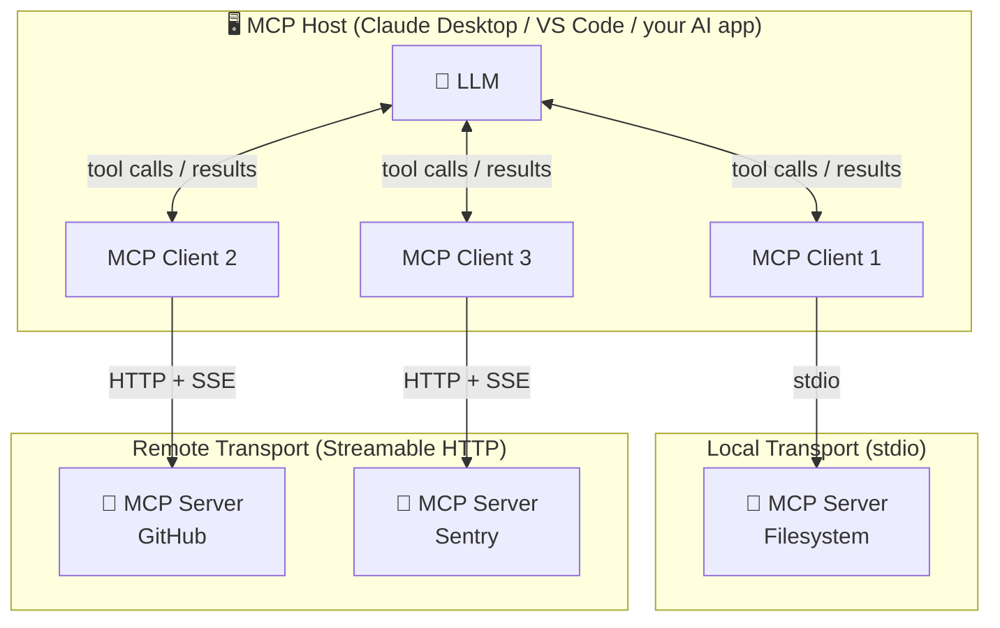

| Role | What It Is | Example |
|------|-----------|---------|
| **MCP Host** | The AI application that manages all clients | Claude Desktop, VS Code |
| **MCP Client** | 1-to-1 connector to a single MCP server; instantiated by the host | Internal session object |
| **MCP Server** | Standalone program exposing tools/resources/prompts | Filesystem server, GitHub server |

> **Critical nuance:** One host spawns *one client per server*. A host talking to 3 servers has exactly 3 client instances. The client is middleware; it is not the server.

---

### 🧅 Two Layers

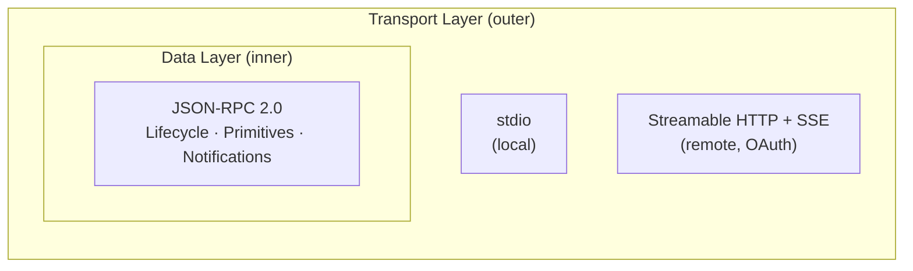

| Layer | Responsibility | Protocol |
|-------|---------------|----------|
| **Data Layer** | Message schema, semantics, primitives, lifecycle | JSON-RPC 2.0 |
| **Transport Layer** | Physical communication channel, auth, framing | stdio / Streamable HTTP |

**Transport options:**
- **stdio** — Standard I/O streams; used for local (same-machine) servers; zero network overhead; single client per server.
- **Streamable HTTP** — HTTP POST for client→server; Server-Sent Events (SSE) for server→client streaming; supports OAuth; used for remote servers; multi-client capable.

---

### 🧩 The Three Server Primitives

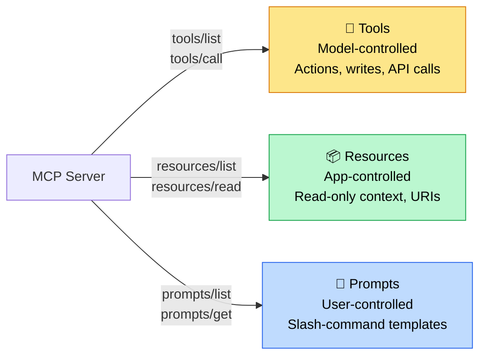

Everything a server exposes falls into one of three categories:

#### 1. 🔧 Tools — *Model-controlled, action-oriented*

- Functions the LLM *decides* to call based on context.
- Defined with JSON Schema (`inputSchema`).
- Can **write**, mutate state, call APIs.
- Discovery: `tools/list` → Execution: `tools/call`

```json
{
  "name": "searchFlights",
  "description": "Search for available flights between two cities",
  "inputSchema": {
    "type": "object",
    "properties": {
      "origin":      { "type": "string" },
      "destination": { "type": "string" },
      "date":        { "type": "string", "format": "date" }
    },
    "required": ["origin", "destination", "date"]
  }
}
```

#### 2. 📦 Resources — *Application-controlled, read-only context*

- Passive data sources with unique **URIs**; structured like REST endpoints.
- The *application* decides when to retrieve and inject them — not the LLM.
- Two patterns:
  - **Direct resources**: fixed URI → `calendar://events/2024`
  - **Resource templates**: parameterized URI → `weather://forecast/{city}/{date}`
- Supports **parameter completion** (like autocomplete for resource URIs).
- Methods: `resources/list`, `resources/templates/list`, `resources/read`, `resources/subscribe`

```
file:///Documents/resume.pdf    ← Direct
travel://flights/{from}/{to}    ← Template
```

#### 3. 📝 Prompts — *User-controlled, workflow templates*

- Pre-built, parameterized interaction templates exposed by the server.
- Think of them as slash commands (`/plan-vacation destination=Barcelona`).
- Explicitly invoked by the user — not auto-triggered by the LLM.
- Methods: `prompts/list`, `prompts/get`

---

### 🔄 Three Client Primitives

Servers can also *request things from the client* (bidirectional):

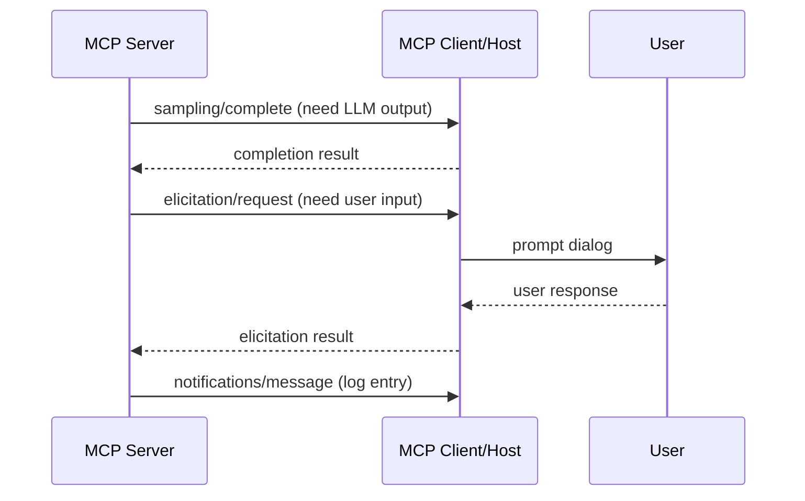

| Primitive | Purpose | Method |
|-----------|---------|--------|
| **Sampling** | Server asks the host LLM to generate a completion (server stays model-agnostic) | `sampling/complete` |
| **Elicitation** | Server requests additional input from the user | `elicitation/request` |
| **Logging** | Server sends log messages to the client for debugging | `notifications/message` |

> **Interview gold:** Sampling allows an MCP server author to leverage an LLM *without* bundling an LLM SDK in their server — they outsource generation back to the host. This is a clever inversion-of-control pattern.

---

### 🔁 Lifecycle: The Handshake

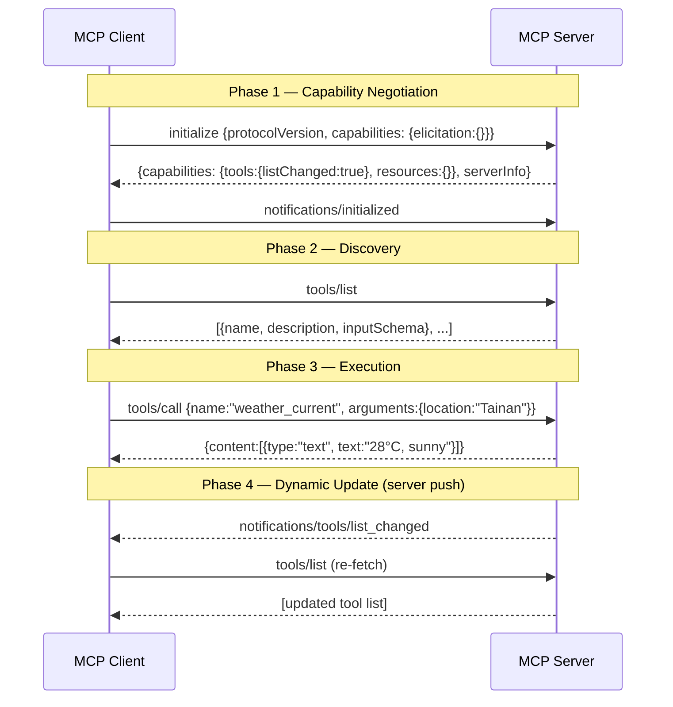

**Capability negotiation** is the key purpose of `initialize` — each party declares what primitives it supports. If the server says `"tools": { "listChanged": true }`, it's advertising it will send push notifications when its tool list changes.

---

### 📡 Notifications: The Event-Driven Layer

- JSON-RPC 2.0 notifications have **no `id` field** — no response expected.
- Allow servers to push state changes *proactively*.
- Key notification: `notifications/tools/list_changed` → client re-fetches `tools/list`.
- This eliminates polling — clients stay synchronized reactively.

---

## 🔗 Conceptual Connections

### The M×N Problem MCP Solves

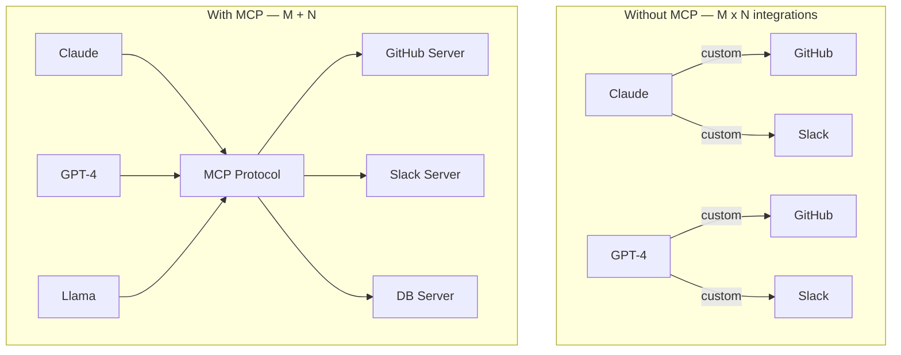

### Contrasts With: Function Calling

| Dimension | Function Calling | MCP |
|-----------|-----------------|-----|
| Architecture | Inline in LLM request | Separate client-server process |
| Scope | Single app | Cross-model, cross-app |
| Tool definition | Embedded in API call every time | Declared once on server, discoverable |
| Reusability | Low — per-project wiring | High — any MCP host can use the server |
| Vendor coupling | Yes (OpenAI schema ≠ Anthropic schema) | No — protocol is provider-agnostic |
| Dynamic tool updates | Manual re-declaration | Push notifications (`list_changed`) |
| Setup complexity | Low | Higher |
| Best for | Prototypes, simple single-model apps | Production, multi-model, enterprise |

> **Key mental model:** Function calling is the **moment** the LLM decides to use a tool. MCP is the **infrastructure** that makes tools discoverable, reusable, and standardized. They are complementary — inside MCP, the LLM still uses something like function calling to select tools. MCP is the outer shell.

### Protocol Stack: Where MCP Lives

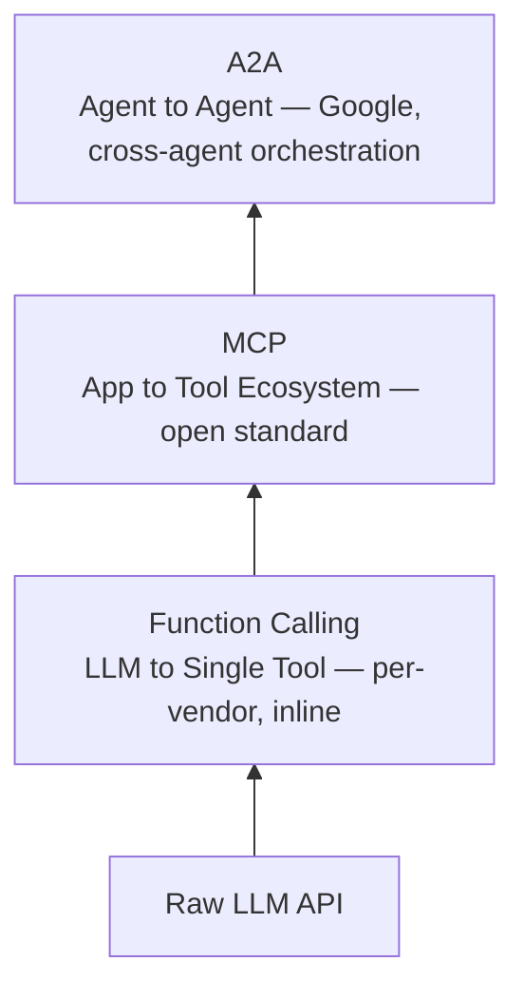

### Enables/Unlocks
- **Tool marketplaces** — publish an MCP server once, any model uses it.
- **Agentic workflows** — long-running, multi-step tasks with state.
- **Sampling inversion** — servers that are model-agnostic but still LLM-powered.
- **Real-time agent adaptation** — via `list_changed` notifications, agents can adapt to new capabilities mid-conversation.

---

## 📜 Historical Context

| Date | Event | Significance |
|------|-------|-------------|
| Nov 2024 | Anthropic open-sources MCP specification | First attempt at a universal tool protocol for LLMs |
| Early 2025 | OpenAI, Microsoft adopt MCP | Becomes de facto cross-industry standard |
| Mid 2025 | Google publishes A2A | Addresses agent-to-agent layer above MCP |
| 2025 | Streamable HTTP replaces deprecated SSE-only transport | More robust remote server support |

---

## ⚠️ Edge Cases, Limits & Caveats

**When it breaks down:**
- For tiny, one-off integrations, MCP setup overhead is wasteful — raw function calling is simpler.
- Remote MCP servers introduce **network latency** vs. local function calls.
- The ecosystem is still young; tooling and debugging support lag behind mature REST/RPC frameworks.

**Common misconceptions:**
- ❌ "MCP replaces function calling" — No. MCP *wraps* and *standardizes* function calling; the model still emits structured tool-call output internally.
- ❌ "Resources are like tools but read-only" — Partially correct, but the control plane differs: Resources are *application*-fetched, not *model*-invoked.
- ❌ "MCP is Anthropic-only" — It's an open standard; OpenAI, Google, and others support it.
- ❌ "One MCP server per host" — Hosts can connect to *many* servers, with one client per server.

**Open/Evolving areas:**
- **Tasks primitive** is experimental — meant for long-running, durable operations.
- Security model is still maturing; OAuth for remote servers is recommended but not always enforced.
- No standardized **multi-agent orchestration** within MCP itself (that's A2A's domain).

---

## 💡 Deeper Insight: MCP as an Inversion of Control

Function calling is **imperative**: the developer hardcodes which tools exist in every request. MCP is **declarative**: tools announce themselves, and hosts discover them dynamically.

This is architecturally analogous to **dependency injection** in software engineering. Instead of a service instantiating its own dependencies (function calling = `new DatabaseClient()`), dependencies are registered and injected at runtime (MCP = dependency container). The consumer (LLM) doesn't know or care how the tool is implemented — it just calls a known interface.

This has a profound implication: **the tool ecosystem can evolve independently from the AI application**. A new search tool can be published as an MCP server, and every MCP-compatible AI application gains access to it without a single code change. This is the path from "AI features in apps" to "AI as a composable operating system."

> 🤔 *Thought experiment*: If MCP became universally adopted, what would the "App Store for AI agents" look like? Tool authors publish MCP servers; agent developers subscribe to capability registries; pricing is per-tool-call. This is not hypothetical — it's the implied endgame of the MCP registry at `modelcontextprotocol.io/registry`.

---

## 💻 Formal Representation

### Full Tool Execution Flow (Python pseudocode)

```python
# HOST sets up MCP clients at startup
async def initialize_mcp():
    sessions = {}
    for server_config in config.mcp_servers:
        read, write = await open_transport(server_config)
        session = ClientSession(read, write)
        init_result = await session.initialize()
        sessions[server_config.name] = {
            "session": session,
            "capabilities": init_result.capabilities
        }
    return sessions

# Discovery: aggregate all tools from all servers
async def build_tool_registry(sessions) -> list[Tool]:
    all_tools = []
    for name, ctx in sessions.items():
        tools_response = await ctx["session"].list_tools()
        for tool in tools_response.tools:
            all_tools.append({**tool, "_server": name})
    return all_tools

# Execution: LLM emits tool call → host routes to correct server
async def handle_llm_tool_call(tool_name: str, arguments: dict, sessions):
    server_name = find_server_for_tool(tool_name)
    session = sessions[server_name]["session"]
    result = await session.call_tool(tool_name, arguments)
    # result.content is a list of content blocks: [{type: "text", text: "..."}]
    return result.content

# Notification handler: keep tool registry fresh
async def on_tools_list_changed(server_name: str):
    session = sessions[server_name]["session"]
    updated_tools = await session.list_tools()
    tool_registry.update(server_name, updated_tools)
    if active_conversation:
        active_conversation.update_llm_capabilities()
```

### JSON-RPC Wire Format (key messages)

```json
// 1. Client → Server: initialize
{ "jsonrpc": "2.0", "id": 1, "method": "initialize",
  "params": { "protocolVersion": "2025-06-18",
               "capabilities": { "elicitation": {} } } }

// 2. Server → Client: response
{ "jsonrpc": "2.0", "id": 1, "result": {
    "capabilities": { "tools": { "listChanged": true }, "resources": {} } } }

// 3. Client → Server: ready (notification — no id)
{ "jsonrpc": "2.0", "method": "notifications/initialized" }

// 4. Client → Server: list tools
{ "jsonrpc": "2.0", "id": 2, "method": "tools/list" }

// 5. Client → Server: call tool
{ "jsonrpc": "2.0", "id": 3, "method": "tools/call",
  "params": { "name": "weather_current",
               "arguments": { "location": "Tainan", "units": "metric" } } }

// 6. Server → Client: push notification (no id!)
{ "jsonrpc": "2.0", "method": "notifications/tools/list_changed" }
```

---

---

## 🆚 Deep Analysis: MCP vs. REST API

> This is a frequent interview curveball: "Why not just call a REST API directly from the LLM?" The answer reveals fundamental differences in *who the consumer is* and *what the interface is designed for*.

### 🎯 The Central Distinction in One Sentence

> **REST APIs are designed for humans (developers) who write code to call them. MCP servers are designed for LLMs (autonomous agents) that discover and call them at runtime — without a developer writing a single line of glue code per tool.**

---

### 🧭 Architectural Comparison

```mermaid
graph TB
    subgraph REST["REST API World"]
        Dev["Developer\nwrites code"]
        App["Application Code\nhardcoded HTTP calls"]
        RESTAPI["REST API Server\nGitHub, Stripe, etc."]
        Dev -->|reads docs, writes| App
        App -->|GET /repos POST /issues| RESTAPI
    end

    subgraph MCPWORLD["MCP World"]
        LLM2["LLM\nreads descriptions, decides"]
        HOST["MCP Host\nroutes calls"]
        MCPSRV["MCP Server\nexposes tools"]
        RESTAPI2["REST API\nor DB, filesystem"]
        LLM2 -->|tools/call based on intent| HOST
        HOST -->|JSON-RPC| MCPSRV
        MCPSRV -->|internally calls| RESTAPI2
    end
```

MCP servers *wrap* REST APIs — they translate a human-readable REST API into a machine-discoverable MCP interface. The REST API doesn't disappear; it gets encapsulated.

---

### 📐 Dimension-by-Dimension Deep Analysis

#### 1. Consumer Identity: Who Is the Caller?

| | REST API | MCP |
|--|---------|-----|
| **Primary caller** | Developer-written code (deterministic) | LLM at runtime (probabilistic, intent-driven) |
| **How caller knows what to call** | Developer reads docs, writes code once | LLM reads `description` field, decides dynamically |
| **Trust model** | Auth token — human is accountable | Host-mediated — *agent* is accountable, user approves |

This is the root difference. REST assumes a **human in the loop at design time**. MCP assumes **no human in the loop at runtime** — the agent must self-navigate.

#### 2. Discoverability: How Does the Caller Learn the Interface?

REST APIs have **OpenAPI / Swagger specs** — but these are static documentation artifacts written for developers to read once and code against.

MCP has **runtime discoverability** via `tools/list`. The LLM fetches the interface *dynamically* at every session start, so:
- New tools added to the server are **automatically available** to all agents.
- Tools removed are **automatically invisible** — no stale code to update.
- The LLM reads `description` and `inputSchema` and *semantically understands* how to call the tool.

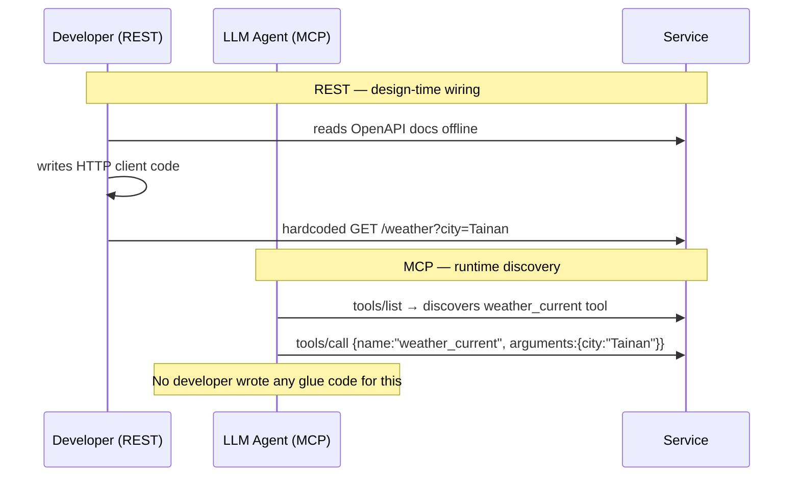

#### 3. Interface Contract: What Does the Interface Describe?

REST APIs describe **endpoints** — URLs, HTTP verbs, headers, status codes — designed for HTTP clients.

MCP describes **semantic capabilities** — what the tool *does* in plain language, plus JSON Schema for inputs — designed for LLMs that reason about *intent*, not URLs.

```json
// REST OpenAPI (for humans / code generators)
{
  "path": "/weather",
  "method": "GET",
  "parameters": [
    { "name": "city", "in": "query", "schema": { "type": "string" } }
  ]
}

// MCP tool definition (for LLMs — description is load-bearing)
{
  "name": "get_weather",
  "description": "Returns current weather for a city. Use when the user asks about weather conditions.",
  "inputSchema": {
    "type": "object",
    "properties": { "city": { "type": "string", "description": "City name" } },
    "required": ["city"]
  }
}
```

The `description` field in MCP is **semantically load-bearing** — it's what the LLM uses to *decide* whether to call this tool. In REST, documentation is optional decoration for humans; the client never reads it at runtime.

#### 4. Communication Style: Stateless vs. Stateful Session

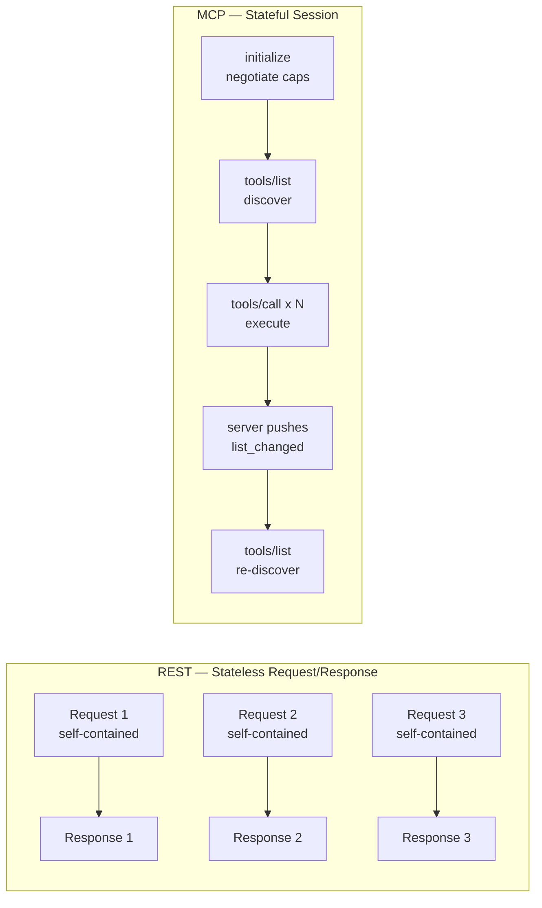

REST is **stateless** — each request carries all context, enabling horizontal scaling trivially.

MCP is **stateful** — there is a session with negotiated capabilities, and both sides maintain shared state. This statefulness enables:
- Server-initiated **push notifications** (impossible in pure REST without polling or WebSockets as bolt-ons).
- **Capability versioning** — both sides know exactly what the other supports.
- **Long-running task tracking** (Tasks primitive — experimental).

The tradeoff: MCP sessions are harder to scale horizontally than stateless REST endpoints.

#### 5. Security & Authorization Model

| Concern | REST API | MCP |
|---------|---------|-----|
| **Auth** | API key / OAuth token per request | OAuth recommended; host mediates all calls |
| **Human oversight** | None built-in | Consent gates — user can approve/deny tool executions |
| **Sandboxing** | Not in protocol | Each MCP server runs in isolated process |
| **Scope control** | Scoped tokens | Capability declarations during handshake limit exposure |

The key MCP insight: **the LLM is an untrusted runtime**. REST APIs were not designed to be called by probabilistic agents that might hallucinate arguments or call wrong endpoints. MCP adds a consent and governance layer *between* the LLM and execution — something REST was never designed to provide.

#### 6. Error Handling Philosophy

REST errors are HTTP status codes (`404`, `422`) — designed for developers to handle in code.

MCP errors are JSON-RPC error objects fed **back into the LLM's reasoning loop** so the agent can retry, reformulate, or explain to the user.

```json
// REST error — for developer exception handling
HTTP 422 { "error": "invalid_request", "message": "date must be YYYY-MM-DD" }

// MCP error — fed to LLM for self-correction
{ "jsonrpc": "2.0", "id": 3,
  "error": { "code": -32602,
              "message": "Invalid arguments: date must be in YYYY-MM-DD format" } }
```

#### 7. Bidirectionality

REST is unidirectional at the protocol level — the client always initiates. Server push requires bolt-ons (WebSockets, SSE, webhooks).

MCP has **bidirectionality built in** from the protocol level:
- Client → Server: `tools/call`, `resources/read`
- Server → Client: `notifications/tools/list_changed`, `sampling/complete`, `elicitation/request`

The server can ask *the LLM* for help (sampling) or ask *the user* for input (elicitation). This inversion is architecturally impossible in standard REST without significant custom scaffolding.

---

### 📊 Full Comparison Table

| Dimension | REST API | MCP |
|-----------|---------|-----|
| **Primary consumer** | Developer-written code | LLM agent at runtime |
| **Interface discovery** | Static docs (OpenAPI) | Dynamic runtime (`tools/list`) |
| **Interface language** | URL + HTTP verbs | Semantic descriptions + JSON Schema |
| **Session model** | Stateless | Stateful (negotiated session) |
| **Server push** | Bolt-on (WebSocket/SSE/webhook) | First-class (notifications) |
| **Bidirectionality** | No | Yes (sampling, elicitation) |
| **Human oversight** | None in protocol | Consent gates built-in |
| **Error consumer** | Developer code | LLM reasoning loop |
| **Auth** | Per-request tokens | Session-level OAuth |
| **Horizontal scaling** | Easy (stateless) | Harder (stateful sessions) |
| **Tool reusability** | Requires custom wrapper each time | Zero-code reuse across any MCP host |
| **Dynamic capability changes** | Manual code deploy required | `list_changed` notification + re-discover |

---

### 🗺️ When to Use What: Decision Map

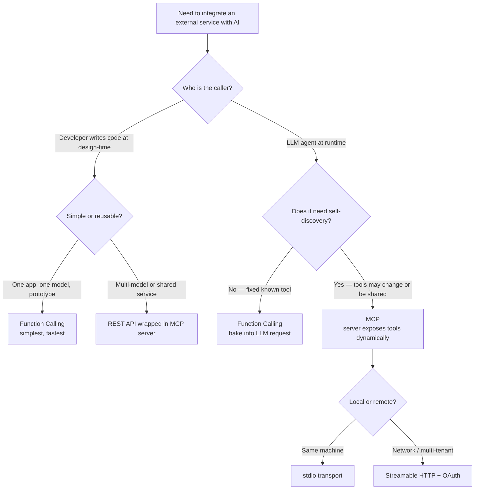

---

### 💡 The Synthesis: MCP Is Not a REST Replacement — It's a REST Adapter for Agents

The cleanest mental model: **REST APIs are the backend. MCP is the agent-facing adapter layer.**

```
User intent (natural language)
        ↓
      LLM  (decides which tool, with what args — like function calling internally)
        ↓
  MCP Host  (routes, handles consent, manages sessions)
        ↓
  MCP Server  (translates MCP → REST / DB / filesystem)
        ↓
  REST API / Database / Filesystem
```

MCP doesn't replace REST APIs. It wraps them to make them **agent-consumable** — adding discoverability, semantic descriptions, consent gates, bidirectionality, and session statefulness that REST was never designed to provide.

The best MCP servers are thin adapters: they expose existing APIs (GitHub REST API, Slack API, Stripe API) through the MCP interface, adding only the agent-specific layer on top. The REST API is the horse. MCP is the saddle that lets an LLM ride it.

---

## ❓ Active Recall

### Factual
- [ ] What are the three *server* primitives in MCP and who controls each one (model / application / user)?
- [ ] What is the difference between a Direct Resource and a Resource Template?
- [ ] What transport mechanisms does MCP support, and when would you use each?
- [ ] What does the `listChanged: true` capability declaration mean during initialization?
- [ ] What is the *Sampling* primitive and why would a server author use it?
- [ ] What is the role of the `description` field in a tool definition, and why doesn't REST have an equivalent?

### Application
- [ ] You're building a multi-tenant SaaS AI assistant that needs to use a Slack tool and a Jira tool, shared across 10 different AI models. Sketch the MCP architecture. Where are the servers? What does the host look like?
- [ ] A user asks the AI to "check if my PR was merged." The AI decides to call `github/getPRStatus`. Walk through the full MCP wire protocol from the moment the LLM decides to call the tool to when it gets the result.
- [ ] Your MCP server dynamically gains a new tool at runtime (e.g., a user enables a new integration). How does the connected client learn about this, and what does it do next?
- [ ] You have a Stripe REST API. Walk through the decision: should you expose it to your LLM via function calling, direct REST wrapper, or an MCP server? What factors drive each choice?

### Critical Analysis
- [ ] Function calling and MCP both let LLMs use tools. What's the *architectural* difference? When would you deliberately choose function calling over MCP in production?
- [ ] The *Sampling* primitive inverts control: a server asks the host LLM for a completion. What security/trust concerns does this raise?
- [ ] If MCP becomes universal, what is the implication for **vendor lock-in** when switching LLM providers? Is this fully solved?
- [ ] MCP says it "does not dictate how AI applications use LLMs or manage the provided context." Why is this a deliberate design choice, and what does it leave open?
- [ ] Compare MCP's role vs. A2A's role. Why can't MCP alone handle agent-to-agent collaboration?
- [ ] REST APIs are stateless by design (a strength for scalability). MCP sessions are stateful. What are the *tradeoffs* this introduces — for both scalability and correctness?
- [ ] A REST API uses HTTP status codes for errors; MCP feeds errors back as JSON-RPC objects. Why does this distinction matter specifically for *agentic* systems?
- [ ] Someone argues: "Just give the LLM the OpenAPI spec and let it call the REST API directly — no MCP needed." What are the concrete failure modes of this approach that MCP is designed to prevent?