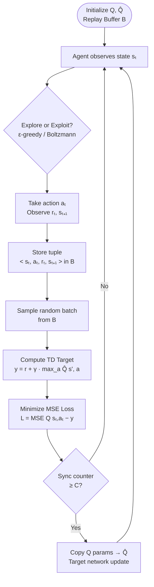

# 📄 Q-Learning & Deep Q-Networks (DQN)

**Tags:** #reinforcement-learning #value-based #Q-learning #DQN #temporal-difference #deep-RL
**Links:** [[Reinforcement Learning Fundamentals]], [[Policy Gradient Methods]], [[Temporal Difference Learning]], [[Actor-Critic Methods]], [[Markov Decision Processes]]

---

## 🎯 The "Elevator Pitch"

> Q-learning is a **value-based, model-free RL algorithm** that learns to score every (state, action) pair with a number — the expected future reward — and then greedily picks the highest-scoring action. No explicit policy network is learned; the policy *falls out* of the Q-function for free.

---

## 🧠 Core Mechanics

### 1. The Critic Paradigm: Value-Based vs. Policy-Based

In the **value-based** approach, instead of learning a policy π directly, we learn a **critic** — a function that *evaluates* how good a state or (state, action) pair is under a given policy π.

Two canonical critic functions exist:

| Critic | Input | Output | Meaning |
|---|---|---|---|
| **State Value Function** $V^\pi(s)$ | state $s$ | scalar | Expected cumulative reward starting from $s$, following $\pi$ to episode end |
| **State-Action Value Function** $Q^\pi(s, a)$ | state $s$, action $a$ | scalar | Expected cumulative reward if we **force** action $a$ at state $s$, then follow $\pi$ thereafter |

**Critical nuance:** A critic is *always tied to a specific actor* π. The same state $s$ can have vastly different $V^\pi(s)$ depending on whether π is expert or random. Evaluating a state's "inherent goodness" in isolation is meaningless.

#### Formal Definitions

$$V^\pi(s) = \mathbb{E}_\pi\left[\sum_{t=0}^{\infty} \gamma^t r_t \,\middle|\, s_0 = s\right]$$

$$Q^\pi(s, a) = \mathbb{E}_\pi\left[\sum_{t=0}^{\infty} \gamma^t r_t \,\middle|\, s_0 = s,\, a_0 = a\right]$$

where $\gamma \in [0, 1)$ is the **discount factor** that geometrically downweights future rewards (handles infinite-horizon problems and encodes time-preference).

**Relationship between $V$ and $Q$:**

$$V^\pi(s) = Q^\pi(s, \pi(s))$$

This only holds when the action taken *is* what π would choose. If the action is forced to some $a \neq \pi(s)$, then $Q^\pi(s, a) \neq V^\pi(s)$ in general.

---

### 2. Estimating the Value Function: MC vs. TD

Two families of methods estimate $V^\pi$ or $Q^\pi$ from experience. Their trade-off is fundamental.

#### 2a. Monte Carlo (MC)

Run a full episode. Compute the actual **cumulative return** $G_t$ from state $s_t$ to episode termination:

$$G_t = r_t + \gamma r_{t+1} + \gamma^2 r_{t+2} + \cdots = \sum_{k=0}^{T-t} \gamma^k r_{t+k}$$

Treat it as a regression target:

$$\mathcal{L} = \left(V^\pi_\theta(s_t) - G_t\right)^2$$

**Why MC has high variance:** $G_t$ is the sum of many random variables. If each step reward $r$ has variance $\sigma^2$, then summing $T$ such rewards yields variance on the order of $T\sigma^2$ (by the identity $\text{Var}(kX) = k^2 \text{Var}(X)$). Every noisy step propagates into $G_t$.

**Practical constraint:** Requires complete episodes, making it unsuitable for long-horizon or continuing tasks.

#### 2b. Temporal Difference (TD)

Instead of waiting for the episode to end, bootstrap from the *next step* using the **Bellman consistency equation**:

$$V^\pi(s_t) = r_t + \gamma \, V^\pi(s_{t+1})$$

This is a recursive identity: the value of a state equals immediate reward plus discounted value of the successor. The TD update minimizes:

$$\mathcal{L} = \left(V^\pi_\theta(s_t) - \left[r_t + \gamma V^\pi_\theta(s_{t+1})\right]\right)^2$$

The bracketed term is called the **TD target**. Only one-step reward $r_t$ is observed; the rest is estimated from the current value network.

**Why TD has lower variance but bias:** The target uses only a single reward $r_t$ (low variance), but the bootstrapped $V^\pi_\theta(s_{t+1})$ may be inaccurate (introducing **bias** when $V_\theta$ is far from the true $V^\pi$).

#### MC vs. TD Summary

| Property | MC | TD |
|---|---|---|
| Variance | **High** (sum of many random rewards) | **Low** (single-step reward) |
| Bias | **Unbiased** (uses actual returns) | **Biased** (bootstraps from imperfect estimate) |
| Data requirement | Full episodes required | Single transitions suffice |
| Common usage | Rare in practice | **Dominant approach** |

**Practical hybrid — TD(λ):** Interpolates between 1-step TD and full MC by blending multi-step returns. Controls the bias-variance trade-off via λ ∈ [0, 1] (λ=0 → TD, λ=1 → MC).

#### MC vs. TD: A Divergence Example

Consider a critic observing 8 episodes. State $s_a$ appears once, always followed by $s_b$; the single trajectory through $s_a$ ends with total reward 0. State $s_b$ appears in all 8 episodes, getting reward 1 six times and reward 0 twice (expected value = 3/4).

- **MC estimate of** $V^\pi(s_a)$: Observes exactly one episode through $s_a$ with total return 0 → $V^\pi(s_a) = 0$. MC **attributes the bad outcome to $s_a$ itself**.
- **TD estimate of** $V^\pi(s_a)$: Uses $V^\pi(s_a) = r + \gamma V^\pi(s_b) = 0 + \frac{3}{4} = \frac{3}{4}$. TD **separates the transition reward from $s_b$'s own value**.

Neither is "wrong" — they make different assumptions about whether $s_a$ causally affects $s_b$'s outcomes. TD is more statistically principled when the visit through $s_a$ was a small, possibly noisy sample.

---

### 3. The Q-Function: From Critic to Controller

Unlike $V^\pi(s)$, the **Q-function** $Q^\pi(s, a)$ enables *action selection* without a separate policy network. Two architectural flavors:

```
Flavor 1 (general):       Input: (s, a) ──► Q-network ──► scalar Q(s, a)
Flavor 2 (discrete only): Input: s      ──► Q-network ──► [Q(s,a₁), Q(s,a₂), ..., Q(s,aₙ)]
```

Flavor 2 is computationally efficient for discrete actions (single forward pass evaluates all actions simultaneously). It is inapplicable to continuous action spaces since the output dimensionality would be infinite.

---

### 4. Policy Improvement via Q-Functions

The core Q-learning loop exploits a powerful theoretical guarantee: **given $Q^\pi$, we can always find a strictly better policy $\pi'$**.

Define:

$$\pi'(s) = \arg\max_a Q^\pi(s, a)$$

**Theorem (Policy Improvement):** For all states $s$:

$$V^{\pi'}(s) \geq V^\pi(s)$$

#### Proof Sketch

**Step 1:** By definition, $V^\pi(s) = Q^\pi(s, \pi(s))$.

**Step 2:** Since $\pi'$ picks the action maximizing $Q^\pi$:

$$Q^\pi(s, \pi(s)) \leq \max_a Q^\pi(s, a) = Q^\pi(s, \pi'(s))$$

So $V^\pi(s) \leq Q^\pi(s, \pi'(s))$.

**Step 3 (expand by Bellman):** $Q^\pi(s, \pi'(s))$ equals the expected reward from taking $\pi'(s)$ *once*, then following $\pi$ from $s_{t+1}$ onward:

$$Q^\pi(s, \pi'(s)) = \mathbb{E}\left[r_t + \gamma V^\pi(s_{t+1})\right]$$

**Step 4 (apply Step 2 recursively):** Since $V^\pi(s_{t+1}) \leq Q^\pi(s_{t+1}, \pi'(s_{t+1}))$:

$$\mathbb{E}\left[r_t + \gamma V^\pi(s_{t+1})\right] \leq \mathbb{E}\left[r_t + \gamma Q^\pi(s_{t+1}, \pi'(s_{t+1}))\right]$$

Expanding $Q^\pi(s_{t+1}, \pi'(s_{t+1}))$ again by Bellman and continuing this unrolling recursively through all future steps yields:

$$V^\pi(s) \leq \mathbb{E}_{\pi'}\left[\sum_{k=0}^{\infty} \gamma^k r_{t+k} \,\middle|\, s_t = s\right] = V^{\pi'}(s)$$

**Intuition:** Even replacing π with π' for *a single step* already improves outcomes. Replacing it at *every step* produces the full improvement $V^{\pi'}(s) \geq V^\pi(s)$. $\pi'$ is never an independent network — it is simply the *greedy policy derived from Q*.

#### Q-Learning Iterative Loop

```
Initialize π (random)
Repeat until convergence:
    1. Interact with env using π → collect data
    2. Learn Q^π (via TD or MC)
    3. π' ← greedy policy from Q^π  [π'(s) = argmax_a Q^π(s,a)]
    4. π ← π'
```

This forms a **policy iteration** cycle guaranteed to monotonically improve π at each step.

---

## 🗺️ Visual Model

### Q-Learning Algorithm Flow



### State-Value vs. Q-Value Relationship

```mermaid
stateDiagram-v2
    direction LR
    [*] --> State_s
    State_s --> Action_forced: Q(s,a): force action a
    State_s --> Action_policy: V(s): follow π
    Action_forced --> Reward_Q: r_t + γ·V^π(s_{t+1})
    Action_policy --> Reward_V: r_t + γ·V^π(s_{t+1})
    note right of Action_forced: π not necessarily\ntaken at s
    note right of Action_policy: π always taken;\nQ(s, π(s)) = V(s)
```



---

### 5. DQN Engineering: Three Essential Stabilization Tricks

#### Trick 1 — Target Network

**Problem:** In the naive TD update, both the "prediction" and the "target" are outputs of the *same* network being optimized simultaneously:

$$\mathcal{L} = \left(Q_\theta(s_t, a_t) - \left[r_t + \gamma \max_{a'} Q_\theta(s_{t+1}, a')\right]\right)^2$$

As $Q_\theta$ improves, the target $r_t + \gamma \max_{a'} Q_\theta(s_{t+1}, a')$ *also shifts* — you're chasing a moving target. This creates feedback loops and training instability, analogous to trying to hit a target that darts away every time you fire.

**Solution:** Maintain a **frozen copy** $\hat{Q}$ (the target network) used only for target computation. Only $Q_\theta$ receives gradient updates. Every $C$ steps (e.g., $C = 100$), hard-copy $Q_\theta \to \hat{Q}$:

$$\mathcal{L} = \left(Q_\theta(s_t, a_t) - \underbrace{\left[r_t + \gamma \max_{a'} \hat{Q}(s_{t+1}, a')\right]}_{\text{fixed target from } \hat{Q}}\right)^2$$

The target network provides stable target values over several training iterations, preventing drastic changes in Q-values that would destabilize learning. The prediction and target never collapse to equality because their inputs differ: prediction uses $(s_t, a_t)$ while target uses $(s_{t+1}, a')$.

**Soft update variant (Polyak averaging):** Instead of hard copy every $C$ steps, continuously blend:
$$\hat{\theta} \leftarrow \tau \theta + (1 - \tau)\hat{\theta}, \quad \tau \ll 1$$
This is used in DDPG and SAC for smoother target tracking.

#### Trick 2 — Experience Replay Buffer

**Problem:** Consecutive transitions $(s_t, a_t, r_t, s_{t+1})$ in online RL are **temporally correlated** — the agent is locally exploring one region of state space. Training a neural net on highly correlated, sequential batches leads to unstable updates and catastrophic interference.

**Solution:** Maintain a **circular replay buffer** $\mathcal{B}$ of capacity $N$ (e.g., $N = 50,000$). At each step, store the transition. At each training step, **sample a random minibatch** from $\mathcal{B}$:

```
B = {(s_i, a_i, r_i, s'_i) : i sampled uniformly from B}
```

Benefits:
1. **Breaks temporal correlation** → more i.i.d.-like minibatches for stable gradient descent
2. **Sample efficiency** → each transition can be replayed multiple times (the most expensive operation in RL is environment interaction, not gradient computation)
3. **Data diversity** → a batch spans many different policies' experience, improving generalization

**Off-policy subtlety:** The replay buffer mixes data from multiple past policies. This technically makes DQN off-policy. However, this is valid: we're estimating $Q^\pi$ using TD updates that require only individual transitions $(s, a, r, s')$, not full trajectories. The Bellman equation holds per-transition regardless of which policy generated the data — unlike policy gradient methods that require on-policy trajectory samples.

#### Trick 3 — Exploration Strategy

**Problem:** A greedy policy ($\arg\max_a Q(s, a)$) is **deterministic**. If action $a_2$ is sampled first and yields positive reward, all future decisions at that state will always pick $a_2$. Actions $a_1, a_3$ are never revisited — Q-values for unvisited (s, a) pairs remain at initialization and may be incorrect.

Two standard solutions:

**ε-Greedy:**

$$a_t = \begin{cases} \arg\max_a Q(s_t, a) & \text{with probability } 1 - \varepsilon \\ \text{random action} & \text{with probability } \varepsilon \end{cases}$$

In practice, $\varepsilon$ is **annealed** from ~1.0 (pure exploration) to ~0.01 (mostly exploitation) over training. Early training requires broad exploration; later training refines the policy.

**Boltzmann (Softmax) Exploration:**

$$P(a \mid s) = \frac{\exp(Q(s, a) / \tau)}{\sum_{a'} \exp(Q(s, a') / \tau)}$$

Temperature $\tau$ controls the spread: high $\tau$ → near-uniform (explore), low $\tau$ → near-greedy (exploit). This is principled — it proportionally favors higher Q-value actions rather than treating all non-greedy actions equally. Analogous to the action sampling in policy gradient methods.

---

## ⚠️ Edge Cases & Constraints

- **Q-value overestimation in DQN:** The $\max$ operator in the TD target selects the *highest estimated Q*, which biases targets upward due to estimation noise. **Double DQN** (van Hasselt et al., 2016) decouples action selection from value estimation to correct this: use $Q_\theta$ to select the action, use $\hat{Q}$ to evaluate it → $y = r + \gamma \hat{Q}(s', \arg\max_{a'} Q_\theta(s', a'))$.

- **Continuous action spaces:** The $\arg\max_a Q(s,a)$ step is intractable for continuous $a$ (infinite search space). Solutions include: (a) **DDPG** — learn a separate deterministic actor $\mu_\phi(s)$ to approximate $\arg\max$; (b) **NAF** (Normalized Advantage Functions) — parameterize Q as a quadratic in $a$ so the max is analytic.

- **Deadly Triad (Sutton & Barto):** Combining function approximation + bootstrapping + off-policy learning can cause divergence even with a target network. The target network reduces but does not eliminate this risk. Linear function approximators have convergence guarantees; deep networks do not in general.

- **Sparse reward environments:** If most transitions have $r=0$, Q-values propagate slowly (require many Bellman backups to convey signal from rare rewarding transitions). Techniques: reward shaping, hindsight experience replay (HER), intrinsic motivation (curiosity-based rewards).

- **Partial observability:** Q-learning assumes fully observable states (Markov property). In POMDPs, the agent receives observations, not full states. Solutions: stack recent frames (original DQN stacks 4 frames), use recurrent networks (DRQN with LSTM).

- **Replay buffer stale data:** Very old transitions may reflect an actor so different from the current one that they distort Q estimates. Prioritized Experience Replay (PER, Schaul et al. 2016) addresses this by sampling transitions proportional to TD error magnitude rather than uniformly.

---

## 💻 Logical Code Snippet (Python)

```python
import random
from collections import deque
import numpy as np

# ── Q-network (conceptual placeholder) ──────────────────────────────────────
class QNetwork:
    def __init__(self, state_dim, action_dim):
        # In practice: torch.nn.Sequential or similar deep network
        self.weights = np.random.randn(state_dim, action_dim) * 0.01

    def forward(self, state):
        # Returns Q(s, a) for all actions simultaneously
        return state @ self.weights  # shape: (action_dim,)

    def copy_from(self, other):
        self.weights = other.weights.copy()


# ── Replay Buffer ────────────────────────────────────────────────────────────
class ReplayBuffer:
    def __init__(self, capacity=50_000):
        self.buffer = deque(maxlen=capacity)  # FIFO: oldest evicted when full

    def push(self, s, a, r, s_next):
        self.buffer.append((s, a, r, s_next))

    def sample(self, batch_size):
        # Random sampling breaks temporal correlation
        batch = random.sample(self.buffer, batch_size)
        s, a, r, s_next = zip(*batch)
        return np.array(s), np.array(a), np.array(r), np.array(s_next)

    def __len__(self):
        return len(self.buffer)


# ── DQN Training Loop ────────────────────────────────────────────────────────
def dqn_training(env, state_dim, action_dim,
                 gamma=0.99, epsilon=1.0, epsilon_min=0.01,
                 epsilon_decay=0.995, batch_size=32, sync_every=100):

    Q       = QNetwork(state_dim, action_dim)   # Online network (trained)
    Q_hat   = QNetwork(state_dim, action_dim)   # Target network (frozen)
    Q_hat.copy_from(Q)                          # Initialize identically

    buffer  = ReplayBuffer(capacity=50_000)
    step    = 0

    for episode in range(1000):
        s = env.reset()

        while True:
            # ── Exploration: ε-greedy ────────────────────────────────────
            if random.random() < epsilon:
                a = env.sample_random_action()              # Explore
            else:
                q_vals = Q.forward(s)
                a = np.argmax(q_vals)                       # Exploit

            s_next, r, done = env.step(a)

            # ── Store transition ──────────────────────────────────────────
            buffer.push(s, a, r, s_next)
            s = s_next
            step += 1

            # ── Training step (once buffer has enough data) ───────────────
            if len(buffer) >= batch_size:
                S, A, R, S_next = buffer.sample(batch_size)

                # TD target computed using FROZEN Q_hat (not Q)
                # This is the key stabilization: target doesn't move during training
                q_next    = Q_hat.forward(S_next)             # shape: (B, |A|)
                td_target = R + gamma * np.max(q_next, axis=1) # shape: (B,)

                # Prediction from online Q
                q_pred    = Q.forward(S)                       # shape: (B, |A|)
                q_pred_sa = q_pred[np.arange(batch_size), A]  # Q(sᵢ, aᵢ)

                # Regression loss (MSE); gradient only through Q, not Q_hat
                loss = np.mean((q_pred_sa - td_target) ** 2)
                # In practice: loss.backward(); optimizer.step()

            # ── Sync target network every C steps ────────────────────────
            if step % sync_every == 0:
                Q_hat.copy_from(Q)           # Hard copy: θ̂ ← θ

            # ── Anneal epsilon ────────────────────────────────────────────
            epsilon = max(epsilon_min, epsilon * epsilon_decay)

            if done:
                break

    return Q


# ── Policy extraction (no separate network needed!) ──────────────────────────
def greedy_policy(Q, state):
    """π'(s) = argmax_a Q(s, a) — policy improvement step."""
    q_vals = Q.forward(state)
    return np.argmax(q_vals)


# ── Boltzmann exploration (alternative to ε-greedy) ──────────────────────────
def boltzmann_action(Q, state, temperature=1.0):
    """Sample action proportional to exp(Q(s,a)/τ) — softer than greedy."""
    q_vals = Q.forward(state)
    # Subtract max for numerical stability before softmax
    logits = (q_vals - np.max(q_vals)) / temperature
    probs  = np.exp(logits) / np.sum(np.exp(logits))
    return np.random.choice(len(q_vals), p=probs)
```

---

## ❓ Active Recall

### Factual

- [ ] What is the formal definition of $Q^\pi(s, a)$, and how does it differ from $V^\pi(s)$?
- [ ] Why is a critic always "tied to an actor π"? What breaks if you ignore this?
- [ ] State the Bellman consistency equation for $V^\pi(s)$ and explain the intuition behind it.
- [ ] What is the role of the target network, and why does updating it every step (rather than every $C$ steps) cause training instability?
- [ ] Why does ε-greedy exploration anneal ε over time rather than keeping it fixed?

### Application

- [ ] Given $Q^\pi(s, \cdot) = [2.1, 0.5, 1.8]$ for actions $[a_1, a_2, a_3]$, what does $\pi'(s)$ choose? What does the Boltzmann distribution at $\tau = 0.5$ give approximately?
- [ ] Explain in your own words why experience replay makes DQN off-policy, and why this is theoretically acceptable.
- [ ] Draw the update graph for a DQN with a target network: which parameters receive gradients, which are frozen, and when does copying occur?
- [ ] In a continuous action space, why does $\arg\max_a Q(s, a)$ break down, and what architectural change does DDPG make to fix this?

### Critical Analysis

- [ ] The MC and TD estimates of $V^\pi(s_a)$ differ in the example given in class. Which is more statistically principled with limited data, and under what assumptions does each "win"?
- [ ] The Deadly Triad (function approximation + bootstrapping + off-policy) can cause divergence. Which of the three does the target network address? Which does replay buffer address? What remains unaddressed?
- [ ] Double DQN claims DQN overestimates Q-values. Construct a toy example where $\max_{a'} Q(s', a')$ introduces positive bias, and explain why decoupled selection/evaluation corrects it.
- [ ] If the replay buffer's oldest data comes from a policy very different from the current one, can TD updates on this data still theoretically converge to $Q^\pi_\text{current}$? Why or why not?

---

## 📚 References

1. Watkins, C.J.C.H. & Dayan, P. *Q-Learning*. Machine Learning, 8(3–4):279–292, 1992. [https://www.gatsby.ucl.ac.uk/~dayan/papers/cjch.pdf](https://www.gatsby.ucl.ac.uk/~dayan/papers/cjch.pdf) — The original convergence proof showing Q-learning reaches optimal action-values with probability 1, given all state-action pairs are visited infinitely often.

2. Mnih, V., Kavukcuoglu, K., Silver, D., et al. *Human-level control through deep reinforcement learning*. Nature 518, 529–533, 2015. [https://doi.org/10.1038/nature14236](https://doi.org/10.1038/nature14236) — The landmark DQN paper introducing experience replay and target networks to stabilize deep Q-learning on Atari.

3. Weng, L. *A (Long) Peek into Reinforcement Learning*. Lil'Log, 2018. [https://lilianweng.github.io/posts/2018-02-19-rl-overview/](https://lilianweng.github.io/posts/2018-02-19-rl-overview/) — Comprehensive overview of RL foundations including value functions, TD methods, and Q-learning.

4. Regehr, M.T. & Ayoub, A. *An Elementary Proof that Q-learning Converges Almost Surely*. arXiv:2108.02827, 2021. [https://arxiv.org/abs/2108.02827](https://arxiv.org/abs/2108.02827) — A self-contained proof of convergence for Q-learning using minimal external theory.

5. Yang, Z., Xie, Y. & Wang, Z. *A Theoretical Analysis of Deep Q-Learning*. arXiv:1901.00137, 2019. [https://arxiv.org/pdf/1901.00137](https://arxiv.org/pdf/1901.00137) — First theoretical analysis establishing algorithmic and statistical convergence rates for DQN.

6. Sutton, R.S. & Barto, A.G. *Reinforcement Learning: An Introduction*, 2nd ed. MIT Press, 2018. [http://incompleteideas.net/book/the-book-2nd.html](http://incompleteideas.net/book/the-book-2nd.html) — The canonical RL textbook; covers MC, TD, and Q-learning in Chapters 5–6.

7. van Hasselt, H., Guez, A. & Silver, D. *Deep Reinforcement Learning with Double Q-learning*. AAAI 2016. [https://arxiv.org/abs/1509.06461](https://arxiv.org/abs/1509.06461) — Addresses DQN's systematic Q-value overestimation via decoupled action selection and evaluation.

8. Schaul, T., Quan, J., Antonoglou, I. & Silver, D. *Prioritized Experience Replay*. ICLR 2016. [https://arxiv.org/abs/1511.05952](https://arxiv.org/abs/1511.05952) — Non-uniform replay sampling proportional to TD error, accelerating learning from informative transitions.
