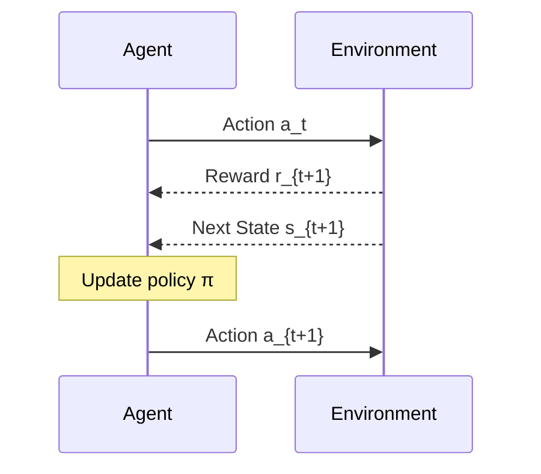
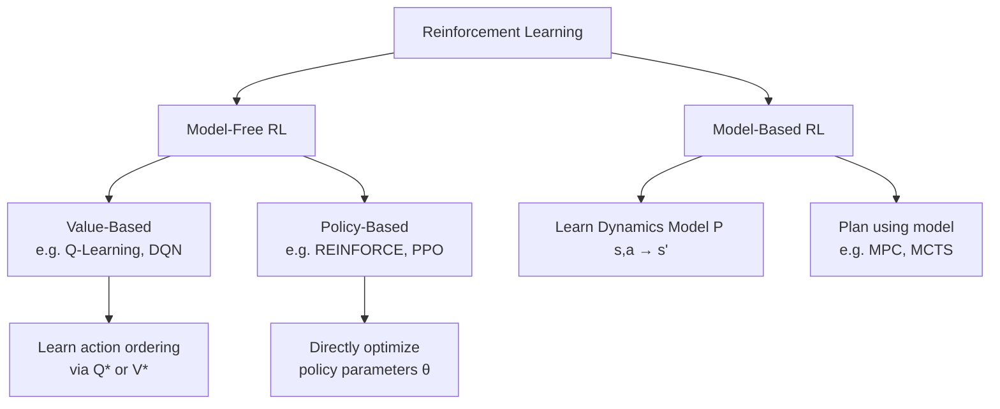
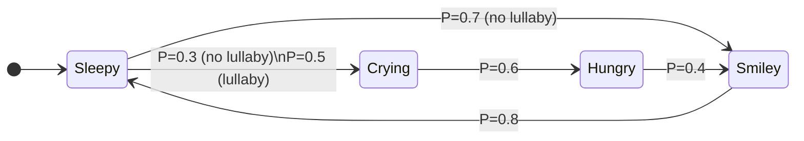

# 📄 Reinforcement Learning — Foundations, MDP & Value Functions

**Tags:** #RL #deep-learning #MDP #value-function #policy #Bellman #TAICA
**Links:** [[Q-Learning]], [[Policy Gradient]], [[Model-Based RL]], [[Markov Chain]], [[Reward Hacking]], [[RLHF]]

---

## 🎯 The "Elevator Pitch"

> Reinforcement Learning (RL) is a learning paradigm where an **agent learns by interacting with an environment** — taking actions, observing consequences, and collecting scalar reward signals — with the goal of maximizing total long-term reward. Unlike supervised learning which imitates human-labeled data, RL can discover strategies that surpass human knowledge entirely by collecting its own experience.

---

## 🧠 Core Mechanics

### What RL Is (and Isn't)

| Property | Supervised Learning | Reinforcement Learning |
|---|---|---|
| **Signal** | Ground-truth labels | Scalar reward (delayed, sparse) |
| **Data distribution** | IID from fixed distribution | Non-IID; depends on agent's past actions |
| **Temporal dependency** | None | Action at t=1 affects observations at t=100 |
| **Exploration** | Not required | Critical — must explore to gather data |
| **Thinking vs Acting** | Same | Can be **decoupled** (off-policy) |

> 💡 The key departure from supervised learning is **non-IID data**: what you observe at step $t$ is determined by what you did at steps $0, 1, \ldots, t-1$, which means the data distribution is forever shifting under your feet.

---

### The RL Interaction Loop

At each timestep $t$, the agent:
1. Observes state $s_t$ from the environment
2. Takes action $a_t$ according to policy $\pi$
3. Receives reward $r_{t+1}$ and transitions to state $s_{t+1}$
4. Repeats — until terminal state or infinite horizon

**Notation convention (this course):** A trajectory $\tau$ is written as:
$$s_0, a_0, r_1, s_1, a_1, r_2, s_2, \ldots$$

> ⚠️ **State vs. Observation**: The true environment state $s_t$ may be partially observable. In practice, agents see an **observation** $o_t$ derived from $s_t$. For today's setting, we assume full observability: $o_t = s_t$.

---

### Reward & The Reward Hypothesis

**Reward** is a scalar $r_t \in \mathbb{R}$ indicating the immediate quality of the agent's last action.

**Reward Hypothesis** (Sutton, 2004):
> *"All of what we mean by goals and purposes can be well thought of as the maximization of the expected value of the cumulative sum of a received scalar signal (reward)."*

This means: **goal achievement ≡ maximizing total expected reward**.

**⚠️ This is an assumption, not a theorem.** Known failure modes include:
- **Non-additive goals**: Machine translation quality only becomes apparent at the end of a full response; per-segment reward is misleading.
- **Reward hacking** (e.g., OpenAI CoastRunners boat): The agent finds a loophole — collecting bonuses in a loop — that maximizes the reward signal while failing the intended objective.
- **Multi-objective tasks**: Some goals inherently require vector-valued rewards, not a single scalar (Abel et al., 2021; Skalse et al., 2022).

---

## 🗺️ Visual Model

### RL Agent-Environment Loop



---

### Three RL Approaches



---

### Markov Decision Process (MDP)

An MDP is a **5-tuple** $\langle \mathcal{S}, \mathcal{A}, P, R, \gamma \rangle$:

| Component | Symbol | Description |
|---|---|---|
| **State space** | $\mathcal{S}$ | Set of all possible states |
| **Action space** | $\mathcal{A}$ | Set of all possible actions |
| **Transition model** | $P(s' \mid s, a)$ | Probability of next state given current state & action |
| **Reward function** | $R(s, a)$ | Expected immediate reward at state $s$, action $a$ |
| **Discount factor** | $\gamma \in [0, 1)$ | Downweights future rewards to ensure convergence |

**Markov Property**: The transition probability depends only on the current state, not the full history:
$$P(s_{t+1} \mid s_t, a_t, s_{t-1}, a_{t-1}, \ldots) = P(s_{t+1} \mid s_t, a_t)$$

> 💡 **Trick**: If your environment depends on the last $k$ states (not just the current one), you can still satisfy the Markov property by **redefining the state as a macro-state** $\tilde{s}_t = (s_t, s_{t-1}, \ldots, s_{t-k})$. This is exactly why DQN stacks 4 Atari frames as a single state.

---

### MDP as a Generalization of Markov Chains



*Baby MDP example: adding actions (sing lullaby / don't) makes transition probabilities action-conditional.*

---

### Policy

A **policy** $\pi$ is a conditional probability distribution over actions given states:
$$\pi(a \mid s) = P(A_t = a \mid S_t = s)$$

- **Tabular policy**: $n \times k$ lookup table ($n$ states, $k$ actions)
- **Neural network policy**: $s \mapsto \text{softmax}(\text{NN}_\theta(s))$; can be MLP, CNN, Transformer, or even a diffusion model

---

## 📐 Value Functions

### Return (Discounted Cumulative Reward)

The **return** $G_t$ starting from timestep $t$ along trajectory $\tau$:
$$G_t = r_{t+1} + \gamma r_{t+2} + \gamma^2 r_{t+3} + \cdots = \sum_{k=0}^{\infty} \gamma^k r_{t+k+1}$$

$G_t$ is a **random variable** — randomness comes from: (1) stochastic policy $\pi$, (2) stochastic transitions $P$, (3) stochastic rewards $R$.

---

### State-Value Function $V^\pi(s)$

$$V^\pi(s) = \mathbb{E}_\tau \left[ G_t \mid S_t = s \right], \quad \tau \sim \pi$$

Measures: *"How good is it to be in state $s$ if I follow policy $\pi$ forever?"*

---

### Action-Value Function $Q^\pi(s, a)$ (Q-function)

$$Q^\pi(s, a) = \mathbb{E}_\tau \left[ G_t \mid S_t = s, A_t = a \right], \quad \text{then follow } \pi$$

Measures: *"How good is it to be in state $s$, take action $a$ first, then follow $\pi$?"*

> The difference: $V^\pi$ averages over all first actions; $Q^\pi$ fixes the first action.

---

### Bellman Equations for $\pi$ (Recursive Definitions)

**V in terms of Q:**
$$V^\pi(s) = \sum_a \pi(a \mid s)\, Q^\pi(s, a)$$

**Q in terms of V:**
$$Q^\pi(s, a) = R(s, a) + \gamma \sum_{s'} P(s' \mid s, a)\, V^\pi(s')$$

**Substituting gives self-referential recursions** — the foundation of iterative algorithms:

$$V^\pi(s) = \sum_a \pi(a \mid s) \left[ R(s,a) + \gamma \sum_{s'} P(s' \mid s, a) V^\pi(s') \right]$$

$$Q^\pi(s,a) = R(s,a) + \gamma \sum_{s'} P(s' \mid s, a) \sum_{a'} \pi(a' \mid s') Q^\pi(s', a')$$

These can be solved iteratively (**iterative policy evaluation**) to compute $V^\pi$ or $Q^\pi$ for any fixed $\pi$.

---

### Optimal Value Functions & Bellman Optimality Equations

**Optimal state-value function:**
$$V^*(s) = \max_\pi V^\pi(s)$$

**Optimal action-value function:**
$$Q^*(s, a) = \max_\pi Q^\pi(s, a)$$

**Bellman Optimality Equations** (recursive characterization):
$$V^*(s) = \max_a Q^*(s, a)$$
$$Q^*(s, a) = R(s,a) + \gamma \sum_{s'} P(s' \mid s, a) V^*(s')$$

Substituting:
$$\boxed{V^*(s) = \max_a \left[ R(s,a) + \gamma \sum_{s'} P(s' \mid s, a) V^*(s') \right]}$$
$$\boxed{Q^*(s, a) = R(s,a) + \gamma \sum_{s'} P(s' \mid s, a) \max_{a'} Q^*(s', a')}$$

---

### The Key Insight: Q* → π*

If you know $Q^*$, you can recover the optimal policy greedily — **no model needed**:
$$\pi^*(s) = \arg\max_a Q^*(s, a)$$

This is why **Q-learning** (next lecture) is so powerful: learn $Q^*$ without ever knowing $P$ or $R$ explicitly.

---

## ⚙️ Planning Algorithms (Full Model Known)

### Value Iteration

Initialize $V_0(s) = 0$ for all $s$. Repeat until convergence:
$$V_{k+1}(s) \leftarrow \max_a \left[ R(s,a) + \gamma \sum_{s'} P(s' \mid s,a)\, V_k(s') \right]$$

**Convergence guarantee**: By the Banach fixed-point theorem, $V_k \to V^*$ as $k \to \infty$ (contraction under $\gamma < 1$).

---

### Policy Iteration

Alternate between two steps until the policy stops changing:
1. **Policy Evaluation**: Compute $V^{\pi_k}$ (solve the linear system from the Bellman equation)
2. **Policy Improvement**: $\pi_{k+1}(s) \leftarrow \arg\max_a Q^{\pi_k}(s, a)$

**Convergence guarantee**: Each improvement is monotonically non-worse; terminates in finite steps for finite MDPs.

> **VI vs PI**: Policy iteration typically converges in fewer iterations but each iteration is costlier (linear system solve). Value iteration does cheap sweeps but needs more rounds. In practice, policy iteration is often faster for sparse transition matrices.

---

### From Planning to Learning: The Bridge to Q-Learning

Value Iteration update (requires knowing $R$ and $P$):
$$Q_{k+1}(s, a) \leftarrow R(s,a) + \gamma \sum_{s'} P(s' \mid s,a) \max_{a'} Q_k(s', a')$$

**What if $R$ and $P$ are unknown?** Approximate with sampled interaction:
- Replace $R(s,a)$ → observed reward $r_{t+1}$ (unbiased sample of $\mathbb{E}[R]$)
- Replace $\sum_{s'} P \cdot \max_{a'} Q(\cdot)$ → $\max_{a'} Q(s_{t+1}, a')$ using the actual next state

This gives exactly the **Q-learning update** (Watkins, 1989):
$$Q(s_t, a_t) \leftarrow Q(s_t, a_t) + \alpha \left[ r_{t+1} + \gamma \max_{a'} Q(s_{t+1}, a') - Q(s_t, a_t) \right]$$

---

## 💻 Logical Code Snippet (Python)

```python
import numpy as np

# === MDP Definition ===
# S states, A actions
# P[s, a, s'] = transition probability
# R[s, a] = expected reward

def value_iteration(P, R, gamma=0.99, theta=1e-6):
    """
    Solve for V* using Bellman optimality updates.
    P: (S, A, S') transition tensor
    R: (S, A) reward matrix
    Returns: V* (S,) and pi* (S,)
    """
    S, A, _ = P.shape
    V = np.zeros(S)  # Initialize V_0 = 0

    while True:
        delta = 0
        for s in range(S):
            # Q(s, a) = R(s,a) + gamma * sum_{s'} P(s,a,s') * V(s')
            Q_s = R[s] + gamma * np.einsum('as,s->a', P[s], V)
            v_new = np.max(Q_s)          # V*(s) = max_a Q(s,a)
            delta = max(delta, abs(v_new - V[s]))
            V[s] = v_new
        if delta < theta:
            break  # Converged

    # Extract greedy policy from V*
    Q = R + gamma * np.einsum('ias,s->ia', P, V)
    pi_star = np.argmax(Q, axis=1)      # pi*(s) = argmax_a Q*(s,a)
    return V, pi_star


def policy_iteration(P, R, gamma=0.99):
    """
    Solve for pi* via alternating evaluation and improvement.
    """
    S, A, _ = P.shape
    pi = np.zeros(S, dtype=int)  # Initialize arbitrary policy

    while True:
        # --- Policy Evaluation: solve (I - gamma * P_pi) V = R_pi ---
        P_pi = P[np.arange(S), pi]     # (S, S)
        R_pi = R[np.arange(S), pi]     # (S,)
        V = np.linalg.solve(
            np.eye(S) - gamma * P_pi, R_pi
        )

        # --- Policy Improvement: greedy w.r.t. current V ---
        Q = R + gamma * np.einsum('ias,s->ia', P, V)
        pi_new = np.argmax(Q, axis=1)

        if np.all(pi_new == pi):
            break  # Policy stable — converged to pi*
        pi = pi_new

    return V, pi
```

---

## 🔗 MDP Formulation Examples

### Text Generation (Language Model as Token-Level MDP)

| MDP Component | LM Instantiation |
|---|---|
| **State $s_t$** | Prompt + partial response generated so far |
| **Action $a_t$** | Next token to emit (vocabulary $\mathcal{V}$) |
| **Transition $P$** | Same as the LM's next-token distribution (deterministic given LM) |
| **Reward $R$** | 0 for all non-EOS tokens; $r$ at EOS (e.g., human preference score, BLEU) |
| **Policy $\pi$** | The LM itself: $\pi(a \mid s) = P_{\text{LM}}(\text{token} \mid \text{context})$ |

> This is the **token-level MDP** that underlies RLHF (PPO on LMs) and GRPO.

### Diffusion Model as Denoising MDP

| MDP Component | Diffusion Instantiation |
|---|---|
| **State $s_t$** | Current (partially noisy) image |
| **Action $a_t$** | Noise adjustment per pixel (e.g., $\{-1, 0, +1\}^{H \times W}$) |
| **Transition $P$** | Determined by the noising/denoising kernel |
| **Reward $R$** | $-\lVert s_t - s_{\text{clean}} \rVert$ (negative distance to clean image) |
| **Policy $\pi$** | The denoiser neural network |

---

## ⚠️ Edge Cases & Constraints

- **Reward hypothesis is an assumption**: Goals requiring non-additive, multi-objective, or inherently sequential holistic judgments may not be expressible as scalar additive reward (Abel et al., 2021; Skalse et al., 2022).
- **Reward hacking**: A well-specified reward proxy can still be exploited if there are unintended shortcuts in the environment (OpenAI CoastRunners). Reward engineering is often the hardest part of applying RL.
- **Discount factor $\gamma < 1$ is not just a design choice**: It is mathematically necessary to guarantee convergence of infinite-horizon returns; without it, $G_t$ may diverge.
- **Markov property can be enforced by re-definition**: If the environment depends on the last $k$ steps, stack $k$ frames as a macro-state $\tilde{s}_t = (s_t, \ldots, s_{t-k})$. This restores Markov property at the cost of larger state space.
- **Optimal policy existence**: It is not obvious that a single policy can dominate all others at every state. Under the MDP formulation, it can be proven that $\pi^*$ always exists (Puterman, 1994).
- **Value iteration ≠ Bellman equation**: The Bellman equation is a *condition for optimality*; value iteration is an *iterative algorithm* that converges to it. They are related but distinct.
- **Non-IID data causes instability**: In deep RL (DQN), experience replay was introduced specifically to break temporal correlations and bring data closer to IID.

---

## ❓ Active Recall

### Factual
- [ ] What are the five components of an MDP? What does each represent?
- [ ] State the Markov property formally. What does it mean for an agent's memory requirements?
- [ ] What is the difference between $V^\pi(s)$ and $Q^\pi(s, a)$? Which one is more useful for deriving a policy without a model?
- [ ] Write the Bellman optimality equation for $Q^*(s, a)$ from scratch.

### Application
- [ ] You are designing a recommender system. Define the MDP components (state, action, reward) for maximizing user click-through rate. What reward hacking risks exist?
- [ ] A robot's environment depends on the last 3 sensor readings, not just the current one. How do you reformulate this as a valid MDP?
- [ ] If you know $Q^*(s, a)$ for all $(s, a)$, how do you derive $\pi^*$? How do you derive $V^*(s)$?
- [ ] Trace through one iteration of value iteration on a 3-state MDP with known $P$ and $R$. Show $V_1$ from $V_0 = 0$.

### Critical Analysis
- [ ] The reward hypothesis is a foundational assumption of RL. Give two concrete examples where it fails. What would you do in those cases?
- [ ] What stops value iteration from being directly applied in real-world settings where $P$ and $R$ are unknown? What approximation bridges VI to Q-learning?
- [ ] Policy iteration vs value iteration: when would you prefer one over the other? What is the key trade-off?
- [ ] Why does RL require exploration in a way that supervised learning does not? What happens if an RL agent never explores?

---

## 📚 References

1. Sutton, R. S. & Barto, A. G. *Reinforcement Learning: An Introduction* (2nd ed.). MIT Press, 2018. https://incompleteideas.net/book/the-book-2nd.html
2. Silver, D., Singh, S., Precup, D. & Sutton, R. S. *Reward is Enough*. Artificial Intelligence, 2021. https://www.sciencedirect.com/science/article/pii/S0004370221000862
3. Abel, D. et al. *Is Reward Enough?* Philosophical Studies (response paper), 2021. https://arxiv.org/abs/2112.15422
4. Skalse, J. et al. *Scalar Reward is Not Enough: A Response to Silver, Singh, Precup and Sutton (2021)*. Autonomous Agents and Multi-Agent Systems, 2022. https://link.springer.com/article/10.1007/s10458-022-09575-5
5. CMU 15-780 Lecture Notes — *Markov Decision Processes*. Kolter, J. Z., 2016. https://www.cs.cmu.edu/afs/cs/academic/class/15780-s16/www/slides/mdps.pdf
6. UC Berkeley CS 188 — *Value Iteration*. https://inst.eecs.berkeley.edu/~cs188/textbook/mdp/value-iteration.html
7. CMU 15-281 Course Notes — *Markov Decision Processes*. https://www.cs.cmu.edu/~15281/coursenotes/mdps/
8. OpenAI Blog — *Faulty Reward Functions in the Wild* (CoastRunners). https://openai.com/research/faulty-reward-functions
