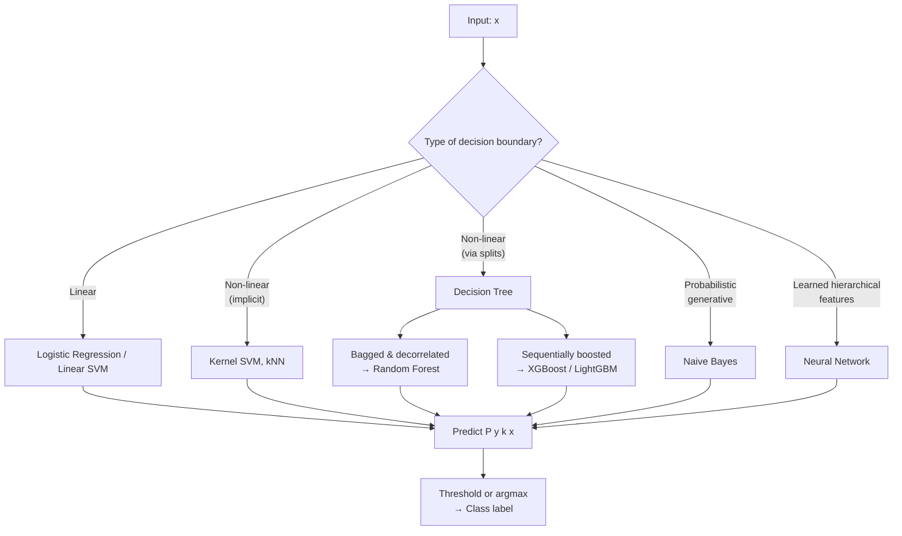

# 📄 Classification Algorithms

**Tags:** #academic #ml #supervised-learning #classification
**Links:** [[Regression Algorithms]], [[Clustering Algorithms]], [[Decision Trees]], [[Bias-Variance Tradeoff]], [[Ensemble Methods]]

---

## 🎯 The "Elevator Pitch"
> Classification is **supervised learning where the target is a discrete label** — spam or ham, dog or cat or capybara, fraud or not. The model learns a function from features to a class (and ideally a probability), and we judge it not by distance but by **how often it's right**, weighted by which mistakes are worse.

---

## 🧠 Core Mechanics

### Definition
Given `(x_i, y_i)` pairs where `y_i ∈ {1, 2, …, K}`, learn a function that maps a feature vector to a class label — or, more usefully, to a probability distribution `P(y = k | x)` over the `K` classes. The argmax of that distribution gives the prediction.

### The Three Sub-Problems
- **Binary classification** (K=2): the building block. Spam, fraud, churn, diagnosis.
- **Multiclass** (K>2, mutually exclusive): digit classification, language detection.
- **Multilabel** (each example can have multiple labels): a movie tagged both "comedy" and "romance".

### Why Regression Doesn't Just Work Here
You *could* fit a linear regression to encode `y ∈ {0,1}` and threshold at 0.5. Don't. Linear regression assumes the target is unbounded and Gaussian-distributed; it will happily predict probabilities of 1.4 or −0.3, weight far-from-boundary points too heavily, and fall apart when classes are imbalanced. The right move is to model the *log-odds* directly — that's logistic regression.

---

## 🔑 The Algorithm Zoo

### 1. Logistic Regression
The "linear" baseline of classification. Don't be fooled by the name — it's used for **classification**, not regression. The model:

$$P(y=1 \mid x) = \sigma(w^T x + b) = \frac{1}{1 + e^{-(w^T x + b)}}$$

The sigmoid function squashes a real-valued *score* into a `(0,1)` probability. The decision boundary is *linear* in `x` — the curve only enters through the squashing.

**Training** maximizes log-likelihood (equivalently, minimizes **cross-entropy loss**):
$$\mathcal{L} = -\sum_i \big[ y_i \log p_i + (1-y_i) \log(1 - p_i) \big]$$

No closed form — solved by gradient descent or Newton's method (IRLS).

**Why love it:** interpretable coefficients (each is a log-odds ratio), well-calibrated probabilities, fast, regularizes naturally with L1/L2.
**Why it disappoints:** linear decision boundary is often too rigid; needs feature engineering for non-linear truth.

### 2. k-Nearest Neighbors (kNN)
The simplest classifier ever invented. To classify `x_new`: find its `k` closest neighbors in the training set; let them vote.

- **No training phase** — store the data.
- **All cost is at prediction time** — `O(n)` per query (or `O(log n)` with a k-d tree, but that breaks down in high dimensions).
- **Decision boundary** is piecewise-linear and arbitrarily complex — this is why kNN is the textbook **low-bias, high-variance** model. Increasing `k` increases bias but reduces variance (the classical U-curve).

**Curse of dimensionality killer:** in high dimensions, distances between any two points become similar — "nearest neighbor" loses meaning. kNN works beautifully in low dimensions and falls off a cliff above ~20–50 features.

### 3. Naive Bayes
A generative classifier built on Bayes' theorem with one violently simplifying assumption: **all features are conditionally independent given the class**.

$$P(y \mid x_1, \dots, x_n) \propto P(y) \prod_i P(x_i \mid y)$$

The independence assumption is almost never true — words in a sentence are not independent — yet the classifier often works surprisingly well, especially for text. Why? Because what we need for *correct argmax classification* is much weaker than correct probability estimates: ranking the classes correctly survives even when the absolute probabilities are off.

**Variants:** Multinomial NB (word counts), Bernoulli NB (binary features), Gaussian NB (continuous features assumed normal per class).

### 4. Support Vector Machines (SVM)
The geometric classifier. Find the hyperplane that **maximizes the margin** — the distance from the boundary to the closest training points (the **support vectors**).

For linearly inseparable data, two extensions:
- **Soft margin**: allow some points on the wrong side, penalized by hyperparameter `C`.
- **Kernel trick**: implicitly map data into a higher-dimensional space where it *is* separable, without ever computing the mapping explicitly. The math relies on the fact that the SVM optimization only ever needs *inner products* — replace `⟨x, x'⟩` with a kernel `K(x, x')` like RBF (`exp(−γ‖x−x'‖²)`) or polynomial.

**SVMs were the king of classification 1995–2010**, displaced by deep learning for unstructured data and by gradient boosting for tabular data. Still excellent on small-to-medium problems with clean features.

### 5. Decision Trees
Recursive axis-aligned splits, picking at each node the feature and threshold that best separate the classes. The split criterion for classification is **Gini impurity** or **entropy** (information gain) — both measure how "mixed" the class distribution in a node is.

$$\text{Gini}(S) = 1 - \sum_k p_k^2 \quad\quad \text{Entropy}(S) = -\sum_k p_k \log p_k$$

A tree predicts the **majority class** at the leaf a sample falls into. Single trees are interpretable but unstable (high variance) — small changes in training data → very different splits.

### 6. Random Forests
Same trick as in regression, applied to classification:
1. **Bagging**: each tree gets a bootstrap sample of the data.
2. **Feature subsampling**: at each split, only `√p` features are candidates.
3. **Vote** (or average probabilities) across trees.

The math (Breiman): the forest's generalization error depends on tree **strength** (each tree's individual accuracy) and **correlation** (how similarly the trees behave). Random feature selection drives correlation down without crippling strength — the magic that makes random forests one of the strongest off-the-shelf algorithms.

### 7. Gradient Boosted Trees (GBM, XGBoost, LightGBM, CatBoost)
For binary classification: same Friedman framework as in regression, but the loss is **log-loss** (cross-entropy) and the negative gradient at point `i` reduces to `y_i − p_i` — train the next tree to predict the *current probability error*.

XGBoost adds L1 + L2 regularization to the tree-structure score, uses **second-order** information (Hessian, not just gradient) for sharper updates, handles missing values via learned default split directions, and engineers cache-friendly memory layouts. This is why it wins Kaggle.

### 8. Neural Networks
A multi-layer perceptron with a softmax output is, formally, a non-linear logistic regression. It learns its own features via gradient descent through stacked non-linear layers. For tabular data, GBMs usually beat NNs unless the dataset is huge or has structure (sequences, images) where deep learning shines.

---

## 🗺️ Visual Model



---

## 📏 Evaluating a Classifier — Beyond Accuracy

### The Confusion Matrix (binary)
|              | Predicted +    | Predicted −    |
|--------------|---------------|---------------|
| Actual +     | TP            | FN            |
| Actual −     | FP            | TN            |

From this matrix, every metric is derived.

### The Big Four

- **Accuracy** = `(TP + TN) / total`. Misleading on imbalanced data — a 99% accurate "always predict negative" classifier is useless on a 1% fraud problem.
- **Precision** = `TP / (TP + FP)`. *Of the things I flagged positive, how many were correct?* Use when false positives are expensive (don't email the wrong customer).
- **Recall (Sensitivity, TPR)** = `TP / (TP + FN)`. *Of the actual positives, how many did I catch?* Use when false negatives are deadly (don't miss a tumor).
- **F1 score** = harmonic mean of precision and recall. Single number when you care about both.

### When the Threshold Matters
For probabilistic classifiers, you choose where to threshold `P(y=1 | x)`. Different thresholds → different precision/recall tradeoffs. Two threshold-free metrics:

- **ROC-AUC**: area under the curve of TPR vs. FPR across thresholds. AUC = 0.5 is random; AUC = 1 is perfect. Stable across class imbalance.
- **PR-AUC** (Precision-Recall AUC): more informative than ROC-AUC when the positive class is rare (fraud, rare disease).

### Multiclass
- **Macro-average**: compute the metric per class, take the unweighted mean. Treats all classes equally — good when minority classes matter.
- **Micro-average**: pool all predictions, compute the metric globally. Dominated by majority classes.
- **Weighted-average**: per-class metric weighted by class frequency. A compromise.

### Calibration
A classifier is **calibrated** if predicted probabilities match empirical frequencies — among samples assigned `P(y=1) = 0.7`, roughly 70% should actually be positive. Logistic regression is naturally well-calibrated; tree ensembles often are not, and may need post-hoc **Platt scaling** or **isotonic regression** to fix.

---

## ⚖️ Class Imbalance — The Silent Killer

A 99-to-1 imbalanced dataset will make your model lazy: predicting "always negative" gives 99% accuracy. Defenses:

- **Resampling**: oversample minority (SMOTE) or undersample majority. Easy, but distorts the data distribution.
- **Class weights**: tell the loss function to penalize errors on the minority class proportionally more. Built into most scikit-learn classifiers via `class_weight='balanced'`.
- **Threshold tuning**: don't predict at 0.5; pick the threshold from the validation PR curve.
- **Use the right metric**: stop reporting accuracy. Use F1, PR-AUC, or domain-specific cost-sensitive metrics.

---

## ⚠️ Edge Cases & Constraints

- **Logistic regression's "linear in features" trap.** A linear decision boundary in the *original* features. If the truth is non-linear, you must engineer features (interactions, polynomials) or pick a different model.
- **kNN dies in high dimensions.** "Nearest" stops being meaningful when distances concentrate. Curse of dimensionality.
- **Naive Bayes' independence assumption.** Almost always violated, but the *classifier* can still be accurate even when the *probabilities* are miscalibrated.
- **Trees and class imbalance.** A single tree will happily ignore minority classes; ensembles help, but only if you also use class weighting.
- **Probabilities ≠ confidence.** A model can be 99% confident and 99% wrong (deep nets are notorious for this on out-of-distribution input).
- **Don't optimize for accuracy on imbalanced data.** Period.
- **Cross-validation must respect time and groups.** If your data has temporal structure, use `TimeSeriesSplit`. If it has group structure (multiple readings per patient), use `GroupKFold`. Random shuffling will leak.

---

## 💻 Logical Code Snippet (Python)

```python
# Comparing several classifiers on the same task — fair, reproducible setup.

from sklearn.linear_model import LogisticRegression
from sklearn.neighbors import KNeighborsClassifier
from sklearn.svm import SVC
from sklearn.ensemble import RandomForestClassifier, GradientBoostingClassifier
from sklearn.naive_bayes import GaussianNB
from sklearn.model_selection import train_test_split, cross_val_score
from sklearn.metrics import classification_report, roc_auc_score
from sklearn.preprocessing import StandardScaler
from sklearn.pipeline import Pipeline

# Step 1: Hold-out split. Stratify to preserve class proportions.
X_train, X_test, y_train, y_test = train_test_split(
    X, y, test_size=0.2, stratify=y, random_state=42
)

# Step 2: A dictionary of candidates — each represents a different inductive bias.
# Models sensitive to feature scale (LogReg, kNN, SVM) get wrapped in a pipeline.
models = {
    "Logistic":     Pipeline([("sc", StandardScaler()), ("clf", LogisticRegression(max_iter=1000, class_weight='balanced'))]),
    "kNN":          Pipeline([("sc", StandardScaler()), ("clf", KNeighborsClassifier(n_neighbors=15))]),
    "Linear SVM":   Pipeline([("sc", StandardScaler()), ("clf", SVC(kernel='linear', probability=True, class_weight='balanced'))]),
    "RBF SVM":      Pipeline([("sc", StandardScaler()), ("clf", SVC(kernel='rbf', gamma='scale', probability=True))]),
    "Naive Bayes":  GaussianNB(),
    "Random Forest":RandomForestClassifier(n_estimators=300, class_weight='balanced', random_state=42),
    "GBM":          GradientBoostingClassifier(n_estimators=300, learning_rate=0.05, max_depth=3),
}

# Step 3: Cross-validated AUC — more honest than a single test split.
for name, model in models.items():
    auc_scores = cross_val_score(model, X_train, y_train, cv=5, scoring='roc_auc')
    print(f"{name:14s}  CV AUC = {auc_scores.mean():.3f} ± {auc_scores.std():.3f}")

# Step 4: Pick the best, fit on all training data, evaluate on the held-out test.
best_model = models["GBM"]            # placeholder — pick from CV winner
best_model.fit(X_train, y_train)
y_pred  = best_model.predict(X_test)
y_proba = best_model.predict_proba(X_test)[:, 1]

print(classification_report(y_test, y_pred))
print(f"Test ROC-AUC: {roc_auc_score(y_test, y_proba):.3f}")

# Step 5 (often skipped, often crucial): tune the decision threshold based on the
# precision-recall trade-off your business actually cares about, not the default 0.5.
```

---

## 🧪 Choosing the Right Tool — A Decision Heuristic

1. **Want a baseline you can ship in an hour?** Logistic regression with L2. It's hard to beat by much for many real problems.
2. **Tabular, non-trivial dataset, want maximum accuracy?** Gradient boosting (XGBoost, LightGBM, CatBoost). Default winner.
3. **Need probabilistic output that's well-calibrated?** Logistic regression. If using trees, calibrate post-hoc.
4. **Text classification, especially with tiny data?** Multinomial Naive Bayes is shockingly competitive — and trains in milliseconds.
5. **Truly tiny data (<200 rows), low dimension?** kNN, or an SVM with RBF kernel.
6. **Need to *explain* every individual prediction?** Logistic regression (look at the coefficients) or a shallow decision tree.
7. **Image, audio, sequence?** Deep learning territory — none of the above.

---

## ❓ Active Recall

* [ ] Why is logistic regression called "regression" if it's used for classification? What does it actually regress on?
* [ ] On a fraud dataset where 1% of transactions are fraudulent, your model achieves 99% accuracy. Why might this be terrible?
* [ ] Explain in one sentence why naive Bayes is "naive" — and why the naive assumption can still produce a good *classifier*.
* [ ] Your binary classifier outputs `P(y=1) = 0.65`. You currently threshold at 0.5. The business comes to you and says false positives cost 10x more than false negatives. What do you do?
* [ ] kNN has no training time but is slow at inference. Random forests are slow at training but fast at inference. Why?
* [ ] When does ROC-AUC mislead you, and when should you use PR-AUC instead?
* [ ] Random forests reduce variance via bagging. Gradient boosting reduces bias via sequential residual fitting. Why doesn't bagging just reduce bias too — what's the asymmetry?
* [ ] You have a 50,000-row dataset, balanced classes, 80 numeric features. What model do you reach for first, and why? What's your second choice?
* [ ] What does it mean for a classifier to be "calibrated"? Which classifiers tend to be calibrated out of the box? Which don't?
* [ ] In an SVM, what is a *support vector*, and why does the model only depend on those points after training?

---

## 📚 References

1. Hastie, T., Tibshirani, R., & Friedman, J. *The Elements of Statistical Learning*, 2nd ed. Springer, 2009. (Chapters 4 — Linear Classification, 9 — Trees, 10 — Boosting, 12 — SVMs, 13 — kNN). https://hastie.su.domains/ElemStatLearn/
2. Breiman, L. *Random Forests*. Machine Learning, 45:5–32, 2001. https://link.springer.com/article/10.1023/A:1010933404324
3. Friedman, J. H. *Greedy Function Approximation: A Gradient Boosting Machine*. Annals of Statistics, 29(5):1189–1232, 2001. https://projecteuclid.org/journals/annals-of-statistics/volume-29/issue-5/Greedy-function-approximation-A-gradient-boosting-machine/10.1214/aos/1013203451.full
4. Chen, T. & Guestrin, C. *XGBoost: A Scalable Tree Boosting System*. KDD 2016. https://arxiv.org/abs/1603.02754
5. Cortes, C. & Vapnik, V. *Support-Vector Networks*. Machine Learning, 20:273–297, 1995. (The original SVM paper.) https://link.springer.com/article/10.1007/BF00994018
6. Cover, T. & Hart, P. *Nearest Neighbor Pattern Classification*. IEEE Transactions on Information Theory, 13(1):21–27, 1967. (The original kNN paper.) https://ieeexplore.ieee.org/document/1053964
7. Ng, A. & Jordan, M. *On Discriminative vs. Generative Classifiers: A Comparison of Logistic Regression and Naive Bayes*. NeurIPS 2001. http://papers.neurips.cc/paper/2020-on-discriminative-vs-generative-classifiers-a-comparison-of-logistic-regression-and-naive-bayes
8. Geman, S., Bienenstock, E., & Doursat, R. *Neural Networks and the Bias/Variance Dilemma*. Neural Computation, 4(1):1–58, 1992. https://dl.acm.org/doi/10.1162/neco.1992.4.1.1
9. scikit-learn developers. *Supervised Learning — User Guide*. https://scikit-learn.org/stable/supervised_learning.html
10. James, G., Witten, D., Hastie, T., & Tibshirani, R. *An Introduction to Statistical Learning*, 2nd ed. Springer, 2021. https://www.statlearning.com/
11. Madhavan, S. & Sturdevant, M. *Learn classification algorithms using Python and scikit-learn*. IBM Developer.
