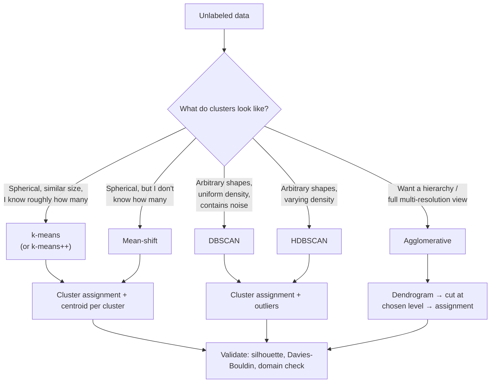

# 📄 Clustering Algorithms

**Tags:** #academic #ml #unsupervised-learning #clustering
**Links:** [[Classification Algorithms]], [[Regression Algorithms]], [[Dimensionality Reduction]], [[Anomaly Detection]]

---

## 🎯 The "Elevator Pitch"
> Clustering is **unsupervised learning where there are no labels** — you give the algorithm a pile of points and ask, *"which of these belong together?"* The answer is a partition (or hierarchy) of the data into groups whose members are more similar to each other than to anyone else.

---

## 🧠 Core Mechanics

### Definition
Given an unlabeled dataset `{x_1, …, x_n}`, find a function `c: x → {1, …, K}` (cluster assignment) such that points in the same cluster are **similar** under some distance/similarity measure, and points in different clusters are **dissimilar**.

The deep observation: there is **no objectively correct clustering**. The algorithm you pick *defines* what "similar" means. K-means says "close in Euclidean distance to a centroid." DBSCAN says "in the same dense region." Agglomerative says "close enough to merge under this linkage rule." Different definitions, different answers — all defensible.

### Two Use Cases You Should Tell Apart
1. **Discover groupings** — find the natural structure, then potentially label it (low-risk customers, churn-prone customers). This is *exploratory data analysis*.
2. **Detect anomalies** — find the points that *don't* fit any group. The clusters are scaffolding; the outliers are the prize.

The same algorithm can serve either goal depending on what you focus on.

### Three Algorithm Families

| Family | Idea | Strengths | Weaknesses |
|---|---|---|---|
| **Centroid-based** (k-means, mean-shift) | Each cluster has a center; assign by distance | Fast, simple, scalable | Assumes spherical clusters; needs `k` (or bandwidth) |
| **Density-based** (DBSCAN, OPTICS, HDBSCAN) | Clusters = dense regions; rest is noise | Arbitrary shapes, finds outliers, no `k` needed | Struggles with varying densities |
| **Hierarchical** (agglomerative, divisive) | Build a tree of nestings; cut at chosen level | Multi-resolution view; no `k` upfront | `O(n²)` or worse — doesn't scale; merges are irreversible |

---

## 🔑 K-Means (Lloyd's Algorithm)

The "Hello, World" of clustering. The objective: minimize the **within-cluster sum of squares**.

$$\min_{C_1, \dots, C_k, \mu_1, \dots, \mu_k} \sum_{j=1}^{k} \sum_{x \in C_j} \|x - \mu_j\|^2$$

This is a hard combinatorial problem (NP-hard for general `k` and dimension), but **Lloyd's algorithm** (1957, published 1982) is a wonderfully simple local-search heuristic:

1. **Initialize** `k` centroid positions.
2. **Assign** each point to its nearest centroid (creates Voronoi cells).
3. **Update** each centroid to the mean of points assigned to it.
4. **Repeat** until assignments stop changing.

### Why It Works (and Why It Sometimes Doesn't)
Each step is **provably non-increasing** in the WCSS objective: assignment can only lower it (we picked the closest centroid), and the mean is the WCSS-minimizing point of a fixed set. So Lloyd's converges. But it converges to a **local minimum** that depends entirely on the initialization. Pathological initializations exist where Lloyd's needs exponentially many iterations to converge. In practice it's fast, typically 10–50 iterations.

### k-means++ — Smarter Initialization
Random initialization is a death trap (multiple centroids fall into the same cluster). **k-means++** (Arthur & Vassilvitskii, 2007) fixes this:
1. Pick the first centroid uniformly at random.
2. For each subsequent centroid, sample a point with probability proportional to `D(x)²` — its squared distance to the nearest existing centroid.

This gives an `O(log k)` approximation guarantee on the optimal WCSS, in expectation. It's now the default in scikit-learn (`init='k-means++'`).

### The Two Catches
1. **You must specify `k`.** Use the **elbow method** (plot WCSS vs. `k`, look for the kink) or the **silhouette score** (geometric quality measure, ranges in [−1, 1]; higher is better).
2. **K-means assumes spherical, equally-sized clusters.** It will famously fail on the "two moons" toy dataset — you cannot separate two interlocking crescents with spherical Voronoi cells. This is *not* a bug; it's the algorithm's inductive bias.

### Computational Cost
`O(n · k · d · iter)` per run — linear in dataset size for fixed `k`, `d`, and iteration count. Very scalable. For huge datasets, **Mini-Batch K-Means** updates centroids on small random batches, sacrificing a little accuracy for a big speedup.

---

## 🔑 Mean-Shift

A centroid-based algorithm with one big philosophical difference from k-means: **you don't tell it `k`**.

The idea: treat the data as samples from an unknown probability density. For each point, **shift it towards the local mode** of the density (computed via a kernel-weighted local mean within a bandwidth `h`). Points that converge to the same mode form a cluster.

- **Pros**: discovers `k` from the data; finds dense regions; robust to outliers (sparse points become orphans).
- **Cons**: bandwidth `h` is tricky to choose and behaves like the `eps` parameter of DBSCAN — too small and everything is its own cluster, too large and everything is one cluster. `O(n²)` per iteration in the naïve version.
- **Performance on non-spherical clusters**: technically density-aware, but in practice still struggles with the "moons" case unless heavily tuned.

---

## 🔑 DBSCAN (Density-Based Spatial Clustering of Applications with Noise)

Proposed by Ester, Kriegel, Sander, & Xu in 1996 — winner of the SIGKDD Test of Time Award (2014). The most important density-based clustering algorithm.

### The Two Parameters
- **`ε` (eps)** — radius of a point's neighborhood.
- **`MinPts`** — minimum number of points (including the point itself) needed in the `ε`-neighborhood for the point to count as "dense."

### The Three Point Types
- **Core point**: has at least `MinPts` neighbors within `ε`. The interior of a cluster.
- **Border point**: not a core point itself, but lies in the neighborhood of a core point.
- **Noise (outlier)**: neither core nor border. Belongs to no cluster.

### The Algorithm (Conceptually)
1. Pick an unvisited point.
2. If it's a core point, start a new cluster, then **recursively absorb all density-reachable points** — its neighbors, its neighbors' neighbors (if they're core), and so on, growing the cluster outward through connected core points.
3. If not a core point and not absorbed by anyone else, label it **noise**.
4. Repeat until all points are visited.

The key idea is **density-reachability** — `q` is density-reachable from `p` if you can chain core points from `p` to `q` such that each is in the `ε`-neighborhood of the previous one.

### Why DBSCAN Wins
- **Finds clusters of arbitrary shape** — including the moons that defeat k-means.
- **Determines the number of clusters automatically** — you set `ε` and `MinPts`, the data decides `k`.
- **Native outlier detection** — noise points are first-class citizens, not an afterthought.

### Why DBSCAN Loses
- **Catastrophic on varying-density data.** A single global `ε` cannot describe a dataset that has both dense, tight clusters and loose, sparse ones.
- **Curse of dimensionality.** In high dimensions, Euclidean distance concentrates, and "what's a meaningful `ε`" becomes meaningless.
- **Border points are nondeterministic** — a border point reachable from two different clusters can be assigned to either, depending on processing order. Use DBSCAN* if this bothers you.

### Choosing `ε`
The standard heuristic: compute the distance from each point to its `k`-th nearest neighbor (where `k = MinPts`), sort these distances, plot them. The "knee" of the curve gives a sensible `ε`. **HDBSCAN** is a modern extension that eliminates `ε` altogether by considering all densities simultaneously and extracting a stable hierarchy.

---

## 🔑 Hierarchical Clustering (Agglomerative)

A wonderfully different paradigm: **don't pick `k` upfront — produce the entire family of clusterings**, from "everyone is alone" to "everyone is one big cluster," and let the user pick the level afterward.

### Bottom-Up (Agglomerative) — the common one
1. Start with `n` clusters, one per point.
2. Find the two closest clusters; merge them.
3. Repeat until one cluster remains.

You get a **dendrogram** — a tree where the height of each merge is the distance at which it occurred. Cut horizontally at any height to get a clustering.

### The Linkage Question
*"Closest" between two clusters of points needs a definition* — the **linkage criterion**:

- **Single linkage**: distance between closest pair across clusters. Captures elongated, chain-like structures; vulnerable to "chaining" where one outlier path links unrelated clusters.
- **Complete linkage**: distance between farthest pair. Produces tight, compact clusters; sensitive to outliers.
- **Average linkage**: average pairwise distance. A reasonable compromise.
- **Ward's method**: merge the pair that minimizes the increase in WCSS. Tends to produce equal-sized, spherical clusters — like k-means in dendrogram form.

### Why It's Beautiful, Why It's Slow
- **Beautiful**: gives you a multi-resolution view; no `k` upfront; the dendrogram is genuinely informative.
- **Slow**: at least `O(n² log n)` time and `O(n²)` memory in the standard implementation. Doesn't scale to millions of points. Use it for `n < 10,000`.

### Top-Down (Divisive)
Start with everything in one cluster, recursively split. Less common — the splitting step is itself a clustering problem, so you've created infinite regress unless you fix that with, say, k-means at each split.

---

## 🗺️ Visual Model



---

## 📏 Evaluating Clustering — The Hard Part

Without ground-truth labels, "is this a good clustering?" has no objective answer. We have proxies.

### Internal Metrics (no labels needed)
- **Silhouette coefficient**: for each point, `(b − a) / max(a, b)` where `a` = mean intra-cluster distance, `b` = mean distance to nearest *other* cluster. Range `[−1, 1]`; higher is better. Average across the dataset.
- **Davies-Bouldin index**: average ratio of within-cluster spread to between-cluster distance. Lower is better.
- **Calinski-Harabasz index** (variance ratio): ratio of between-cluster to within-cluster dispersion. Higher is better.

### External Metrics (when you have ground-truth labels for evaluation only)
- **Adjusted Rand Index (ARI)**: agreement between two clusterings, corrected for chance. Range `[−1, 1]`; 0 = chance.
- **Normalized Mutual Information (NMI)**: information shared between clusterings. Range `[0, 1]`.

### The Honest Answer
**The best validation is domain-specific.** Are the discovered groups *useful*? Do they correspond to known segments? Do business decisions improve when you act on them? Internal metrics are useful for parameter selection within a method; they cannot tell you whether your *method* was right.

---

## ⚠️ Edge Cases & Constraints

- **Scale your features.** All distance-based methods are dominated by features with the largest ranges. `StandardScaler` first, then cluster.
- **Curse of dimensionality.** In high dimensions, distances concentrate — every pair of points is roughly equidistant — and clustering loses meaning. Reduce dimensionality first (PCA, UMAP, autoencoders).
- **K-means is non-deterministic.** Different `random_state` → different solutions. Always run with `n_init ≥ 10` and keep the best.
- **DBSCAN's `ε` is brittle.** Tiny changes can completely reshape clusters. Plot the k-distance graph; better, use HDBSCAN.
- **Don't compare clusterings across algorithms with internal metrics.** A k-means clustering will always look "good" by silhouette because k-means optimizes something silhouette-like. DBSCAN clusters with weird shapes will lose by construction. Cross-comparison is misleading.
- **Outliers wreck everything.** Even one extreme point can drag a k-means centroid; can chain together unrelated clusters in single-linkage; can inflate variance estimates everywhere. Handle them explicitly — DBSCAN does this natively.

---

## 💻 Logical Code Snippet (Python)

```python
# Comparing several clustering algorithms on the same dataset.
# This is the structural map — actual EDA needs much more domain inspection.

import numpy as np
from sklearn.cluster import KMeans, MeanShift, DBSCAN, AgglomerativeClustering
from sklearn.preprocessing import StandardScaler
from sklearn.metrics import silhouette_score
from sklearn.datasets import make_blobs, make_moons

# Step 1: Always scale before any distance-based clustering.
X_scaled = StandardScaler().fit_transform(X)

# Step 2: A dictionary of candidates with very different inductive biases.
clusterers = {
    "K-Means (k=3)":    KMeans(n_clusters=3, n_init=10, init='k-means++', random_state=42),
    "Mean-Shift":       MeanShift(),                                  # discovers k
    "DBSCAN":           DBSCAN(eps=0.5, min_samples=5),               # discovers k + outliers
    "Agglomerative":    AgglomerativeClustering(n_clusters=3, linkage='ward'),
}

# Step 3: Fit each, evaluate with the silhouette coefficient where applicable.
for name, model in clusterers.items():
    labels = model.fit_predict(X_scaled)

    # Silhouette is undefined when only one cluster is found,
    # and DBSCAN's noise label (-1) needs to be excluded.
    mask = labels != -1
    n_clusters = len(set(labels[mask]))

    if n_clusters > 1:
        score = silhouette_score(X_scaled[mask], labels[mask])
        n_noise = np.sum(labels == -1)
        print(f"{name:16s}  k={n_clusters}  silhouette={score:.3f}  noise_pts={n_noise}")
    else:
        print(f"{name:16s}  found a single cluster — try different parameters")

# Step 4 (the part code can't do for you): look at the clusters in 2D
# (PCA or t-SNE projection), tell a story, validate against domain knowledge.
# A good silhouette score on meaningless clusters is still meaningless.
```

---

## 🧪 Choosing the Right Tool — A Decision Heuristic

1. **First, ask: do I actually need clustering, or is the underlying problem really classification or anomaly detection?** Be honest. Clustering is the easiest tool to misuse.
2. **Spherical-ish, you know `k`, big data?** K-means with k-means++. Default starting point.
3. **Arbitrary shapes, want outliers detected automatically?** DBSCAN. If densities vary across regions of your data, jump straight to HDBSCAN.
4. **Want a hierarchy / a full picture of structure at every scale?** Agglomerative with Ward linkage, then cut the dendrogram. Limit to `n < 10,000`.
5. **High-dimensional data?** Reduce with PCA or UMAP first, *then* cluster. Don't cluster in 500 dimensions directly.
6. **Need probabilistic soft assignments rather than hard labels?** Gaussian Mixture Models (EM algorithm) — a probabilistic generalization of k-means.

---

## ❓ Active Recall

* [ ] Why does Lloyd's algorithm (k-means) provably converge, but provably *not* to the global optimum?
* [ ] What does k-means++ do differently, and why is it better than uniform random initialization?
* [ ] Why does k-means fail on the "two moons" dataset, and what's the underlying assumption being violated?
* [ ] In DBSCAN, distinguish core, border, and noise points. Why is border-point assignment non-deterministic?
* [ ] Walk through *why* DBSCAN can find clusters of arbitrary shape but k-means cannot.
* [ ] Your DBSCAN run produces 1 huge cluster swallowing 95% of points + a few tiny ones. What do you adjust?
* [ ] Compare single, complete, average, and Ward linkage. Which gives you compact spheres? Which is vulnerable to chaining?
* [ ] Why is silhouette score a misleading way to compare a k-means clustering against a DBSCAN clustering?
* [ ] You have 5 million points and want to cluster them. Which methods are realistic, which are not, and why?
* [ ] Mean-shift "doesn't need `k`" — but it has a bandwidth parameter. Argue whether this is genuinely better than picking `k`.
* [ ] You discover that all your clusters are dominated by one feature (income, in raw dollars). What did you forget to do?

---

## 📚 References

1. Lloyd, S. P. *Least Squares Quantization in PCM*. IEEE Transactions on Information Theory, 28(2):129–137, 1982 (the original k-means paper, written 1957). https://ieeexplore.ieee.org/document/1056489
2. Arthur, D. & Vassilvitskii, S. *k-means++: The Advantages of Careful Seeding*. SODA 2007. http://ilpubs.stanford.edu:8090/778/
3. Ester, M., Kriegel, H.-P., Sander, J., & Xu, X. *A Density-Based Algorithm for Discovering Clusters in Large Spatial Databases with Noise*. KDD 1996. https://file.biolab.si/papers/1996-DBSCAN-KDD.pdf
4. Schubert, E., Sander, J., Ester, M., Kriegel, H.-P., & Xu, X. *DBSCAN Revisited, Revisited: Why and How You Should (Still) Use DBSCAN*. ACM TODS, 42(3):1–21, 2017. https://dl.acm.org/doi/10.1145/3068335
5. Campello, R. J. G. B., Moulavi, D., & Sander, J. *Density-Based Clustering Based on Hierarchical Density Estimates* (HDBSCAN). PAKDD 2013. https://link.springer.com/chapter/10.1007/978-3-642-37456-2_14
6. Comaniciu, D. & Meer, P. *Mean Shift: A Robust Approach Toward Feature Space Analysis*. IEEE TPAMI, 24(5):603–619, 2002. https://ieeexplore.ieee.org/document/1000236
7. Ward, J. H. Jr. *Hierarchical Grouping to Optimize an Objective Function*. JASA, 58(301):236–244, 1963. (Original Ward's-method paper.) https://www.tandfonline.com/doi/abs/10.1080/01621459.1963.10500845
8. Hastie, T., Tibshirani, R., & Friedman, J. *The Elements of Statistical Learning*, 2nd ed. Springer, 2009. (Chapter 14 — Unsupervised Learning). https://hastie.su.domains/ElemStatLearn/
9. Kriegel, H.-P., Kröger, P., Sander, J., & Zimek, A. *Density-Based Clustering*. WIREs Data Mining and Knowledge Discovery, 1(3):231–240, 2011. https://onlinelibrary.wiley.com/doi/10.1002/widm.30
10. scikit-learn developers. *Clustering — User Guide*. https://scikit-learn.org/stable/modules/clustering.html
11. Sturdevant, M. & Madhavan, S. *Learn clustering algorithms using Python and scikit-learn*. IBM Developer (the source tutorial this note expands on).
