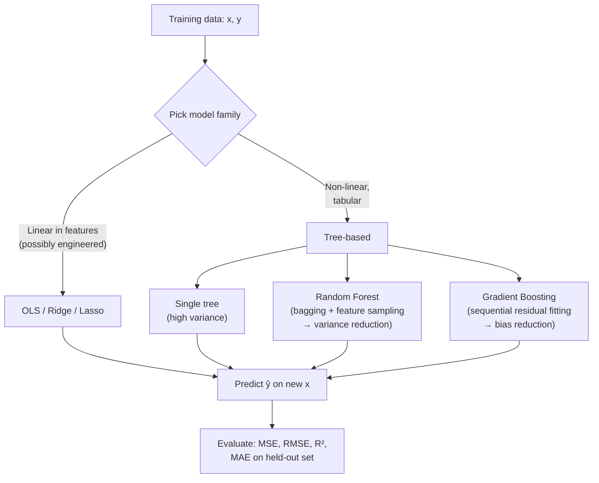

# 📄 Regression Algorithms

**Tags:** #academic #ml #supervised-learning #regression
**Links:** [[Classification Algorithms]], [[Clustering Algorithms]], [[Bias-Variance Tradeoff]], [[Ensemble Methods]], [[Decision Trees]]

---

## 🎯 The "Elevator Pitch"
> Regression is **supervised learning where the target is a continuous number** — predicting a house price, a temperature, a stock return. We learn a function `f(x) ≈ y` from labeled examples and judge it by how close its predictions land to the truth on data it has never seen.

---

## 🧠 Core Mechanics

### Definition
Given a dataset of `(x_i, y_i)` pairs where `y_i ∈ ℝ`, find a function `f` that minimizes a **loss** measuring distance between `f(x)` and `y`. The default loss is **squared error** because (a) it's differentiable everywhere, (b) its minimum is the conditional mean `E[y|x]`, and (c) under Gaussian noise it is the maximum-likelihood estimator.

### The Universal Decomposition
Expected test error of any regression model decomposes into three parts:

```
Error  =  Bias²  +  Variance  +  Irreducible noise
```

- **Bias** — error from the model being too rigid to capture the truth (a line trying to fit a curve).
- **Variance** — error from the model being too flexible and chasing noise in the training set.
- **Noise** — fundamental randomness in `y` even given `x`. You cannot beat this.

This is the lens through which every regression algorithm earns or loses its place. Note: the classical "bias decreases, variance always increases" narrative does not always hold for modern over-parameterized models — see **Edge Cases** below.

### Key Algorithm Families

| Family | Idea | Strength | Weakness |
|---|---|---|---|
| **Linear regression** | Fit a hyperplane | Interpretable, fast, low-variance | High bias when truth is non-linear |
| **Polynomial / basis expansion** | Engineer non-linear features, then fit linearly | Captures curvature with linear math | Explodes in dimensions; unstable at the edges |
| **Regularized linear (Ridge / Lasso)** | Penalize large weights | Tames variance, enables sparsity | Still linear in features |
| **Decision tree** | Recursive axis-aligned splits | Captures interactions; no scaling needed | Unstable; high variance |
| **Random forest** | Bag many de-correlated trees | Strong out-of-the-box; robust to noise | Slower; less interpretable |
| **Gradient boosting (GBM, XGBoost)** | Sequentially fit residuals | State-of-the-art on tabular data | Sensitive to hyperparameters |

---

## 🔑 Linear Regression — The Bedrock

### The model
$$y = w_0 + w_1 x_1 + w_2 x_2 + \dots + w_n x_n + \varepsilon$$

The closed-form **Ordinary Least Squares (OLS)** solution is:
$$\hat{w} = (X^T X)^{-1} X^T y$$

This is the *single most important equation* in classical statistics. It says: project `y` orthogonally onto the column space of `X`.

### Three flavors

- **Simple** — one predictor, one line. Useful for visualization and intuition; almost never enough on its own.
- **Multiple** — many predictors. The default linear model.
- **Polynomial** — feed `[x, x², x³, …]` to a multiple-linear regressor. Still "linear" because it is linear in the *coefficients*, even though the curve is wiggly. Easy to overfit; degree is the knob.

### Why it can fail (in plain terms)
- **Multicollinearity**: highly correlated predictors make `X^T X` near-singular → coefficients become wild and unstable.
- **Heteroscedasticity**: error variance depends on `x` → standard error estimates lie.
- **Non-linearity**: the truth has curvature you didn't engineer in → bias.
- **Outliers**: squared loss takes the square of a single 100σ point — that one row can dominate the whole fit.

### Regularization — the workhorse fix

**Ridge regression** adds an L2 penalty: `min ‖y − Xw‖² + λ‖w‖²`. Pulls weights toward zero, stabilizes the matrix inverse, and trades a bit of bias for much less variance.

**Lasso regression** adds an L1 penalty: `min ‖y − Xw‖² + λ‖w‖₁`. Same goal, but the geometry of the L1 ball drives many weights to *exactly zero* — you get an automatic feature selector.

**Elastic Net** is a convex combination of both — useful when features are correlated and you want grouped sparsity.

---

## 🌳 Trees and Their Ensembles

### Decision tree regression
Split the feature space recursively. At each node, pick the feature and threshold that minimize the **sum of squared residuals** in the resulting children. Predict the mean of `y` in each leaf.

A single tree is a piecewise-constant surface. It is wonderfully expressive but cripplingly **high-variance** — change one row of training data and the splits can rearrange.

### Random Forests (Breiman, 2001)
Two ideas, layered:

1. **Bagging** — train each tree on a bootstrap sample (sample-with-replacement of the training set). Averaging independent estimators kills variance.
2. **Feature subsampling** — at each split, only consider a random subset of features (typically `√p` for classification, `p/3` for regression). This *de-correlates* trees, which is the secret sauce: averaged correlated estimators don't reduce variance much; averaged independent ones do.

The math (Breiman): generalization error is bounded by `ρ̄(1 − s²)/s²`, where `s` is the strength of individual trees and `ρ̄` is their average correlation. Random forests succeed by simultaneously keeping `s` high and `ρ̄` low.

### Gradient Boosted Trees (Friedman, 2001)
The opposite philosophy from bagging: instead of training trees in parallel and averaging, **train them sequentially, each one fixing the mistakes of its predecessors**.

Friedman's insight: think of model-fitting as gradient descent — but in *function space* rather than parameter space. At each step:

1. Compute the negative gradient of the loss with respect to the current prediction (for squared loss, this is just the residual `y − F(x)`).
2. Fit a small tree to those pseudo-residuals.
3. Add a shrunken version of that tree to the running ensemble: `F_{m+1}(x) = F_m(x) + η · h_m(x)`.

The shrinkage rate `η` (the *learning rate*) is the most important hyperparameter — small values (~0.01–0.1) mean more trees but better generalization.

**XGBoost** (Chen & Guestrin, 2016) is the modern high-performance implementation: it adds an explicit L1 + L2 regularization term to the objective, uses second-order Taylor expansion (Newton's method, not just gradients), supports sparsity-aware splits for missing values, and engineers cache-friendly memory layouts. Hence its dominance on tabular Kaggle competitions.

---

## 🗺️ Visual Model



---

## 📏 Evaluating a Regression Model

### Mean Squared Error
$$\text{MSE} = \frac{1}{n}\sum_{i=1}^{n}(y_i - \hat{y}_i)^2$$

Penalizes large errors disproportionately (the squared term). **RMSE** = √MSE puts the units back to the target's units, which is friendlier to read.

### Mean Absolute Error
$$\text{MAE} = \frac{1}{n}\sum_{i=1}^{n}|y_i - \hat{y}_i|$$

Robust to outliers. Use it when your target has heavy tails.

### Coefficient of Determination (R²)
$$R^2 = 1 - \frac{\sum (y_i - \hat{y}_i)^2}{\sum (y_i - \bar{y})^2}$$

Reads as: *"what fraction of the variance in `y` did my model explain, beyond just predicting the mean?"*

- `R² = 1` → perfect fit.
- `R² = 0` → model is no better than predicting the global mean.
- `R² < 0` → model is *worse* than predicting the global mean. Yes, this is possible, and it's a sign something is broken.

### A subtle warning
On the training set, R² can only go up as you add features. Use **adjusted R²**, **cross-validation**, or a held-out test set to get an honest read.

---

## ⚠️ Edge Cases & Constraints

- **Linearity is in the coefficients, not the features.** Polynomial regression *is* a linear model, just on engineered features. This trips up beginners.
- **Squared loss is not always right.** Use Huber loss for outliers, quantile loss when you care about the 90th percentile (forecasting, finance), Poisson loss for counts.
- **Extrapolation is dangerous for trees.** A random forest cannot predict a value outside `[min(y_train), max(y_train)]` — it's a piecewise-constant model, no extrapolation possible. Linear models extrapolate (sometimes wildly), trees do not.
- **The classical bias-variance "U-curve" is not universal.** Modern over-parameterized neural networks can show **double descent**: error goes up, then *down again* as capacity grows past the interpolation threshold (Belkin et al., 2019; Neal et al., 2018). The classical U-curve still holds for non-parametric methods like kNN and kernel regression.
- **Polynomial regression of high degree is mostly a trap.** It tends to oscillate wildly between training points (Runge's phenomenon). Splines and regularization usually beat it.
- **Standardize your features for regularized regression.** Ridge and Lasso penalize the magnitude of weights — features measured on different scales get unfairly punished or favored.

---

## 💻 Logical Code Snippet (Python)

```python
# Comparing linear, random forest, and gradient boosting on a regression task.
# This is the structural map — not a tuned, production-ready pipeline.

import numpy as np
from sklearn.linear_model import LinearRegression, Ridge, Lasso
from sklearn.ensemble import RandomForestRegressor, GradientBoostingRegressor
from sklearn.model_selection import train_test_split
from sklearn.metrics import mean_squared_error, r2_score

# Step 1: Split the data — never evaluate on data the model has seen
X_train, X_test, y_train, y_test = train_test_split(X, y, test_size=0.2, random_state=42)

# Step 2: Define candidate models — each represents a different bias-variance bet
models = {
    "OLS":             LinearRegression(),                                    # high bias, low variance
    "Ridge (λ=1.0)":   Ridge(alpha=1.0),                                       # shrinks weights, lowers variance
    "Lasso (λ=0.1)":   Lasso(alpha=0.1),                                       # also performs feature selection
    "Random Forest":   RandomForestRegressor(n_estimators=300, random_state=42),
    "GBM":             GradientBoostingRegressor(n_estimators=300, learning_rate=0.05, max_depth=3),
}

# Step 3: Fit and evaluate each — same train/test split, fair comparison
results = {}
for name, model in models.items():
    model.fit(X_train, y_train)
    y_pred = model.predict(X_test)
    results[name] = {
        "RMSE": np.sqrt(mean_squared_error(y_test, y_pred)),
        "R²":   r2_score(y_test, y_pred),
    }

# Step 4: Inspect — which model wins depends on the data
# Tabular + non-linear interactions → GBM/RF usually win
# Truly linear, low-noise data → OLS or Ridge can match them at a fraction of the cost
```

A more rigorous version would wrap step 3 in a `cross_val_score` loop, perform hyperparameter search via `GridSearchCV`, and standardize features in a `Pipeline` before the regularized models.

---

## 🧪 Choosing the Right Tool — A Decision Heuristic

1. **Is the data tabular and non-tiny (>1k rows)?** Try gradient boosting first (LightGBM, XGBoost, CatBoost). It's the default winner.
2. **Tiny dataset, you suspect linearity?** Ridge regression. The bias of a linear model becomes a *feature*, not a bug, when you don't have enough data to learn anything fancier.
3. **Need interpretability for stakeholders / regulators?** Lasso (sparse, picks features) or a single shallow decision tree.
4. **High-dimensional, sparse (text, genomics)?** Lasso or Elastic Net. The sparsity prior matches reality.
5. **Image, audio, sequence?** None of this — go to deep learning. Tabular ML stops being the right answer.

---

## ❓ Active Recall

* [ ] Why does the OLS solution `(X^T X)^{-1} X^T y` break down when features are highly correlated, and how does Ridge fix it?
* [ ] Polynomial regression of degree 5 — is it a linear model or non-linear model? Why does the answer matter?
* [ ] In a random forest, what role does the *feature subsampling* at each split play? Why isn't bagging alone enough?
* [ ] Explain gradient boosting in one sentence, in terms of gradient descent in function space.
* [ ] Under what condition can R² be negative on a test set, and what does that mean diagnostically?
* [ ] When does the classical bias-variance U-curve *fail* to describe what we observe in practice?
* [ ] You are predicting house prices. The dataset has 800 rows and 30 features, some of which you suspect are useless. Which model do you reach for first, and why?
* [ ] Why can a random forest never predict a value outside the range of `y_train`, but a linear regression can? Is this a bug or a feature?
* [ ] Why is squared error a bad loss when the target distribution has heavy tails, and what's a better alternative?
* [ ] What does XGBoost add over Friedman's original GBM that makes it the modern competition default?

---

## 📚 References

1. Hastie, T., Tibshirani, R., & Friedman, J. *The Elements of Statistical Learning*, 2nd ed. Springer, 2009. (Chapters 3 — Linear Methods, 9 — Trees, 10 — Boosting, 15 — Random Forests). The canonical textbook. https://hastie.su.domains/ElemStatLearn/
2. Friedman, J. H. *Greedy Function Approximation: A Gradient Boosting Machine*. Annals of Statistics, 29(5):1189–1232, 2001. https://projecteuclid.org/journals/annals-of-statistics/volume-29/issue-5/Greedy-function-approximation-A-gradient-boosting-machine/10.1214/aos/1013203451.full
3. Breiman, L. *Random Forests*. Machine Learning, 45:5–32, 2001. https://link.springer.com/article/10.1023/A:1010933404324
4. Chen, T. & Guestrin, C. *XGBoost: A Scalable Tree Boosting System*. KDD 2016. https://arxiv.org/abs/1603.02754
5. Geman, S., Bienenstock, E., & Doursat, R. *Neural Networks and the Bias/Variance Dilemma*. Neural Computation, 4(1):1–58, 1992. https://dl.acm.org/doi/10.1162/neco.1992.4.1.1
6. Neal, B. et al. *A Modern Take on the Bias-Variance Tradeoff in Neural Networks*. arXiv:1810.08591, 2018. https://arxiv.org/abs/1810.08591 (the modern counterpoint to Geman's classical view).
7. scikit-learn developers. *Linear Models — User Guide* and *Ensemble Methods — User Guide*. https://scikit-learn.org/stable/modules/linear_model.html and https://scikit-learn.org/stable/modules/ensemble.html
8. Tibshirani, R. *Regression Shrinkage and Selection via the Lasso*. JRSS-B, 58(1):267–288, 1996. (The original Lasso paper.) https://www.jstor.org/stable/2346178
9. James, G., Witten, D., Hastie, T., & Tibshirani, R. *An Introduction to Statistical Learning*, 2nd ed. Springer, 2021. https://www.statlearning.com/
10. Madhavan, S. & Sturdevant, M. *Learn regression algorithms using Python and scikit-learn*. IBM Developer (the source tutorial this note expands on).
